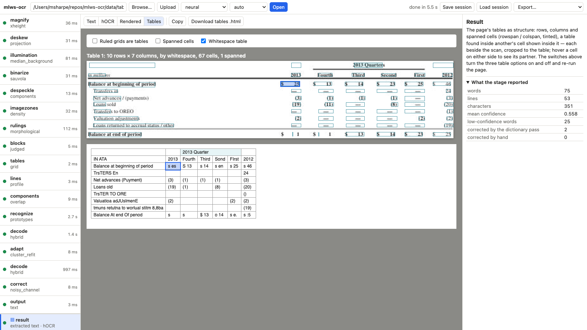
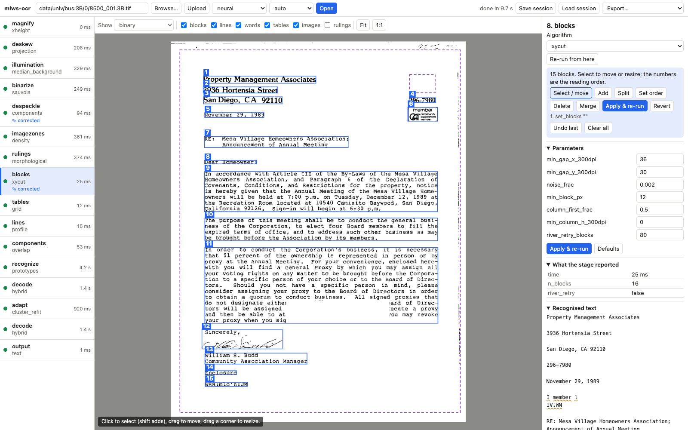
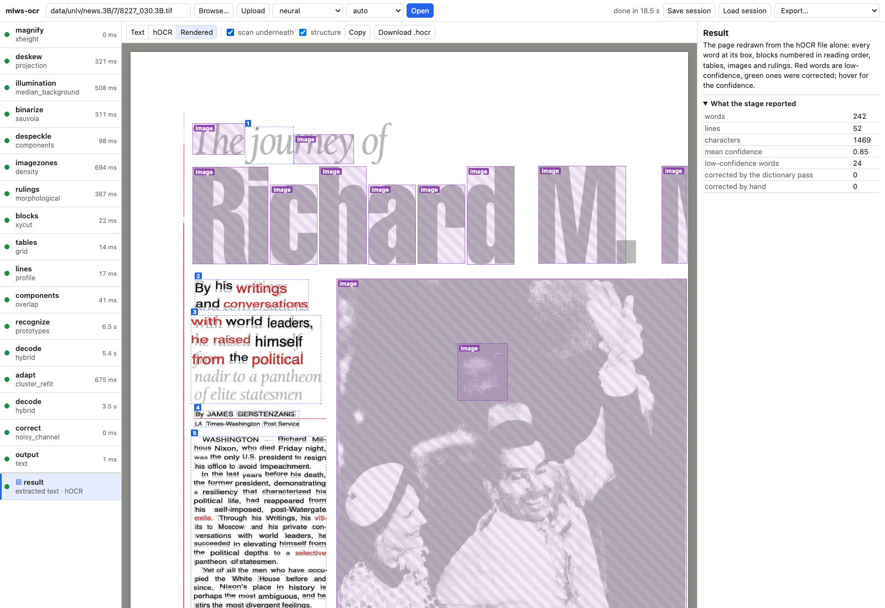

# mlws-ocr

A **readable OCR** for real-world scanned documents, in two engines that
share one pipeline: a **classic** feature-based engine — the reference
implementation Tesseract's legacy engine should have been — and a
**neural** engine that adds networks to it one measured term at a time:
a word-strip scorer, a line reader, a per-line judge.

**Every model is trained here.** No pre-trained weights, no vision or
language foundation model. Each network is small enough to read (the
largest is under 290k parameters), trains on a laptop or its GPU in an evening
from public data, and runs locally from one exported `.npz`.
[docs/NEURAL_NETWORK_THEORY.md](docs/NEURAL_NETWORK_THEORY.md) teaches
the theory from a single neuron up and draws each network's shape and the
reasons for it; `docs/NETWORKS.md` records what each is for, how its
training data is acquired and how it is trained.

**Code legibility is a deliverable.** Small stages, explicit features, a
debug rendering for every step, and a research log that records where
each algorithm comes from and what it measured — including everything
that did not work.

## Results

Character / word accuracy on real scanned pages, September 2026. Legacy
Tesseract (`--oem 0`) is the reference, measured with the same scripts on
the same pages; the LSTM column is Tesseract 5.5.3 with its default English
model; bold marks the row's leader. The held-out rows are pages no tuning,
training or evaluation decision has used (`eval_unlv.py --heldout`,
`eval_tesseract.py --heldout`). Classic's CORD word score is below zero (it
inserts more words than a camera receipt holds) and is left out. The full
scoreboard and its history are in `docs/DESIGN.md` §8.

| set | what it is | classic | neural | legacy Tesseract | Tesseract LSTM |
|---|---|---|---|---|---|
| dev-8 | UNLV business letters, tuning set | 95.2 / 89.4 | **97.7 / 95.4** | 95.0 / 91.7 | 95.5 / 93.1 |
| broad-30 | UNLV business letters, the headline set | 91.9 / 82.3 | 95.8 / **93.0** | 95.5 / 91.7 | **96.0** / 92.7 |
| legal-8 | UNLV legal pleadings (typewriter) | 91.7 / 81.3 | **93.9 / 90.3** | 90.4 / 88.7 | 90.3 / 86.9 |
| modern | born-digital PDFs and templated business letters | 91.6 / 83.5 | **94.2 / 90.7** | 75.4 / 70.8 | 74.2 / 66.6 |
| business | invoices, payslips, receipts, statements, purchase orders | 95.3 / 86.1 | **98.0 / 96.8** | 70.7 / 68.0 | 70.7 / 68.6 |
| news-8 | UNLV newspapers (the layout rules were tuned here) | 94.2 / 84.1 | **96.9** / 94.2 | 96.3 / 93.1 | 96.7 / **94.8** |
| mag-8 | UNLV magazines (the layout rules were tuned here) | 66.8 / 45.5 | 87.2 / 81.3 | 87.3 / **84.7** | **87.8** / 84.4 |
| newspapers, held out | 30 UNLV newspaper pages no decision has used | 76.5 / 63.4 | 86.7 / 81.6 | 87.1 / 82.4 | **87.7 / 84.2** |
| magazines, held out | 30 UNLV magazine pages no decision has used | 68.3 / 50.7 | **83.7 / 75.6** | 77.9 / 71.3 | 78.5 / 73.6 |
| letters, held out | 30 UNLV business letters no decision has used | 90.7 / 83.1 | **93.9 / 91.1** | 92.4 / 88.8 | 93.1 / 90.6 |
| sroie | real scanned receipts, ICDAR 2019 | 48.0 / 13.6 | **79.5 / 62.4** | 56.2 / 29.4 | 64.0 / 40.3 |
| funsd | real scanned forms, FUNSD, at 2x | 37.4 / 12.7 | 65.9 / 44.3 | 54.8 / 32.0 | **66.4 / 47.2** |
| legal reports | real typescript and printed office pages, Library of Congress | 70.5 / 47.3 | **87.5 / 73.7** | 57.5 / 42.8 | 78.8 / 66.3 |
| cord | photographed receipts, CORD, cut to the receipt | 30.7 / – | **53.5 / 31.1** | 42.1 / 19.5 | 46.7 / 21.1 |
| blocks | a paragraph handed in alone, no layout (broad-30's text zones) | 94.4 / 85.8 | **98.6 / 97.2** | 98.2 / 96.6 | 98.5 / 96.5 |


**Tables.** Table structure is scored by TEDS (tree-edit similarity of the
recognised tables to their HTML truth, text included; after the slash,
TEDS-S, structure alone; 1.0 is perfect), read with `neural-table` and
the classic profile with the same options:
ruled grids kept from the picture zones, short grid rules, spanned cells,
open sides, nested tables, words split at cell borders, figure columns, and tables found
on the page (the generated sets, scored page-wide over every table) or the
`table` hint (FinTabNet's single-table crops, magnified from 72 dpi).
The neural-table column adds the self-trained table detector, structure
network and table line reader. Neither Tesseract engine outputs table
structure -- its text, hOCR and TSV carry no rows, columns or cells -- so
there is nothing to score. With the options off, every set scores
between 0.00 and 0.03.

| set | what it is | classic | neural-table |
|---|---|---|---|
| payroll forms | generated ruled payroll forms: spanned headers, two-row records, open sides; software, typewriter and hand-lettered entries (20 pages) | 0.600 / 0.854 * | **0.907 / 0.935** |
| paystubs | generated: earnings and deductions nested in the stub, in five rule styles from full grid to whitespace (20 pages) | – | 0.919 / 0.938 |
| invoices | generated: line items with spanned totals, five rule styles (20 pages) | – | 0.967 / 0.981 |
| timesheets | generated: two-level spanned headers, five rule styles (20 pages) | – | 0.944 / 0.964 |
| receipts | generated: thermal-roll receipts, whitespace or a header rule (20 pages) | – | 0.940 / 0.963 |
| real receipts | CORD photographed receipts, their line items as the table (30 receipts) | – | 0.466 / 0.553 |
| annual-report tables | real financial tables, FinTabNet.c, ruled by whitespace (60 tables) | 0.607 / 0.781 | **0.806 / 0.873** |
| scientific tables | real tables from papers, PubTables-1M test crops (60 tables); page-level detection F1 0.967 at IoU 0.5 (40 pages, v0.17.0) | – | 0.723 / 0.815 |

Neural-table on main after v0.17.0 (2026-09-30: nil dashes read, a receipt's paper edge dropped, receipt item rows kept apart -- docs/RESEARCH.md); the generated sets' truth was corrected where it disagreed with its own images (timesheets, payroll forms). \* measured before the open-sides and short-rule options and before the payroll truth held both amounts of each diagonal gross cell (the set was regenerated, 2026-09-28); – not measured.

**Held-out pages.** The eight-page sets flatter newspapers and magazines:
on 30 fresh pages of each type, never used for any decision, the neural
profile reads newspapers at 86.7 / 81.6 and magazines at 83.7 / 75.6 (with
the per-page segmenter judge on those two types since 26 September 2026;
XY-cut alone read them at 79.7 and 65.9; magazines 68.1 before text-row protection
and 77.1 before deskew stopped trusting an estimate at its search limit, which had
rotated three straight photo-heavy pages by 5 degrees). Letters (93.7), legal pages
(94.2) and a freshly rendered business set (97.5) hold up. Tesseract LSTM
on the same held-out pages: newspapers 87.7 / 84.2, magazines 78.5 / 73.6,
letters 93.1 / 90.6 (neural 93.7 / 90.8).
`scripts/eval_unlv.py --heldout` draws them.

**Photographs and the facing page (27 September 2026).** Photographs no
longer cost text (0.3% of the text's ink falls in picture zones), but a
scanned spread often holds a strip of the facing page along the edge, and
every word read there is an insertion against the page's truth. Its column
is recognisable -- lines running off the image, words cut mid-word -- and is
now left out on newspaper and magazine pages: mag-8 81.4 -> 87.2, news-8
95.4 -> 96.9 (ahead of Tesseract's LSTM on characters), fresh magazines 82.1 /
73.2 -> 83.7 / 75.6 (ahead of it on both).

**Reading a paragraph (27 September 2026).** Handed a paragraph with no
layout to find, the engine now reads more of its words right than either
Tesseract engine (98.6 / 97.2 against 98.5 / 96.5). Error typing against
Tesseract's LSTM found four fixes: a rule that re-joins letter-spaced
display type had been joining '3 x 5' into '3x5'; a sentence-case pass had
lowercased capitalised words the reader read right ('President', 'Board');
the dictionary lacked contractions ('we'll', 'you'll'), so an apostrophe
lost to 'well' and 'were'; and the reader could not write * = + @ [ ] _ `.

**Receipts (27 September 2026).** The line reader has now also trained on
the annotated lines of SROIE's training receipts and FUNSD's training forms,
and on twice the typewritten Legal Reports lines. To keep it from
forgetting how it read everything else, it was held to the previous reader
while it learned: its weights by L2-SP, and its character-by-character
readings by Learning without Forgetting (distillation from the previous
reader), and the running average of its weights is what ships. SROIE went
68.2 / 47.6 -> 78.6 / 60.2; nothing outside receipts dropped more than
0.4 word. The capitals the receipts taught still show on clean sans-serif
text, so a case-repair pass mends 'Iong' and 'DOg'.

**Magazines and forms (26 September 2026).** Three fixes found by looking
at the worst pages. The picture-zone stage had swallowed magazine captions
and photo-side columns; rows of glyphs that chain like text are now given
back (held-out magazines 68.1 -> 77.2). On forms, rows of underline dashes
had set the page's x-height to 3.6 px, and every all-caps line was then
deleted as a scanner sliver; and dashed or fax-broken underlines, which the
solid-rule finder missed, garbled the text resting on them. Photographed
receipts went 46.4 / 21.7 -> 52.4 / 30.6 and forms 63.5 -> 66.1.

**The grey-strip reader (26 September 2026).** The line reader now reads
each line from the flattened grey page, contrast-stretched, instead of
from the binarised one: binarisation had been erasing faint thermal and
dot-matrix strokes before the network ever saw them. Photographed
receipts rose 8.7 characters and 13.7 words, forms 5.7 / 8.2, the Legal
Reports 2.1 / 4.3, SROIE 3.9 words; legal-8 gave back half a point.

On the tabular business pages Tesseract reads by column and pays the
edit distance for the order; there, the bag-of-words recall is the
recognition comparison (neural 97.7, legacy 97.5). The two real corpora
are hard for every engine — faded dot-matrix receipts, 72-dpi faxed
forms — and are where the work now is; `docs/TESSERACT.md` has the
detail. The whole run of
measurements, and every mechanism that was tried and turned down, is in
`docs/RESEARCH.md`.

## Against Tesseract

Both Tesseract engines are measured on every set with the same scripts
and pages; [docs/TESSERACT.md](docs/TESSERACT.md) is the full side-by-side
of the numbers, the shared ideas and the differences. The short form:

- **Ahead of both engines** on typewriter pleadings (+4 characters),
  modern documents (+19) and tabular business pages (+26 by edit
  distance, level on bag-of-words recall), on the letter tuning set, and
  on the Library of Congress typescript archive (+6.8 characters and +2.7
  words over the LSTM; +4.2 / +1.5 on a 100-page draw).
  Tesseract's page analysis is the reason on all three: margins and hole
  punches read as text, templated letters broken, tables read by column.
- **Behind on the headline letter set** by 0.2 characters / 0.1 words
  against legacy and 0.7 / 1.1 against the LSTM. Handed the same text as
  bare blocks the reader is at character parity, so the gap is letterhead
  display lines and word spacing, not the recognizer.
- **Behind on newspapers and magazines**, which are measured and not
  tuned; the loss is column layout.
- **Scanned receipts level with the LSTM** in words (39.7 against 40.3)
  and four characters ahead; forms behind by eight. **Photographed
  receipts** (CORD) are the widest gap: 9 characters and 13 words behind.
- **A tenth of the training data**: 286k parameters trained on this
  machine from open fonts and UNLV truth, against Tesseract's 4,500 fonts
  and Google's training run. Real scanned strips in training are what buy
  the lead on degraded pages.

## Quick start

```sh
python3 -m venv .venv && .venv/bin/pip install -e ".[dev]"
.venv/bin/python scripts/fetch_models.py                      # the released model files into data/, SHA-256 checked
.venv/bin/pytest                                              # every stage against synthetic ground truth
.venv/bin/python scripts/make_demo_page.py                    # a degraded demo scan
.venv/bin/mlws-ocr run configs/neural.toml demo_page.png      # read it (writes text.txt and page.hocr under runs/)
.venv/bin/mlws-ocr run configs/neural.toml scan.pdf --pdf-page 0
.venv/bin/mlws-ocr run configs/neural.toml paragraph.png --doc-type block   # the image is one block of text
.venv/bin/mlws-ocr run configs/neural-table.toml paystub.png  # a table document (writes tables.json, .html, .csv)
.venv/bin/mlws-ocr-ui scan.png                                # the interactive workbench at http://127.0.0.1:8330
.venv/bin/mlws-ocr inspect                                    # browse persisted runs (read-only)
.venv/bin/mlws-ocr batch configs/neural.toml scans/ --out out/  # many pages at once, one per worker process
.venv/bin/mlws-ocr-service --config configs/neural.toml       # POST an image to http://127.0.0.1:8340/ocr
.venv/bin/mlws-ocr-lab data/unlv/bus.3B                       # live segmentation lab at http://127.0.0.1:8801
```

`--doc-type` is an optional layout hint (`letter`, `legal`, `book`,
`form`, `newspaper`, `magazine`, `block`, `table`); the engine never requires it.
Every run writes `text.txt` and `page.hocr` — hOCR with the page's
structure (blocks in reading order, lines, words with boxes and a
calibrated probability each, tables, image zones, rulings) — beside the
persisted page. The service returns
the same as JSON, one page per worker process, so a machine with N cores
reads about N pages at once (`scripts/service_load.py` is its load test).
`mlws-ocr batch` does the same for files, directories and whole PDFs: 16
UNLV letters take 185 s on one worker and 29 s on thirteen (33 pages a
minute on a 14-core laptop), with text, hOCR and a `batch.json` summary
per run.

**Tables.** A page's tables come out as structure, not only as text:
`tables.json` (each table's rows, columns and cells with rowspan, colspan,
box and text, header rows marked, each cell's column and row header
path, a table inside another's cell nested under that cell), `tables.html` (the same as `<table>` markup),
`tables.csv`, and `ocr_table` in the hOCR. The neural profile finds ruled
tables from their rules (spanned cells, open sides, tables nested in a
frame) and tables set by whitespace or ruled only between rows anywhere
on the page; it reads a column of figures as figures ('S 25' → '$ 25')
and checks each table's arithmetic (quantity × price = amount, a row's
day columns against its total, column totals),
marking the cells a failed check points at. None of this changes the
page's text. For table documents, `configs/neural-table.toml` adds the
options that do: a large ruled grid kept from the picture zones, short
dividers under spanned headers, low-dpi crops magnified, rules taken out
of the reader's strips, figure columns re-read with digits only, and four
self-trained networks: a table detector over the whole page, a structure
network that gives a table's rows, columns and extent, a separator network
that joins a table's wrapped rows, and a line reader fine-tuned on table
lines. A table image on its own reads best with `--doc-type table`. Measured by TEDS
against HTML truth (`scripts/eval_tables.py`), table by table in the
comparison above.

Training the sequence models is faster with the optional extra
(`pip install -e ".[train]"`, torch on the machine's own GPU); the numpy
implementation of every model is the reference, and the pipeline never
imports torch unless asked to.

## The workbench

`mlws-ocr-ui [IMAGE]` opens a page in the browser and runs it through the
whole pipeline, then lets you revisit any stage: see what it did (its
images, numbers and overlays), pick another algorithm or change its
parameters, correct it by hand, and re-run from there — upstream stages
are kept, downstream ones re-run. Corrections are data, saved with the
session and re-applied on every re-run:

- **deskew** — the stage's estimate beside the angle applied; type an
  angle, or click two points along a line of text;
- **noise** — tune the despeckle size, click a mark to erase it, click a
  removed speck to restore it, drag a box to clear;
- **blocks and lines** — select, move, resize, add, delete, split, merge,
  and click the blocks in reading order;
- **text** — click a word on the page or in the text panel to correct
  it; the text and hOCR are rebuilt;
- **tables** — add or remove a column or row line, merge cells, type a
  cell's text, draw a table the page missed or delete one; the tables'
  JSON, HTML and CSV are rebuilt, the text left as read;
- **post-processing** — the learned-dictionary pass's corrections, each
  clickable on the page, and its on/off switch.

The last tab is the **result**: the extracted text, the hOCR source, the
tables (rows, columns and spanned cells), or
the page **rendered from the hOCR file alone** — every word at its box,
blocks numbered in reading order, tables, images and rulings, low-
confidence words in red and corrected ones in green, optionally over a
faint copy of the scan or side by side with it (hovering a word marks
its box on the scan). It shows at a glance what the file carries and
what the page lost (a line never read, a headline taken for a picture).

**Tables** get their own view in the result tab: each table beside the scan
cropped to it (above it, for a wide table), rows, columns and spanned
cells tinted, a nested table inside its cell; hover a cell on either side
to see its partner. Switches above it turn the table options on and off
and re-run the page -- ruled grids kept from the picture zones, short
grid rules, spanned cells, tables found on the page (set by whitespace or
ruled only between rows), and a page that is one table -- and the tables
stage lists what it found. On the page view, ruled tables are drawn solid, whitespace ones
dashed, each labelled with its size.



Sessions save to a `.mlws.json` file (image, profile, every choice and
correction) and reload; the page exports as text, hOCR, page JSON, the
cleaned image, or the session's settings as a profile TOML. Standard
library server, plain JavaScript and canvas, no build step
(`src/mlws_ocr/workbench/`).





## Engines

One codebase, three profiles under `configs/`; pass one to `mlws-ocr run`
or to any evaluation script's `--config`. `default.toml` is the classic
profile, kept as the reference; the neural profile is the accurate one.

| profile | config | networks | role |
|---|---|---|---|
| **classic** | `configs/classic.toml` | the MLP second opinion (53k) and the character GRU (258k) | the feature engine: nearest-prototype, outline and MLP channels over explicit glyph features, a beam decoder with lexicon and language model, per-document adaptation. Its row is the regression guard after every neural adoption. |
| **pure** | `configs/pure.toml` | none | classic with both networks off; what the feature engine reads on its own |
| **neural** | `configs/neural.toml` | classic's, plus the word-strip CRNN+CTC scorer as the judge of the classic word variants, the line reader (every line read end to end by the line model), the fitted judge that decides each line between the two readings, and the word-confidence calibrator | the engine to use; reports table structure (spans, nesting, tables found on the page, figure columns, arithmetic checks) without changing the text |
| **neural-table** | `configs/neural-table.toml` | neural's, with a line reader fine-tuned on table lines in place of neural's, plus the table separator network (wrapped rows joined), the table detector (248k), the table structure network (277k) and the fitted choice between the rules' table and the network's | neural plus the table options that also change what the reader sees (ruled grids kept from the picture zones, short grid rules, low-dpi crops magnified, rules taken out of the reader's strips, figure columns re-read as figures, turned cell text read): for payroll forms, paystubs, statements, invoices, receipts, and tables from reports and papers |
| **neural-line** | `configs/neural_line.toml` | the same, as the experiment profile for a new line model or choice rule | development |

`tests/test_profiles.py` keeps the profiles honest (pure differs from
classic only in the two network switches; neural only in the recognize
and decode terms), and `tests/test_regression.py` reads the synthetic
page under each profile against the accuracies recorded at adoption.

## Models and data

All models live under `data/` (gitignored). Every release ships them as
one asset, `mlws-ocr-models-v<version>.tar.gz` with a manifest naming
what each file is and its SHA-256; `scripts/fetch_models.py` downloads
and verifies the set for the version in `pyproject.toml`. They are built
by the scripts in this repository, from three public sources: text rendered from the
pinned font stock and any directory of open fonts (the Google Fonts
checkout gives 3,179 faces past the shape gate), the UNLV/ISRI
ground-truth scans with a guard that keeps every evaluated page out of
every harvest, and a public-domain text corpus (Project Gutenberg plus US
federal text). [docs/DATA_SOURCES.md](docs/DATA_SOURCES.md) says where to get each
dataset and where it goes under `data/`; `docs/NETWORKS.md` has the full
account per model; the short form:

```sh
.venv/bin/python scripts/build_langmodel.py data/corpus_en_plus data/lang_en.npz   # lexicon + character trigrams
.venv/bin/python scripts/train_charlm.py --corpus data/corpus_en_plus              # character GRU language model
.venv/bin/python scripts/build_prototypes.py data/prototypes.npz --condense 90     # glyph prototypes (renders + harvests)
.venv/bin/python scripts/build_prototypes.py data/pool_all.npz --cap 1000000000 --inlier 100 && .venv/bin/python scripts/train_mlp.py data/pool_all.npz data/mlp.npz
.venv/bin/python scripts/build_outline_protos.py data/outline_protos.npz --condense=12 --min-cover=0.85
.venv/bin/python scripts/make_seq_data.py --out data/seq_synth_v1.npz --n 250000  # synthetic word windows, touching pairs included
.venv/bin/python scripts/harvest_lines.py data/unlv/bus.3B --pages 170 --out data/lines_en.npz --line-out data/linesfull_en.npz
.venv/bin/python scripts/train_seq.py --backend torch --synth data/seq_synth_v1.npz --lines data/lines_en.npz --out data/seq_en_vN.npz
.venv/bin/python scripts/harvest_word_conf.py data/unlv/bus.3B --pages 60 --config configs/neural.toml && .venv/bin/python scripts/train_wordconf.py data/wordconf_en.npz
# the table networks: make_det_data.py + train_tabledet.py (detector), make_split_data.py + train_splitnet.py (structure),
# train_table_select.py (the rules-or-network choice), harvest_boxes.py --tables (the table reader's lines); recipes in docs/NETWORKS.md
```

A trained network goes live only when it clears the seed-to-seed range
of its recipe on the evaluation sets, or wins with two seeds; the live
file changes only on adoption, and the measurement is recorded either
way.

## Measurement

```sh
.venv/bin/python scripts/eval_unlv.py data/unlv/bus.3B --pages 30 --seed 2 --doc-type letter --config configs/neural.toml   # a UNLV set (broad-30)
.venv/bin/python scripts/make_modern_set.py && .venv/bin/python scripts/make_business_set.py   # today's documents; tabular business pages
.venv/bin/python scripts/eval_unlv.py data/business/sev0 --pages 60 --seed 1 --by-kind --config configs/neural.toml
.venv/bin/python scripts/eval_blocks.py truth data/unlv/bus.3B --pages 30 --seed 2 && .venv/bin/python scripts/eval_blocks.py score data/unlv/bus.3B --pages 30 --seed 2 --config configs/neural.toml
.venv/bin/python scripts/eval_blocks.py zones data/unlv/bus.3B --pages 30 --seed 2 --config configs/neural.toml   # where on the page the errors sit
TESSDATA_PREFIX=... .venv/bin/python scripts/eval_tesseract.py data/unlv/bus.3B --pages 30 --seed 2 --oem 0    # the legacy reference, same pages
.venv/bin/python scripts/eval_tables.py data/tables/paystub --pages 20 --whole-page --config configs/neural-table.toml   # a generated table set, every table on the page
.venv/bin/python scripts/eval_tables.py data/tables/fintabnet --pages 60 --doc-type table --config configs/neural-table.toml --set output.ws_table_doc_types=table --set magnify.min_dpi=150
.venv/bin/python scripts/eval_detection.py data/raw/pubtables1m/x --pages 40 --config configs/neural-table.toml   # tables found on scientific pages
```

Character and word accuracy by edit distance, plus order-free word
recall and precision; line-end hyphenation is folded on both sides and
character rule lines are dropped, so an engine is not scored on a
convention. Every run can save its per-page output (`--dump`) and
`scripts/rescore_dump.py` re-scores it under a changed convention in
seconds.

## Architecture

The pipeline is a sequence of **slots** (magnify, deskew, illumination,
binarize, despeckle, image zones, rulings, blocks, tables, lines,
components, recognize, decode, adapt, decode, correct, output), each filled by one of possibly
many registered **implementations**, chosen per run by a TOML config.
Every stage takes a `Page` and returns a new `Page` plus a `DebugBundle`
(images, scalars, notes); the runner persists both at every stage
boundary under `runs/<doc-id>/`, and the inspector is a dependency-free
local viewer over that tree. The full design — every stage, why it is
shaped that way, the three recognition channels, the decoder's priors,
the line reader, the models and how we measure — is in
[docs/DESIGN.md](docs/DESIGN.md); the diagrams (packages, stage contract,
pipeline, profiles, where each model plugs in, the tables subsystem, the
runtime surfaces, training and release) are in
[docs/ARCHITECTURE.md](docs/ARCHITECTURE.md).

```
src/mlws_ocr/
  core/       Page artifact, Stage contract, registry, TOML config, runner, PDF and image I/O
  cleanup/    magnify, deskew (projection | Hough), illumination, binarize (Sauvola | Otsu), despeckle
  layout/     image zones, rulings, blocks (XY-cut | k-NN SCC | whitespace | judged), tables, lines;
              whitespace and mesh table finders; the table separator, structure and detector networks
  glyph/      connected components and cuts, the 95-element feature vector, skeletons, line strips
  recognize/  nearest-prototype, MLP and outline channels; the CRNN sequence model (numpy + torch mirror) and CTC
  lang/       lexicon and character trigrams, the character GRU
  decode/     the beam decoder, its post-passes and sequence-scorer terms, numeric formats and shape repairs, the line reader, the judge, word confidence, the word corrector, text, hOCR and table output
  adapt/      per-document cluster refit
  factory/    synthetic data: font stock, glyph and line rendering, the degradation model, the table generator
  eval/       alignment of output to ground truth
  inspector/  the run browser and the segmentation lab (stdlib http.server + static HTML)
  workbench/  the interactive workbench: a session of per-stage snapshots, user corrections, its server and page
  service.py  the HTTP service (process pool, one page per worker)
configs/      classic.toml (= default.toml), pure.toml, neural.toml, neural-table.toml, neural_line.toml, and layout variants
scripts/      builders, trainers, harvesters and evaluators (70 scripts; each has a docstring saying what it is for)
tests/        every stage against synthetic ground truth; profile structure; regression on the synthetic page
```

The **segmentation lab** (`mlws-ocr-lab`) re-runs block segmentation live
as parameters change and draws the algorithm's inner state — every
component box, every k-NN link kept or pruned, the computed threshold,
the resulting blocks — to settle "why did these blocks come out this
way?" by looking.

## Documentation

- [docs/DESIGN.md](docs/DESIGN.md) — what the system is and why each part is shaped the way it is; the scoreboard.
- [docs/ARCHITECTURE.md](docs/ARCHITECTURE.md) — the system in diagrams: packages, the stage contract, the pipeline, what a page carries, the profiles, where each model plugs in, decoding, tables, runs on disk, the service, the workbench, training and release.
- [docs/NEURAL_NETWORK_THEORY.md](docs/NEURAL_NETWORK_THEORY.md) — neural networks from a single neuron up, then every network in the engine: its job, its exact shape and why, its training, with pictures of the real networks at work.
- [docs/BINARIZATION.md](docs/BINARIZATION.md) — from grey pixels to ink and paper: Otsu and Sauvola, flattening the light, scanner frames, dim photos, despeckle, and why the line reader reads grey.
- [docs/SKEW_CORRECTION.md](docs/SKEW_CORRECTION.md) — finding how far a page is turned (projection profiles, Hough) and turning it back; the ways the search was fooled, and the fixes.
- [docs/SEGMENTATION.md](docs/SEGMENTATION.md) — pictures and rules out, then blocks (RLSA, XY-cut, whitespace rectangles, k-NN + SCC, the per-page judge), reading order, lines, and how segmentation is measured.
- [docs/TABLES.md](docs/TABLES.md) — table extraction: ruled grids from their rules, unruled tables from their words and the junction mesh, the table networks, reading and checking cells, the output records, TEDS.
- [docs/NETWORKS.md](docs/NETWORKS.md) — every network and learned model: purpose, data, training, rebuild order.
- [docs/DATA_SOURCES.md](docs/DATA_SOURCES.md) — every dataset and document source: what it is, its licence, where to download it, where it goes under `data/`, what it trains or measures.
- [docs/TESSERACT.md](docs/TESSERACT.md) — mlws-ocr against Tesseract's legacy and LSTM engines: the numbers, what is the same idea, what differs and why.
- [docs/RESEARCH.md](docs/RESEARCH.md) — the provenance of every algorithm (papers, deviations, code) and the measurement behind every decision, negative results included. Nothing lands without an entry.
- [docs/ROADMAP.md](docs/ROADMAP.md) — where the work stands and what comes next, ranked by measured evidence.
- A paper on the directional k-NN + SCC block-segmentation algorithm
  ([rendered](https://msharpe248.github.io/mlws-ocr/docs/papers/knn-scc-block-segmentation.html),
  [markdown](docs/papers/knn-scc-block-segmentation.md)).
- Its follow-on, taking the method beyond the 1995 specification: XY-cut
  reading order, gutter evidence and a tree of strong components, with
  tuned, trained and held-out measurements
  ([rendered](https://msharpe248.github.io/mlws-ocr/docs/papers/knn-scc-beyond-1995.html),
  [markdown](docs/papers/knn-scc-beyond-1995.md)).

## Licence

MIT (see [`LICENSE`](LICENSE)): the code, the documentation and the model
files released with each version. The evaluation and training datasets the
project downloads (UNLV, SROIE, FUNSD, CORD, FinTabNet.c, PubTables-1M, the
Library of Congress pages and others) are not part of the repository and
keep their own licences; `docs/NETWORKS.md` names each source.

## Where the work stands

The neural profile leads both Tesseract engines on typewriter pleadings,
modern documents and business pages, ties them on a paragraph read alone,
and trails on the headline letter set by 0.7 character / 1.5 word points
against legacy. That residual is letterhead lines in display faces that
both channels misread; it was measured three ways (synthetic display
faces, 86 real letterhead lines, a decomposition by mechanism) and is
recorded as this set's ceiling under the public-data constraint.
Business documents went from 92.1 / 86.9 to 97.2 / 93.4 in one day of
shape and reading-order rules found by a word-error census, and now sit
within 3.5 word points of their own order-free recall. Newspapers and
magazines are measured, not tuned. The small items that were left are
measured and closed: the dropped '%' is fixed, the masked card numbers
and the touching words on bare blocks each resisted the last honest
mechanism and are recorded as residuals. What would move the numbers
next is data the public-data constraint does not yet provide: real
receipts with truth, and real display-face lines.
