# mlws-ocr — architecture in diagrams

This page draws the system. The prose account of each algorithm is in
[DESIGN.md](DESIGN.md), the networks in [NETWORKS.md](NETWORKS.md) and
[NEURAL_NETWORK_THEORY.md](NEURAL_NETWORK_THEORY.md), the data in
[DATA_SOURCES.md](DATA_SOURCES.md). Every diagram here is Mermaid, which
GitHub renders in place; each is followed by a few lines that name the
files to open next.

Contents

1. [The system at a glance](#1-the-system-at-a-glance)
2. [The package map](#2-the-package-map)
3. [The stage contract](#3-the-stage-contract)
4. [The pipeline](#4-the-pipeline)
5. [What a page carries](#5-what-a-page-carries)
6. [The engine profiles](#6-the-engine-profiles)
7. [Where the learned models plug in](#7-where-the-learned-models-plug-in)
8. [Decoding a line](#8-decoding-a-line)
9. [The tables subsystem](#9-the-tables-subsystem)
10. [A run on disk](#10-a-run-on-disk)
11. [The service and batch](#11-the-service-and-batch)
12. [The workbench](#12-the-workbench)
13. [Training, measuring, releasing](#13-training-measuring-releasing)

---

## 1. The system at a glance

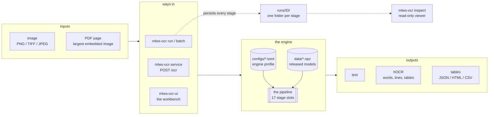

One pipeline, several doors. A **profile** (a TOML file under `configs/`)
says which implementation fills each stage slot and with which
parameters; the **models** are `.npz` files under `data/`, fetched from a
release (`scripts/fetch_models.py`). The command line persists every
stage of a run so it can be inspected afterwards; the service and batch
paths run the same stages in memory.

Entry points (`pyproject.toml`): `mlws-ocr` (`cli.py` — `run`, `batch`,
`stages`, `inspect`), `mlws-ocr-ui` (`cli.py:ui_main` → `workbench/server.py`),
`mlws-ocr-service` (`service.py`), and `mlws-ocr-lab` (`inspector/lab.py`,
the live block-segmentation lab).

## 2. The package map

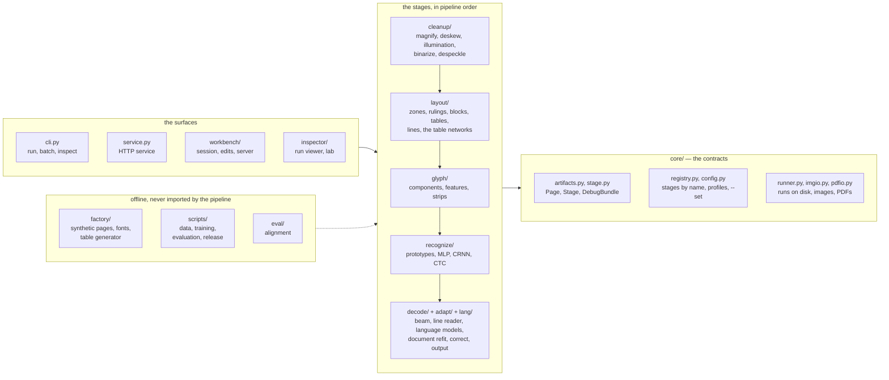

`core/` knows nothing about OCR: it defines the page, the stage, the
registry and the run. Everything else registers stages into it
(`cleanup/__init__.py`, `layout/__init__.py`, … import their modules so the
`@register` decorators run). `factory/` and `scripts/` are offline: they
make training data and measure; the pipeline never imports them.

## 3. The stage contract

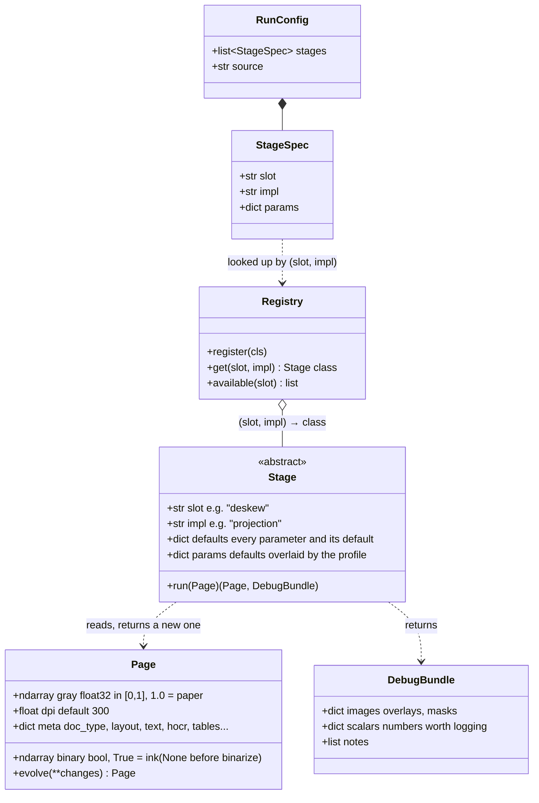

The whole engine rests on this: a stage never mutates the page it is
given, it returns a new one (`Page.evolve`), and it names every parameter
it accepts in `defaults` — a profile key a stage does not declare is an
error, so a typo cannot silently do nothing (`core/stage.py`). The
`DebugBundle` is what makes the engine readable: every stage says what it
did in pictures and numbers, and the runner and the workbench show them.

A profile is a TOML file:

```toml
[pipeline]
stages = ["magnify", "deskew", ..., "decode", "adapt", "decode", "correct", "output"]

[stage.deskew]
impl = "projection"
edge_nearest = true      # any key the class declares in `defaults`
```

`--set slot.key=value` on the command line overrides one parameter for one
run (`core/config.py:parse_sets`, `apply_sets`).

## 4. The pipeline

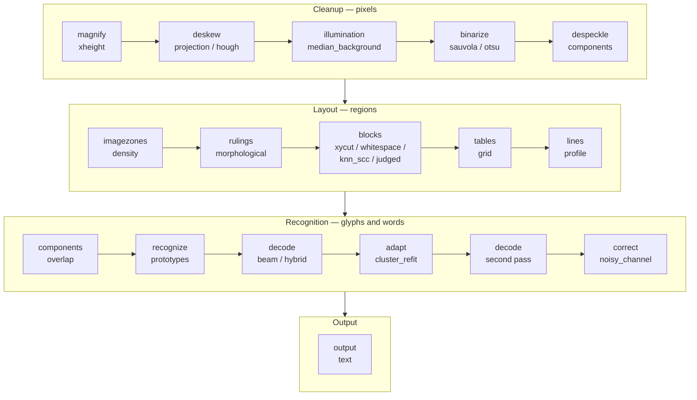

Seventeen slots, in this order in every full profile
(`configs/classic.toml`, `pure.toml`, `neural.toml`, `neural-table.toml`).
`decode` runs twice: once from the recognizer's glyph candidates, and again
after `adapt` has learned this document's own glyph shapes. An optional
`chop` slot (`recognize/chop.py`) can sit between the two passes; no profile
enables it.

| slot | reads | writes | where |
|---|---|---|---|
| magnify | gray, dpi | gray and dpi resampled when the type is small or the page low-dpi | `cleanup/magnify.py` |
| deskew | gray | gray, rotated; `meta.corrections` | `cleanup/deskew.py` |
| illumination | gray | gray, flattened (background divided out, dark frame cleared) | `cleanup/illumination.py` |
| binarize | gray | binary | `cleanup/binarize.py` |
| despeckle | binary | binary, specks removed | `cleanup/despeckle.py` |
| imagezones | binary | binary without pictures; `layout.image_zones` | `layout/imagezones.py` |
| rulings | binary | binary without rules; `layout.rules_h`, `rules_v` | `layout/rulings.py` |
| blocks | binary | `layout.blocks` (ordered text regions) | `layout/blocks.py`, `whitespace.py`, `knn_scc.py`, `segjudge.py` |
| tables | rules, binary | `layout.tables` (ruled grids, spans, nesting) | `layout/tables.py` |
| lines | blocks (and table cells) | `layout.lines` (boxes, baselines) | `layout/lines.py` |
| components | lines, binary | each line's glyph groups, cut alternatives | `glyph/components.py` |
| recognize | groups | each group's ranked character candidates | `recognize/stage.py` |
| decode | lines, groups, candidates | `line.words` (text, box, confidence, endorsements) | `decode/beam.py`, `decode/lineread.py` |
| adapt | groups, first-pass words | candidates refit to this document | `adapt/cluster_refit.py` |
| correct | words | word text corrected by a learned noisy channel | `decode/correct.py` |
| output | everything | `meta.text`, `hocr`, `tables`, `tables_html`, `tables_csv` | `decode/output.py` |

## 5. What a page carries

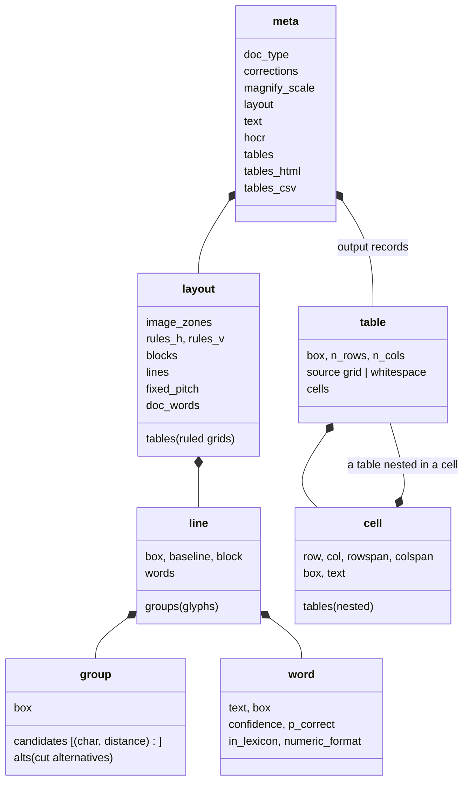

Everything the stages learn about a page lives in `page.meta`, most of it
in `meta["layout"]`, as plain dicts and lists so that a run can be written
to `page.json` and read back. A stage adds its keys; the output stage turns
them into text, hOCR and table records.

## 6. The engine profiles

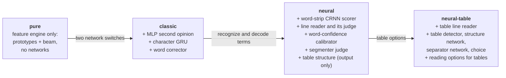

| slot | classic | pure | neural | neural-table |
|---|---|---|---|---|
| blocks | xycut | xycut | judged | judged |
| recognize | prototypes, MLP on | prototypes, MLP off | prototypes | prototypes |
| decode | beam, GRU on | beam, GRU off | hybrid (line reader) | hybrid (table line reader) |
| correct | on (learned confusions) | off | off (case repair only) | off (case repair only) |
| output | text | text | text + tables | text + tables, networks on |

Each profile differs from the one before it only where the arrow says;
`tests/test_profiles.py` fails if any other parameter drifts. The classic
engine is the reference and is never removed; a network enters a profile
only after it measured better on every evaluation set (docs/RESEARCH.md).

## 7. Where the learned models plug in

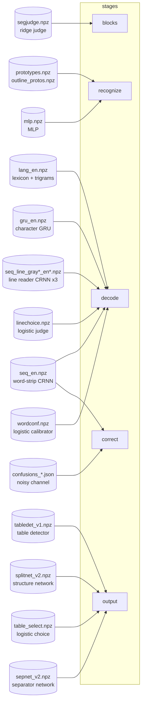

| model | config key | profiles |
|---|---|---|
| segmenter judge | `blocks.impl = "judged"`, `blocks.model_path` | neural, neural-table |
| MLP second opinion | `recognize.mlp_path` | classic, neural, neural-table |
| character GRU | `decode.char_lm` | classic, neural, neural-table |
| word-strip CRNN scorer | `decode.seq_path` (and `correct.seq_path`) | neural, neural-table (classic: the corrector's pixel check) |
| line reader (3-member ensemble) | `decode.line_model_path` | neural (`seq_line_gray9`), neural-table (`seq_line_gray15`) |
| line-choice judge | `decode.line_choice_path` | neural, neural-table |
| word-confidence calibrator | `decode.conf_path` | neural, neural-table |
| table detector | `output.table_det_path` | neural-table |
| table structure network | `output.table_split_path` | neural-table |
| rules-or-network choice | `output.table_split_select` | neural-table |
| word-relation network (a small transformer over a crop's words) | `output.table_wordrel_path` | neural-table |
| engine-or-word-network choice | `output.table_wordrel_select` | neural-table |
| table separator network | `output.table_net_path` | neural-table |

What each network is and why it has the shape it has:
[NEURAL_NETWORK_THEORY.md](NEURAL_NETWORK_THEORY.md).

## 8. Decoding a line

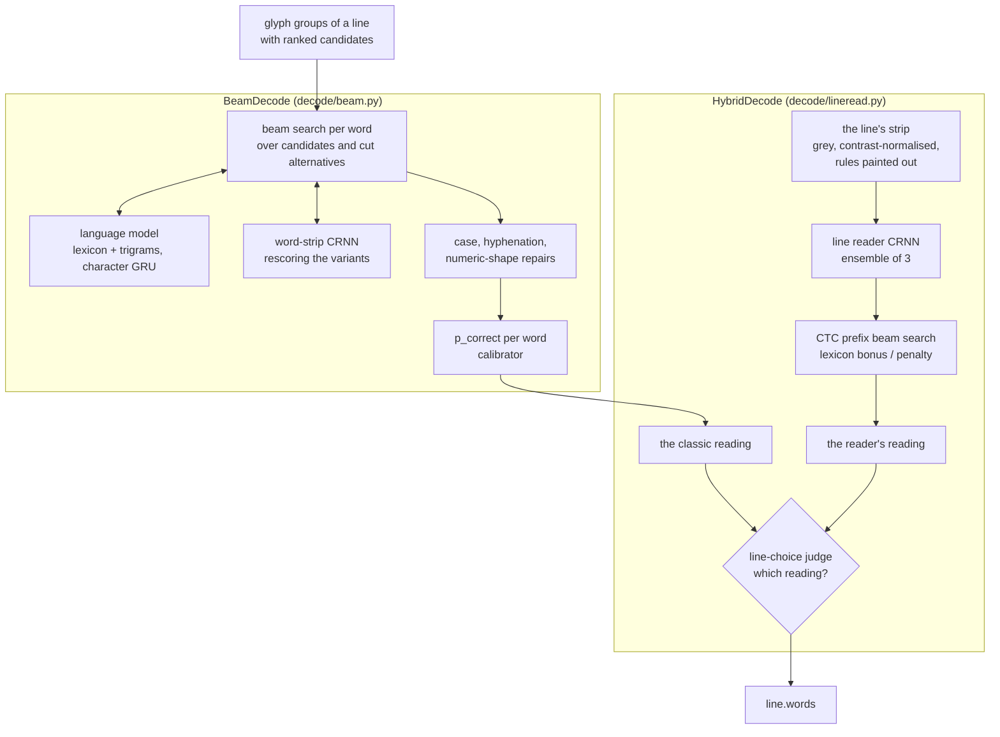

Each line is read twice, by two very different readers: the classic
decoder assembles words from segmented glyphs, the line reader reads the
whole strip at once. A small fitted judge (`decode/linechoice.py`) picks
per line. `adapt` then refits the glyph candidates to the document, and
the second `decode` pass reads again.

## 9. The tables subsystem

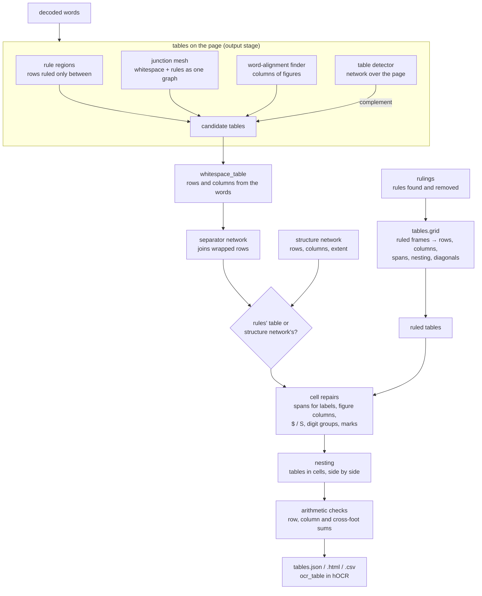

Ruled tables come from their rules (`layout/tables.py`); tables set by
whitespace are found in the output stage, where the words are known
(`layout/wstables.py`, `layout/junctions.py`). In the neural-table
profile three networks join the rules: the detector proposes where tables
are (`layout/tabledet.py`), the structure network proposes each table's
rows and columns (`layout/splitnet.py`), and a separator network is
evidence for joining a wrapped row (`layout/sepnet.py`); a fitted choice
(`table_select.npz`) and guards decide between the rules' table and the
network's (`decode/output.py:_split_or_rules`). Records, nesting, HTML and
CSV are `decode/tableio.py`; the checks `decode/arith.py`.

## 10. A run on disk

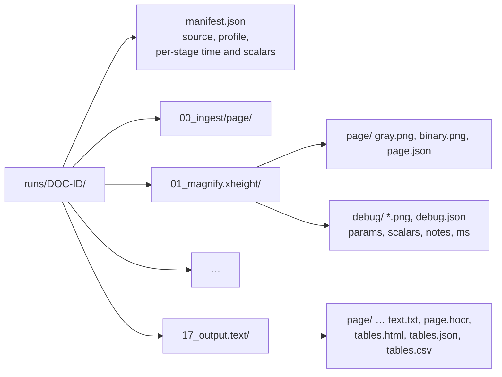

`mlws-ocr run configs/neural.toml page.png` writes one directory per stage
(`core/runner.py`); `mlws-ocr inspect` serves them read-only
(`inspector/server.py`). Nothing is hidden between two stages: the page as
it stood, and the stage's own pictures of what it did, are on disk.

## 11. The service and batch

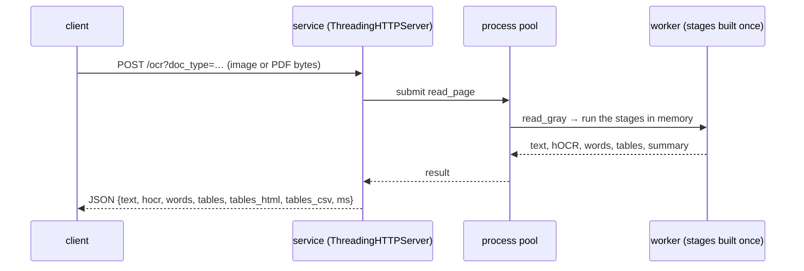

`mlws-ocr-service` (`service.py`) builds each worker's stages once
(`_worker_init`) and reads pages in memory, without the per-stage
persistence of a run. `mlws-ocr batch` (`batch.py`) uses the same worker
setup over a directory or a PDF and writes `<name>.txt`, `.hocr`,
`.tables.{html,json,csv}` and `batch.json`.

## 12. The workbench

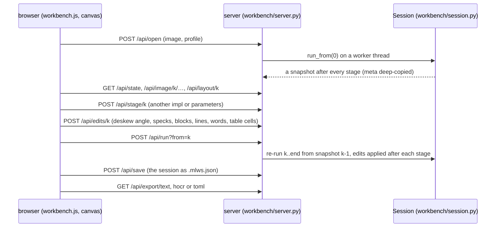

The workbench keeps the page as it stood after every stage, so changing a
stage's algorithm or correcting its result re-runs only what comes after.
Corrections are data (`workbench/edits.py`) applied after their stage, so
they survive a re-run of the stages above them; a session saves as
`.mlws.json` and the tuned settings export as a profile.

## 13. Training, measuring, releasing

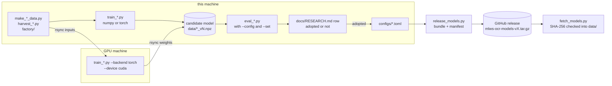

A model is trained, measured with the same scripts on every evaluation
set, recorded in `docs/RESEARCH.md` whether it won or not, and only then
named in a profile. Training runs in numpy or, for the larger networks,
in torch on a GPU machine (`*_torch.py` mirrors each numpy network; the
tests hold the two to the same outputs). A release bundles the live model
files with a manifest of what each one is and its SHA-256.
