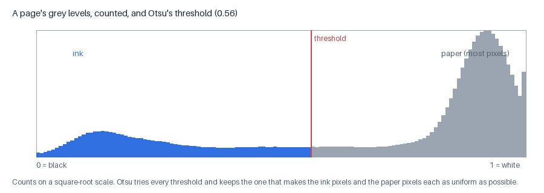
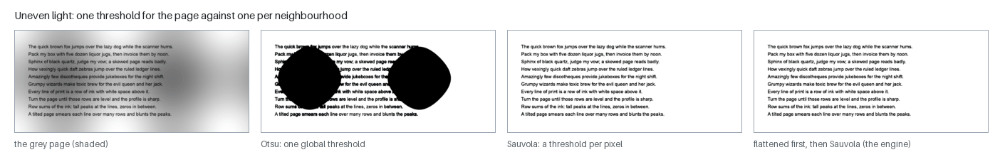
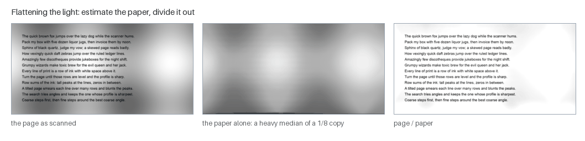
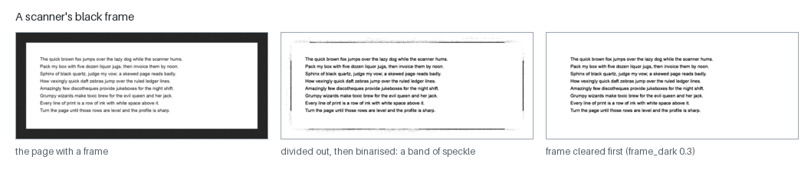
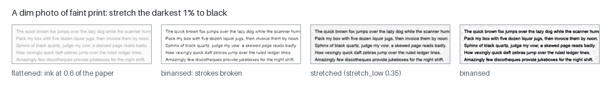
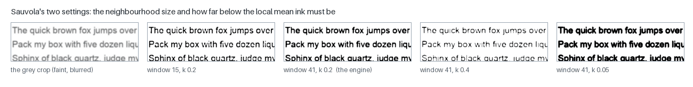
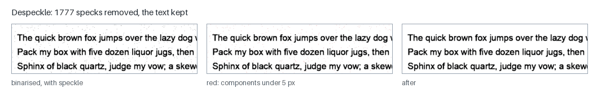
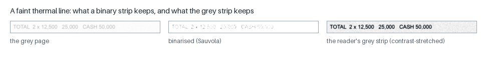

# Binarization: from grey pixels to ink and paper

A scanner or a camera gives the engine a **grey** image: every pixel a
brightness between black and white. Most of the engine's layout and classic
recognition work wants a simpler picture — each pixel either **ink** or
**paper** — because the questions it asks are about shapes: where are the
connected blobs, how many holes does this glyph have, is this a rule or a
row of text. Turning grey into ink-or-paper is **binarization**, and it is
the step where information is most easily and most permanently lost.

This page explains the idea, the two binarizers in the engine and why the
default is the local one, the cleanup that runs before it (flattening the
light, clearing scanner frames, stretching dim photos) and after it
(despeckle), and why the neural line reader reads the grey page instead.
Figures are drawn by `scripts/make_page_figures.py --only binarize` on pages
rendered and degraded by the project's synthetic scanner model.

- Code: `src/mlws_ocr/cleanup/illumination.py` (slot `illumination`),
  `cleanup/binarize.py` (slot `binarize`; impls `sauvola`, the default, and
  `otsu`), `cleanup/despeckle.py` (slot `despeckle`), `cleanup/magnify.py`
  (slot `magnify`); `glyph/strip.py` (the reader's grey strips).
- Where they run: `magnify → deskew → illumination → binarize → despeckle`,
  the first five stages of every profile.
- Related: [SKEW_CORRECTION.md](SKEW_CORRECTION.md) (the stage before),
  [SEGMENTATION.md](SEGMENTATION.md) (the stages that read the binary),
  [ARCHITECTURE.md](ARCHITECTURE.md).

---

## 1. What the page is

A page is a `Page` (`core/artifacts.py`) holding a **grey** image — float32,
0.0 black to 1.0 white, loaded through one function (`core/imgio.load_gray`)
so every stage agrees on the scale — and, once this stage has run, a
**binary** image of the same size, `True` where there is ink. The grey page
is never thrown away: later stages (the neural line reader, the table
networks) read it directly.

## 2. One threshold for the page: Otsu

The simplest binarizer picks one grey level and calls everything darker
ink. Which level? Look at the page's **histogram** — how many pixels have
each grey value:

A printed page has two populations: a big peak of paper near white and a
smaller hump of ink near black, with the pixels on the soft edges of strokes
in between. **Otsu's method** (Otsu, 1979) tries every threshold `t` and
keeps the one that makes the two sides each as tight as possible —
equivalently, that pushes their means furthest apart, weighted by their
sizes:

$$t^* = \arg\max_t\; \omega_0(t)\,\omega_1(t)\,\big(\mu_0(t) - \mu_1(t)\big)^2$$

where `ω₀, ω₁` are the shares of pixels below and above `t` and `μ₀, μ₁` their
mean grey levels. It needs no parameters and one pass over a 256-bin
histogram.

**Where it fails: uneven light.** One threshold assumes the paper is
equally bright everywhere. It rarely is — a photocopier's shading, a book's
curved gutter, a phone's shadow:

Where the light falls off, the paper itself is darker than the threshold
and floods to black (second panel). Otsu stays in the engine as the global
baseline (`binarize.otsu`) and as the quick ink mask inside the skew search,
but it is not the default.

## 3. Flatten the light first: the illumination stage

Before any threshold, the engine estimates the **paper** and divides it out
(`illumination.median_background`; flat-fielding, with a median filter in
place of Sternberg's rolling ball, 1983):

1. Shrink the page to an eighth of its size.
2. Take a heavy **median** over a 31 × 31 window of the small copy (about 250
   pixels at full size). A median ignores a minority of dark pixels, and text
   strokes are a small minority of any window that size — so only the paper
   survives.
3. Enlarge that estimate back to full size (clamped at 0.05 so a very dark
   region cannot cause a divide-by-almost-zero).
4. Divide: `corrected = page / paper`. Where the paper was dim, dividing by a
   small number brightens it; the ink, darker than its own local paper, stays
   dark.

The flattened page is not yet ink-or-paper, but the paper is now close to
1.0 everywhere, which is what a threshold needs.

### Scanner frames

A book scanned on a flatbed often comes with a black **frame** where the lid
did not meet the glass. Divided out, the frame's own median *is* the frame,
so it turns paper-white with speckle — and the binarizer then made
hundreds of junk "lines" from the speckle (a 15-line Library of Congress page
gave 176). The frame is a **grey-level** fact, gone by the time the binary
exists, so it has to be cleared here: a dark region (local mean below 0.3)
that touches **three or more** of the image's four edges is painted paper
(`illumination.frame_dark = 0.3`, every profile).

Three edges, because a frame touches four (or three, for a lid's strip),
while a dark photograph bleeding off a corner touches two and must stay;
0.3 because a scanner frame sits at 0.1–0.2 and shaded paper in a phone
photo sits near 0.5. Measured: the Rumor Project page 24.1 / 32.9 → **97.3 /
90.2** character / word accuracy, and every other evaluation set unchanged
(RESEARCH, 2026-09-22 and -23).

### Dim photographs

A phone photo of faded thermal print can be so dim that, even flattened,
the ink reaches only 0.8 of the paper's brightness — and the binarizer finds
almost nothing (0.4% of one receipt's page, no line). The table profile
**stretches** such a page: when its darkest 1% is still lighter than 0.35
after flattening, the grey scale is stretched (at most 5×) so that level
becomes black (`illumination.stretch_low = 0.35`, neural-table):

Measured on the table sets: FinTabNet.c 0.766 → **0.789** TEDS (a header in
pale grey now read), CORD structure 0.487 → 0.541 (RESEARCH, 2026-09-29).

## 4. One threshold per neighbourhood: Sauvola

Flattening removes slow changes in the light; it cannot remove everything —
stains, bleed-through from the reverse side, a smudge. A **local** threshold
decides each pixel against its own neighbourhood.

**Niblack** (1986) set the threshold at each pixel from the mean `m` and
standard deviation `s` of the grey levels in a window around it:
`T = m + k·s`. In text regions that works; in blank paper `s` is tiny, `T`
hugs the paper's own noise, and the background fills with specks.

**Sauvola** (Sauvola & Pietikäinen, 2000) fixed that by letting the
standard deviation **scale** the mean instead of adding to it:

$$T(x, y) = m(x, y)\,\Big[\,1 + k\Big(\frac{s(x, y)}{R} - 1\Big)\Big]$$

`R` is the largest standard deviation possible (the dynamic range; for the
engine's 0–1 grey pages scikit-image takes `R = 1`), and `k` a small positive
number. In blank paper `s` is near zero, so `T ≈ m(1 − k)`: the threshold sits
a fixed fraction **below** the local paper, and paper noise stays paper. On
a stroke's edge `s` is large, `T` rises towards `m`, and the stroke's pixels
fall below it: ink. The mean and standard deviation for every window are
computed from two **integral images** (running sums of the grey levels and
of their squares), so the cost does not depend on the window's size.

The two settings, and what they trade:

- **The window** (41 × 41 pixels) must be larger than a character stroke and
  smaller than the scale over which the light changes. Too small and the
  inside of a bold stroke looks like "paper" to its own window and hollows
  out; too large and the threshold stops following the light.
- **`k`** (0.2) sets how far below the local mean a pixel must be. Smaller
  `k` keeps faint and thin strokes but thickens everything; larger `k`
  thins strokes and breaks faint ones.

The engine runs Sauvola on the flattened page (`binarize.sauvola`,
`window = 41`, `k = 0.2`, every profile), via scikit-image. The window is a
fixed 41 pixels, not scaled with dpi: pages below 200 dpi are resampled to
300 first (`magnify.min_dpi = 200`), so the window covers about the same
stretch of paper on every page.

### Otsu against Sauvola, measured

On the same machine and profile (RESEARCH, 2026-09-26):

| set | Sauvola | Otsu |
|---|---|---|
| SROIE receipts | 68.0 / 39.3 | 68.1 / 42.0 |
| FUNSD forms | 58.0 / 33.5 | 61.3 / 36.0 |
| CORD photos | 39.1 / 8.3 | 42.2 / 10.6 |
| broad-30 letters | (the reference) | 0.2 / 1.2 lower |
| **mag-8 magazines** | **77.1** | **70.2** |

Otsu is better on receipts and forms and much worse on magazines, where
photos and tinted panels flood under one threshold. No simple per-page rule
separated the two (the ratio of their ink counts overlapped between
magazines and receipts), so Sauvola stays the default — and the bigger
lever turned out to be not binarizing at all for the reader (§6).

## 5. After the threshold: despeckle

Scanner noise leaves isolated dots of one to four pixels. `despeckle`
removes every connected component smaller than 5 pixels (at 300 dpi;
scaled by the square of the page's dpi) — nothing else, by area alone — and
draws what it removed so an over-eager setting is visible at once:

## 6. What binarization cannot give back

Binarization decides, pixel by pixel, and forgets the evidence. Two cases
showed how much that costs:

- **Hairline serifs.** On the modern set's born-digital pages, the phrase
  "and for other purposes." (20 glyphs) came apart into 78 components at
  Sauvola's settings and 110 at a plain 0.5 threshold: thin antialiased
  serifs and joins fell below any threshold. No threshold setting fixed it;
  the fix was a better print model in the renderer (RESEARCH).
- **Faint thermal and dot-matrix print.** A receipt's pale strokes are
  partly paper to any threshold:

So the **neural line reader reads the grey page**. Each line is cut from
the flattened grey image and contrast-stretched on its own — paper at the
strip's 90th percentile, ink at its 2nd (`glyph/strip.py: gray_contrast`)
— so faint print reaches the reader at full contrast, with every grey edge
it has. Measured when the reader moved from binary to grey strips (the same
network fine-tuned on each, character / word; RESEARCH, 2026-09-26):

| set | binary strips | grey strips |
|---|---|---|
| CORD photos | 41.5 / 10.7 | **46.2 / 22.0** |
| FUNSD forms | 56.4 / 29.7 | **60.8 / 36.1** |
| SROIE receipts | 62.4 / 34.5 | **66.2 / 41.8** |

"The gain is the grey input, not the fine-tune." The binary is still what
layout, the classic recognizer and the table finders read. One consequence
had to be handled: the rulings stage removes table rules from the **binary**,
but the reader's strips come from the **grey**, where the rules were still
drawn and read as '1' and 'l'; the table profile paints the found rules out
of the grey too (`decode.line_gray_rules_out`; payroll forms 0.609 → 0.738).

## 7. Magnify: before any of it

The first stage of all is `magnify`. A page declared below 200 dpi is
resampled to 300 (bicubic) before anything else, so every later stage sees
a working resolution (a 150-dpi scan: mean word confidence 0.57 → 0.81).
Magnifying by measured **type size** instead is an option, off everywhere:
it helped fax-resolution forms and hurt receipts and tables (RESEARCH,
2026-09-20 and 2026-09-30).

## 8. Parameters and profiles

| stage | parameter | default | profiles |
|---|---|---|---|
| illumination | `downsample`, `window`, `floor` | 8, 31, 0.05 | every profile |
| | `frame_dark`, `frame_min_edges` | 0.3, 3 | every profile |
| | `stretch_low`, `stretch_max_gain` | 0.35, 5 | neural-table (off elsewhere) |
| binarize | `impl` | `sauvola` | every profile (`otsu` selectable) |
| | `window`, `k` | 41, 0.2 | every profile |
| despeckle | `min_area_300dpi` | 5 | every profile |
| magnify | `min_dpi`, `to_dpi` | 200, 300 | every profile |
| | `max_scale` | 3.0 (4.2 in neural-table, for 72-dpi table crops) | |
| | `target_px` (type size) | 0 = off | |

Tests: `tests/test_cleanup_stages.py` (illumination flattens the paper;
Sauvola against a ground-truth mask; despeckle removes salt and keeps text),
`tests/test_border.py` (frames cleared, photographs and a cut-off last line
kept), `tests/test_magnify.py`, `tests/test_profiles.py` (the grey reader
must read grey strips).

## References

- N. Otsu, "A threshold selection method from gray-level histograms", IEEE
  Trans. Systems, Man and Cybernetics 9, 1979.
- W. Niblack, *An Introduction to Digital Image Processing*, Prentice Hall,
  1986.
- J. Sauvola & M. Pietikäinen, "Adaptive document image binarization",
  Pattern Recognition 33(2), 2000.
- F. Shafait, D. Keysers & T. Breuel, "Efficient implementation of local
  adaptive thresholding techniques using integral images", DRR 2008.
- S. R. Sternberg, "Biomedical image processing", IEEE Computer 16(1), 1983
  (the rolling ball).
- L. O'Gorman & R. Kasturi, *Document Image Analysis*, IEEE Computer
  Society Press, 1995.
