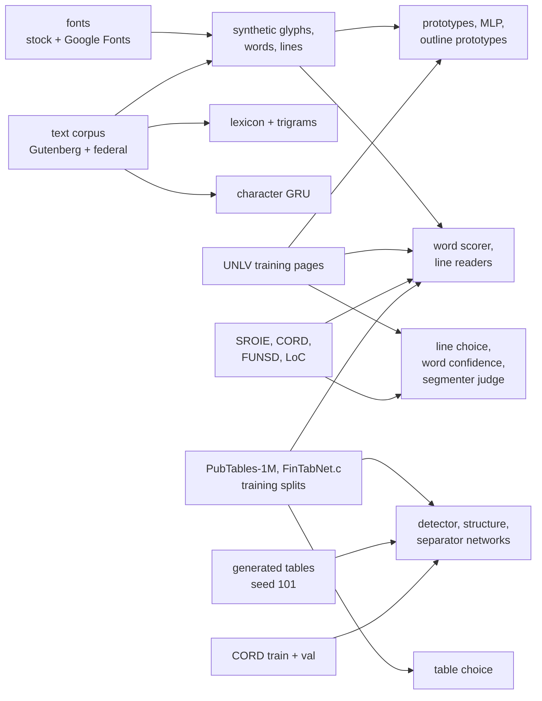

# Data sources: what the engine learns and is measured on, where to get it, where to put it

Every model in mlws-ocr is trained here, and every number in the README is
measured here, from data anyone can obtain. This page lists each source:
what it is, its licence, where to download it, where it goes under
`data/`, which scripts prepare it, and what it is used for. None of it is
in the repository: `data/` is gitignored, and each dataset keeps its own
licence (the repository's MIT licence covers the code, the documents and
the released model files — README, *Licence*).

If you only want to **run** the engine, you need one thing: the released
models.

```sh
.venv/bin/python scripts/fetch_models.py        # the models for this version, SHA-256 checked, into data/
```

Everything else below is for **measuring** (the evaluation sets) or
**retraining** (the training data).

Contents

1. [The released models](#1-the-released-models)
2. [The layout of `data/`](#2-the-layout-of-data)
3. [Scanned and photographed documents](#3-scanned-and-photographed-documents) — UNLV/ISRI, SROIE, FUNSD, CORD, Library of Congress
4. [Tables](#4-tables) — FinTabNet.c, PubTables-1M, the generated table sets
5. [Text](#5-text) — Project Gutenberg, US federal text, the system word list
6. [Fonts](#6-fonts) — the pinned stock, Google Fonts
7. [Generated document sets](#7-generated-document-sets) — modern, business, tables
8. [Tesseract, for comparison](#8-tesseract-for-comparison)
9. [Which data feeds which model](#9-which-data-feeds-which-model)
10. [Which data each evaluation row reads](#10-which-data-each-evaluation-row-reads)
11. [Keeping evaluation data out of training](#11-keeping-evaluation-data-out-of-training)

---

## 1. The released models

| | |
|---|---|
| what | every live model file (`.npz` networks and tables, `.json` confusion tables), with a manifest of what each is and its SHA-256 |
| where from | the repository's GitHub releases: `mlws-ocr-models-v<version>.tar.gz` + `models-manifest.json` |
| licence | MIT, as the code |
| get it | `.venv/bin/python scripts/fetch_models.py` (the version in `pyproject.toml`; `--tag vX.Y.Z` for another, `--dest DIR` elsewhere) |
| lands in | `data/*.npz`, `data/*.json`, flat |
| made by | `scripts/release_models.py --version X --out dist/` (the `MODELS` list in that script is the bundle's contents) |

The manifest records what each file *is* (its recipe, from
[NETWORKS.md](NETWORKS.md)), so a downloaded set is never anonymous
weights. The fetch refuses a bundle whose checksum or member list does not
match the manifest.

## 2. The layout of `data/`

```
data/
├── *.npz, *.json              the released models (§1)
├── unlv/<set>/                UNLV/ISRI scans with truth: bus.3B, legal.3B, mag.3B, news.3B, bus.3A, news.4B
├── raw/                       downloads, as they came
│   ├── sroie/                 git clone of the corrected SROIE mirror
│   ├── funsd/dataset/         FUNSD, unzipped
│   ├── cord/                  CORD parquet + one PNG/JSON per receipt
│   ├── fintabnet/             FinTabNet.c-Structure archive and its unpacked tree
│   ├── pubtables1m/           PubTables-1M evaluation archives, x/ unpacked, structure/ links
│   └── payroll_form/          the blank WH-347 form (PDF)
├── ext/<set>/{eval,harvest}/  external sets converted to <stem>.tif + <stem>.txt
├── tables/<set>/              table evaluation sets: <name>.png + <name>.table.html
├── tables_train/<template>/   generated table pages for training (seed 101)
├── modern/                    modern set: src/ (the PDFs), sev0..2/ (pages)
├── business/                  generated business set, sev0..2/
├── corpus_en/, corpus_en_modern/, corpus_en_plus/    text corpora
├── lines_*.npz, linesfull_*.npz, seq_synth_*.npz     reader training data (harvested or rendered)
├── sep_*.npz, split/, det_*.npz                      table-network training data
└── blocks/                    cached block-segmentation truth
```

Evaluation scripts take a directory, so a set can live anywhere; these are
the places the documentation's command lines use.

## 3. Scanned and photographed documents

### UNLV/ISRI OCR test collection

| | |
|---|---|
| what | 1990s bitonal scans with verified ground-truth text and zone files: business letters (`bus`), legal pleadings (`legal`), magazines (`mag`), newspapers (`news`) — the collection behind the ISRI annual OCR tests |
| used for | the headline evaluation rows (dev-8, broad-30, legal-8, news-8, mag-8, the held-out rows, blocks); and, from pages **no evaluation uses**, glyph harvests (prototypes, MLP), word and line strips (the readers), and the fitted judges |
| licence | © 1996 Regents of the University of Nevada; research use (see each set's `README`); not redistributed here |
| where from | the ISRI OCR evaluation tools' data on SourceForge: <https://sourceforge.net/projects/isri-ocr-evaluation-tools-alt/files/> (tooling: <https://github.com/eddieantonio/ocreval>) |
| get it | `sh scripts/fetch_unlv_testdata.sh` fetches `bus.3B`, `mag.3B`, `news.3B`. `legal.3B`, `bus.3A` and `news.4B`, which the engine also uses, come from the same ISRI collection; no script fetches them yet |
| lands in | `data/unlv/<set>/<n>/<page>.tif` with `<page>.txt` (truth) and `<page>.uzn` (zones); a set's `README`, `pages` and `PAGES_*` index files at its top |

The evaluation harness pairs every `*.tif` with the same-stem `.txt`; the
zone files are needed for the held-out pools and the block evaluation.

### SROIE (ICDAR 2019 scanned receipts)

| | |
|---|---|
| what | 626 scanned till receipts with line boxes and transcripts (the corrected mirror) |
| used for | the `sroie` evaluation row (60 receipts); training lines for the readers (`linesfull_sroie.npz`, grey SROIE lines); line-choice pairs |
| licence | the images the competition's (research use); the mirror's corrections MIT |
| where from | <https://github.com/zzzDavid/ICDAR-2019-SROIE> |
| get it | `git clone https://github.com/zzzDavid/ICDAR-2019-SROIE data/raw/sroie` |
| prepare | `.venv/bin/python scripts/make_external_sets.py --sroie data/raw/sroie/data --out data/ext` (a seeded 60 to `eval`, the rest to `harvest`) |
| lands in | `data/raw/sroie/data/{img,box,key}/`; `data/ext/sroie/{eval,harvest}/<stem>.tif + .txt` |

### FUNSD (forms)

| | |
|---|---|
| what | 199 scanned forms from the tobacco-industry document archive (an RVL-CDIP subset), word boxes grouped into entities; about 72 dpi |
| used for | the `funsd` evaluation row (the 50 official test forms at 2×); training lines for the readers (`linesfull_funsd.npz`) |
| licence | non-commercial research |
| where from | the FUNSD page, <https://guillaumejaume.github.io/FUNSD/> (G. Jaume, H. K. Ekenel & J.-P. Thiran, ICDAR-OST 2019) |
| get it | download `dataset.zip` from that page; unzip into `data/raw/funsd/` |
| prepare | `.venv/bin/python scripts/make_external_sets.py --funsd data/raw/funsd/dataset --funsd-scale 2 --out data/ext` |
| lands in | `data/raw/funsd/dataset/{training_data,testing_data}/{images,annotations}/`; `data/ext/funsd/{eval,harvest}/` |

### CORD v2 (photographed receipts)

| | |
|---|---|
| what | 1,000 Indonesian shop and restaurant receipts photographed on phones, word quadrilaterals and line-item labels; train 800 / validation 100 / test 100 |
| used for | the `cord` text row (the 100 test receipts cut to the receipt); the "real receipts" table set (line items as the table); training lines for the readers; receipts for the separator, structure and detector networks (train and validation only) |
| licence | CC BY 4.0 |
| where from | <https://huggingface.co/datasets/naver-clova-ix/cord-v2> |
| get it | `.venv/bin/python scripts/fetch_cord.py --out data/raw/cord` (needs `pip install pyarrow` once, to read the parquet files) |
| prepare | text sets: `scripts/make_external_sets.py --cord data/raw/cord`; table set: `scripts/import_table_sets.py cord --src data/raw/cord/parquet --out data/tables/cord` |
| lands in | `data/raw/cord/parquet/*.parquet`, `data/raw/cord/{train,validation,test}/<split>_<id>.png + .json`; `data/ext/cord/{eval,evalcrop,harvest}/`; `data/tables/cord/cord_test_<k>.png + .table.html` |

### Library of Congress "By the People" transcriptions

| | |
|---|---|
| what | the Library of Congress crowdsourced transcription package: a CSV of 434,006 completed pages (2026-08-28), each with its image URL and a reviewed transcription |
| used for | the `legal reports` evaluation row (40 pages of the "Historical Legal Reports" campaign; a disjoint 100-page draw too); training lines from other pages of that campaign and of two others (NAWSA, the Rumor project); probe sets (Early Copyright, Federal Theatre playbills) |
| licence | public domain |
| where from | the Library's item page, <https://www.loc.gov/item/2026395156/> (download the comprehensive CSV) |
| prepare | `.venv/bin/python scripts/make_btp_set.py --csv <the CSV> --campaign "Historical Legal Reports" --n 40 --out data/ext/btp_legal/eval` (the page images are fetched from the CSV's URLs, politely; `--exclude-dir` keeps a draw disjoint from earlier ones) |
| lands in | `data/ext/btp_legal/{eval,eval100,harvest,harvest2/shard0N}/<AssetId>.tif + .txt`; `data/ext/btp_{nawsa,rumor}/harvest/`; `data/ext/btp_{copyright,playbills}/eval/` |

## 4. Tables

### FinTabNet.c (tables from annual reports)

| | |
|---|---|
| what | table crops from S&P 500 annual reports with rows, columns, spanning cells, header and word boxes (the corrected FinTabNet); rendered at 72 dpi |
| used for | the "annual-report tables" evaluation set (60 of a 300-table sample); training tables for the separator and structure networks; validation tables for the table choice; table lines for the table reader |
| licence | CDLA-Permissive 2.0 (B. Smock, R. Pesala & R. Abraham, ICDAR 2023; from FinTabNet, X. Zheng et al., WACV 2021) |
| where from | <https://huggingface.co/datasets/bsmock/FinTabNet.c> (`FinTabNet.c-Structure.tar.gz`, about 3.2 GB) |
| get it | download it into `data/raw/fintabnet/` and unpack there |
| prepare | `.venv/bin/python scripts/import_table_sets.py fintabnet --src data/raw/fintabnet/FinTabNet.c-Structure --names scripts/sets/fintabnet_sample300.txt --out data/tables/fintabnet` |
| lands in | `data/raw/fintabnet/FinTabNet.c-Structure/{train,val,test}/*.xml`, `images/*.jpg`, `words/*_words.json`; `data/tables/fintabnet/<name>.png + .table.html` |
| measure | `scripts/eval_tables.py data/tables/fintabnet --pages 60 --doc-type table --config configs/neural-table.toml --set output.ws_table_doc_types=table --set magnify.min_dpi=150` |

`scripts/sets/fintabnet_sample300.txt` is the sample the evaluation set is
drawn from (300 test tables, half with spanning cells).

### PubTables-1M (tables from scientific papers)

| | |
|---|---|
| what | PubMed Central pages with table boxes (the detection split) and cropped tables with row, column and spanning-cell truth (the structure split) |
| used for | the "scientific tables" evaluation set (60 crops of a 300-table sample) and the page-level detection F1 (40 test pages); training pages for the detector and tables for the structure network; table lines for the table reader |
| licence | CDLA-Permissive 2.0 (B. Smock, R. Pesala & R. Abraham, CVPR 2022) |
| where from | <https://huggingface.co/datasets/bsmock/pubtables-1m> |
| get it | `sh scripts/fetch_pubtables.sh` — the eight evaluation archives (about 8 GB), unpacked into `x/`, with the `structure/` links the importer reads |
| prepare | `.venv/bin/python scripts/import_table_sets.py pubtables --src data/raw/pubtables1m/structure --names scripts/sets/pubtables_sample300.txt --out data/tables/pubtables` |
| lands in | `data/raw/pubtables1m/x/PubTables-1M-*/`, `data/raw/pubtables1m/structure/{test,images,words}`; `data/tables/pubtables/<name>.png + .table.html` |
| measure | `scripts/eval_tables.py data/tables/pubtables --pages 60 --doc-type table --config configs/neural-table.toml --set output.ws_table_doc_types=table`; `scripts/eval_detection.py data/raw/pubtables1m/x --pages 40 --config configs/neural-table.toml` |

The **training** archives (hundreds of GB of pages) are on the same mirror;
they were fetched only on the GPU machine that trained the table networks,
and the data makers read them from any path
(`make_det_data.py pubtables --src <dir>`, `make_split_data.py pubtables --src <dir>`).

### The generated table sets

Payroll forms, paystubs, invoices, timesheets and receipts, drawn by the
project itself with exact nested truth — see §7.

### The screenshot set

`data/tables/screens`: 80 tables as a screen shows them. Real structures and
text — the HTML truth of 40 FinTabNet.c and 40 PubTables-1M test tables
already in `data/tables/` — drawn as web pages in six styles (plain, a light
grid, zebra stripes, dark mode, a coloured header, spreadsheet gridlines) and
captured by headless Chrome at 96 and 192 dpi; the truth is exactly the HTML
drawn. Made by `scripts/make_screen_set.py --n 80` (needs Google Chrome).
Measured with `eval_tables.py data/tables/screens --pages 80 --doc-type table
--config configs/neural-table.toml --set output.ws_table_doc_types=table`.

## 5. Text

### Project Gutenberg (public-domain books)

| | |
|---|---|
| what | five English novels: Gutenberg ebooks 1342 (*Pride and Prejudice*), 1661 (*The Adventures of Sherlock Holmes*), 2701 (*Moby Dick*), 84 (*Frankenstein*), 98 (*A Tale of Two Cities*); German, French, Spanish and Italian books for the other languages' lexicons |
| used for | the lexicon and trigrams (`lang_en.npz`), the character GRU (`gru_en.npz`), and the words the synthetic training lines spell |
| licence | public domain (in the US) |
| where from | <https://www.gutenberg.org/ebooks/1342> and so on — the "Plain Text UTF-8" file of each |
| lands in | `data/corpus_en/<id>.txt` (other languages: `data/corpus_<lang>/g<id>.txt`); the Gutenberg header and licence footer are stripped by the builders |

### US federal text

| | |
|---|---|
| what | House bills of the 118th Congress and six Federal Register issues, tags stripped |
| used for | modern vocabulary in the lexicon, the character model and the synthetic lines |
| licence | public domain (17 U.S.C. §105) |
| where from | <https://www.govinfo.gov/bulkdata> |
| get it | `sh scripts/fetch_modern_corpus.sh` (into `data/corpus_en_modern/`) |

Then the union the language models are built from:

```sh
mkdir -p data/corpus_en_plus && cp data/corpus_en/*.txt data/corpus_en_modern/*.txt data/corpus_en_plus/
.venv/bin/python scripts/build_langmodel.py data/corpus_en_plus data/lang_en.npz
.venv/bin/python scripts/train_charlm.py --corpus data/corpus_en_plus
```

### The system word list

`build_langmodel.py` also merges `/usr/share/dict/words` (present on macOS
and most Linux systems) into the lexicon unless given `--no-dict`.

## 6. Fonts

| | |
|---|---|
| the pinned stock | named body faces (Arial, Courier New, Georgia, Trebuchet, Avenir Next, Geneva and others; `factory/stock.py`), found in the system font directories (`factory/fonts.py`: `/System/Library/Fonts`, `/Library/Fonts`, `/usr/share/fonts`, `~/Library/Fonts`, `~/.fonts`). Two faces (Verdana, Tahoma) are held out for the synthetic test. Used for glyph renders (prototypes, MLP, outline prototypes) and the generated pages |
| Google Fonts | the open-font collection (OFL): <https://github.com/google/fonts> (the `ofl/` tree; a sparse checkout is enough). Any directory works — pass it as `--font-dirs`. 3,179 faces pass the shape gate. Used for the synthetic windows the readers train on: `make_seq_data.py --no-stock --font-dirs /path/to/fonts --out data/seq_synth_gfonts_v1.npz --n 250000` |
| extra classes | `MLWS_EXTRA_CLASSES='*=+@[]_`'` in the environment adds those characters to the alphabet of every render and training run (how the v0.15 reader learned them) |

## 7. Generated document sets

The project draws some of its own test documents, with truth exact by
construction. All of them can be regenerated from their seeds, and the
images are the project's own to publish.

| set | script | lands in | notes |
|---|---|---|---|
| modern | `scripts/make_modern_set.py` | `data/modern/sev{0,1,2}/` | pages of five US House bills and a Federal Register issue (PDFs from <https://www.govinfo.gov>, placed in `data/modern/src/` as `bill-*.pdf`, `fr-2024-03-15.pdf`), plus templated letters, invoices and payslips; needs poppler (`pdftoppm`, `pdftotext`) |
| modern training pages | `scripts/make_modern_train.py` | `data/modern_train/` | other pages of the Federal Register issue |
| business | `scripts/make_business_set.py` (seed 11) | `data/business/sev{0,1,2}/` | invoices, payslips, receipts, statements, purchase orders at three degradation levels; seed 101 → `data/business_train`, seed 303 → `data/business_heldout` |
| tables | `scripts/make_table_set.py --template {payroll_form,paystub,invoice,timesheet,receipt} --n 40 --seed 1 --out data/tables/<template>` (`--styles` picks the rule styles) | `data/tables/<template>/<name>.png, .table.html, .txt, .json` | five rule styles from full grid to whitespace; seed 101 → `data/tables_train/` for training. The payroll form fills a blank US Department of Labor WH-347 (public domain; a fillable copy published by the Texas Department of Housing and Community Affairs), placed at `data/raw/payroll_form/wh347_tx.pdf` |

## 8. Tesseract, for comparison

| | |
|---|---|
| what | the reference engine the README compares against: legacy (`--oem 0`) and LSTM (`--oem 3`, Tesseract 5.5.3, default English model) |
| get it | a `tesseract` binary on the `PATH` (Homebrew's is LSTM-only); for the legacy engine, `eng.traineddata` from <https://github.com/tesseract-ocr/tessdata> (it carries both engines), and `TESSDATA_PREFIX` pointing at its directory |
| measure | `TESSDATA_PREFIX=/path/to/tessdata .venv/bin/python scripts/eval_tesseract.py data/unlv/bus.3B --pages 30 --seed 2 --oem 0` |

## 9. Which data feeds which model



| model | trained from |
|---|---|
| prototypes, outline prototypes, MLP | glyphs rendered from the font stock, and glyphs harvested from UNLV training pages with their truth |
| lexicon, trigrams, character GRU | the text corpus (+ the system word list for the lexicon) |
| word-strip scorer | synthetic word windows (stock and Google Fonts) + real word strips from UNLV training pages |
| line readers | synthetic lines + real lines from UNLV, SROIE, CORD, FUNSD, Library of Congress pages; the table reader also table lines from PubTables-1M and FinTabNet.c training crops |
| line-choice judge, word-confidence calibrator | readings of UNLV training pages and receipts, labelled by their truth |
| segmenter judge | UNLV training-pool newspaper and magazine pages |
| separator network | drawn tables + FinTabNet.c training tables + CORD receipts |
| structure network | PubTables-1M and FinTabNet.c training tables + drawn tables + generated business tables + CORD receipts |
| detector | PubTables-1M detection training pages + generated business pages + CORD receipts |
| table choice | FinTabNet.c validation tables + PubTables-1M training tables the structure network never saw |

The recipes and command lines are in [NETWORKS.md](NETWORKS.md); the
network shapes in [NEURAL_NETWORK_THEORY.md](NEURAL_NETWORK_THEORY.md).

## 10. Which data each evaluation row reads

Always pass `--config` (the evaluation scripts default to the classic
pipeline) and name the profile with any figure you report.

| README row | directory | command |
|---|---|---|
| dev-8 | `data/unlv/bus.3B` | `eval_unlv.py data/unlv/bus.3B --pages 8 --seed 1 --doc-type letter` |
| broad-30 | `data/unlv/bus.3B` | `eval_unlv.py data/unlv/bus.3B --pages 30 --seed 2 --doc-type letter` |
| legal-8 | `data/unlv/legal.3B` | `eval_unlv.py data/unlv/legal.3B --pages 8 --seed 1 --doc-type legal` |
| news-8, mag-8 | `data/unlv/news.3B`, `mag.3B` | `--pages 8 --seed 1 --doc-type newspaper` / `magazine` |
| held-out newspapers, magazines, letters | `data/unlv/news.3B`, `mag.3B`, `bus.3B` | `eval_unlv.py <set> --heldout` (and `eval_tesseract.py --heldout` for the same pages) |
| modern | `data/modern/sev0..2` | `eval_unlv.py data/modern/sevN --pages 59 --by-kind` |
| business | `data/business/sev0` | `eval_unlv.py data/business/sev0 --pages 60 --seed 1 --by-kind` |
| sroie, funsd, legal reports, cord | `data/ext/sroie/eval` (60), `data/ext/funsd/eval` (50), `data/ext/btp_legal/eval` (40), `data/ext/cord/evalcrop` (100) | `eval_unlv.py <dir> --pages <all of them>` (the default is 10) |
| blocks | the zones of broad-30 | `eval_blocks.py truth data/unlv/bus.3B --pages 30 --seed 2`, then `eval_blocks.py score …` |
| payroll forms, paystubs, invoices, timesheets, receipts | `data/tables/<set>` | `eval_tables.py data/tables/<set> --pages 20 --whole-page --config configs/neural-table.toml` |
| real receipts | `data/tables/cord` | `eval_tables.py data/tables/cord --pages 30 --config configs/neural-table.toml` |
| annual-report tables, scientific tables | `data/tables/fintabnet`, `data/tables/pubtables` | §4 |

## 11. Keeping evaluation data out of training

A model that has seen an evaluation page scores itself. The project keeps
them apart three ways:

- **UNLV**: the harvest scripts refuse every page any evaluation draws
  (`harvest_glyphs.py: eval_pages_set()` — the seeded draws of every set),
  and the held-out pools exclude the tuning and training draws.
- **External sets**: each is split once into `eval` and `harvest`
  directories; the line harvest takes `--eval-dir` and refuses those stems;
  the Library of Congress draws take `--exclude-dir`.
- **Tables**: the networks train on the datasets' **training** splits; the
  evaluation sets are drawn from the **test** splits (FinTabNet.c,
  PubTables-1M, CORD) or from a different seed (the generated sets: 1 for
  evaluation, 101 for training).
