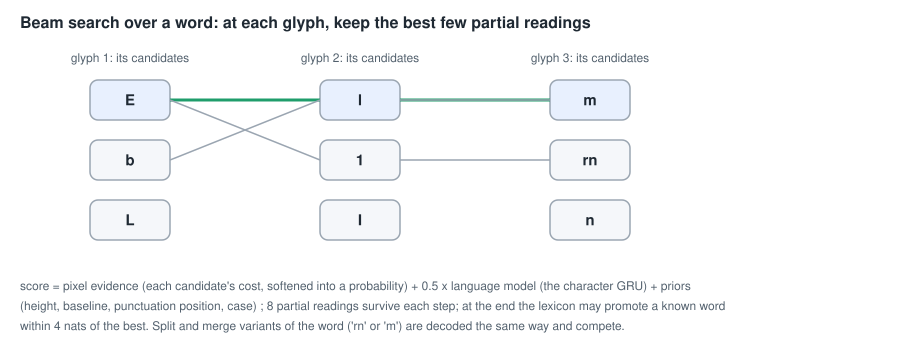
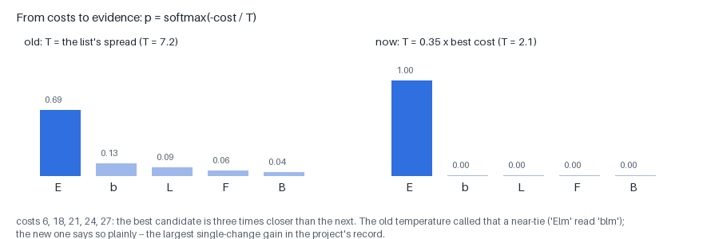
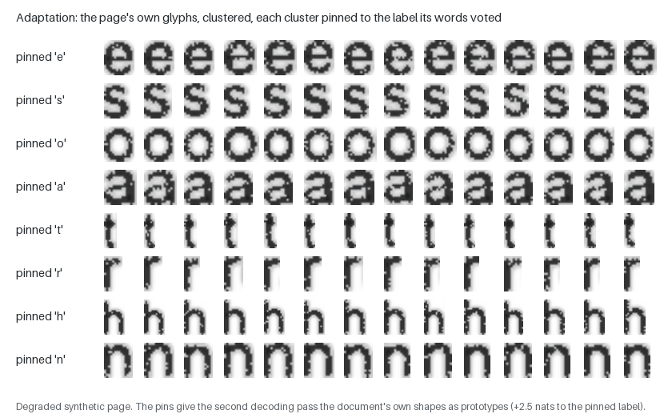
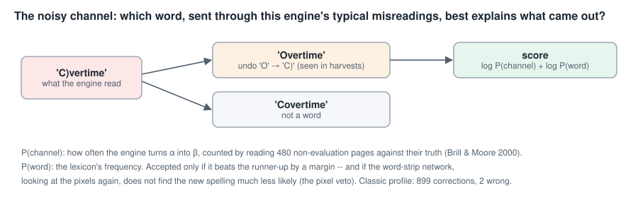

# Decoding: from candidates to words, adapting to the page, correcting what is left

The recognizer hands over, for every glyph, a ranked list of possible
characters with costs ([RECOGNITION.md](RECOGNITION.md)). **Decoding** turns
those lists into words: it chooses one candidate per glyph — and one of the
cut and merge alternatives where segmentation was unsure — so that the
result looks like the pixels *and* like language. Then the engine
**adapts**: it learns this document's own letter shapes from the words it is
confident of, and decodes again. Finally a **corrector** repairs words that
are still not words, using a model of the engine's own typical misreadings.

This page walks through all three, and through the neural line reader that
reads each line a second way and the small judge that picks between the
readings.

- Code: `decode/beam.py` (the beam decoder), `decode/segment.py` (words in a
  line), `lang/model.py`, `lang/gru.py` (the language models),
  `decode/formats.py` (numbers, dates, money), `decode/postpass.py` (case,
  hyphenation), `decode/seqterm.py` (the word-strip network's terms),
  `decode/lineread.py` (the line reader), `decode/linechoice.py` (the judge),
  `decode/wordconf.py` (word confidence), `adapt/cluster_refit.py`
  (adaptation), `decode/correct.py` (the corrector).
- Order in the pipeline: `recognize → decode → adapt → decode → correct →
  output`.
- Figures: `scripts/make_page_figures.py --only decode`.

---

## 1. Words in a line

First the line is cut into words (`decode/segment.py`). The gaps between
glyphs come in two sizes — letter gaps and word spaces — so the decoder
splits them into two groups (a one-dimensional 2-means) and cuts at the
larger ones, measured against the line's **x-height** (the height of an 'x':
the size of the type). A gap that falls between the two sizes is left
**uncertain**, and the decoder tries the word both ways, keeping a split only
if every part it makes is a known word or a valid number — "because every
extra word resets the language model's context, so shredding always wins
locally".

## 2. The beam decoder

Within a word, the decoder searches over one candidate per glyph
(`decode/beam.py`). There are too many combinations to try them all — 14
candidates for each of 8 glyphs is 1.5 billion — so it keeps a **beam**: after
each glyph, only the 8 best partial readings survive, each extended by every
candidate of the next glyph and scored again. (Wider beams, 16 or 24,
measured slightly worse: they surface readings the language model likes and
the pixels do not.)

**The score** of a partial reading is a sum of log-probabilities:

- **Pixel evidence.** Each candidate's cost becomes a probability by a
  softmax, `p ∝ exp(−cost / T)`. The temperature `T` decides how seriously the
  costs are taken:

  

  With `T` set to the spread of the list, a candidate three times closer than
  the next counted as a near-tie, and the language model overruled the
  pixels ("Elm" read "blm"). With `T` = 0.35 × the best candidate's cost, it
  counts as decisive. This one change was "the largest single-change gain in
  the project's record": legal pages 86.4 / 69.3 → 90.3 / 78.5 character /
  word accuracy.

- **Language.** 0.5 × the log-probability of the next character given the
  ones before, from the **character GRU** (a recurrent network trained on
  2.4 million words of public-domain text; it carries one state per partial
  reading, so extending a reading is one step) or, in the pure profile, a
  character trigram model. See [NEURAL_NETWORK_THEORY.md §B](NEURAL_NETWORK_THEORY.md).

- **Priors from geometry.** A glyph's position tells what it can be:
  - **height** — a glyph much taller than the x-height is a capital, a digit
    or an ascender letter ('b', 'd', 'h'), and a short one is not;
  - **descenders** — a glyph that reaches below the baseline is 'p', 'y',
    'g'… not 'P' or 'Y' (p→D had happened 144 times);
  - **punctuation position** — '.' sits on the baseline, ',' hangs below it,
    '-' floats in the middle, ' and " float high;
  - **parts** — 'i', 'j', ':', ';' and accented letters are two pieces;
  - **slant** — '/' leans where 'l' does not.

- **Case and look-alikes.** Letters that differ only by size (c o s u v w x
  z, and 1/l) are both kept in play and decided by height; pairs the
  recognizer often confuses (n/h, c/e, o/e) are added as candidates with a
  small penalty. A case change inside a word costs 1.5 (except after the
  first letter: "Word").

**Digit mode.** A token whose glyphs look mostly like digits is decoded as a
number: the language model is switched off (it knows words, not prices),
digits and number punctuation (`$ . , / - : % ( )`) get a bonus, and letters
with a digit twin ('O'/'0', 'l'/'1', 'S'/'5') yield to it. Deciding this *after*
a word-mode reading fails to be a known word — not before — stopped "so"
becoming "50" (letters 91.1 / 76.4 → 91.7 / 77.9).

**The lexicon.** At the end of a word, if the best reading is not a word,
the decoder looks at the other readings within 4 nats of it; a known word
among them can win, with a bonus that grows with how common it is. The
lexicon is 844,000 forms: the 30,000 most frequent words of the corpus with
their frequencies, the system word list, and regular inflections (none of a
sample of 3,000 dictionary words had its plural).

**Numbers, dates, money.** A token matching a numeric format — ZIP code,
phone number, date, year, amount with thousands separators, percentage,
masked card number — is endorsed like a word (`decode/formats.py`). An early
version folded "is a number" into "is a word" and lost 3.4 word points on
invoices: "a boolean that means two things will be wrong for one of them".

**Segmentation variants.** Where the recognizer offered cuts ('rn' as one
glyph or two) or merges (a broken letter), each variant of the word is
decoded and they compete; a variant that is a known word or valid number
gets a bonus, and a cut that adds a character pays a small charge so that
shredding does not win by default.

## 3. Cleaning up the words

After every line (`decode/postpass.py`):

- **Line case** — whether ambiguous letters (c o s u…) are capitals is
  decided by the line's unambiguous letters: in "PAYMENT DUE" an 's' is 'S'.
- **Sentence case** — a capital at a sentence start, a lower-case common word
  mid-sentence, when the document itself capitalises that way.
- **Mixed letters and digits** — '0f' → 'of' when that makes a word;
  '482D2' → '48202' between digits.
- **Hyphenation** — a line-final "manu-" joined to "facturing" when the
  joined word is known.
- **Shapes** — "2 e 2.72" → "2 @ 2.72" on a receipt's quantity line; digits
  spaced by kerning joined.

## 4. The neural readers

In the neural profiles two networks join the decoder
([NEURAL_NETWORK_THEORY.md §C](NEURAL_NETWORK_THEORY.md)):

- **The word-strip scorer** re-scores each word's variants by how likely the
  word's own pixels make each spelling, and may add its own reading when
  that reading is a known word and much more likely (by 3 nats). Adopted as
  "the largest word-accuracy gain in the project's record" at the time:
  letters 91.7 / 81.4 → 92.8 / 85.0.
- **The line reader** reads each whole line end to end, with a lexicon bonus
  inside its own CTC beam search (+1.5 nats for a known word, −0.5 for an
  unknown one), and a **judge** decides per line which reading to keep — a
  logistic regression over 15 pieces of evidence (how many words each
  reading makes that are known, how confident each is, how much they agree,
  how likely the reader finds each). The judge exists because the reader's
  own likelihood "prefers its own reading by construction". The reader
  decides the spaces itself, and once in a while runs two words together
  across a wide gap — in a table, across the gap between two columns, which
  then merge. In the table profile, wherever the strip is empty for 1.2
  x-heights or more between two characters the reader joined, a space goes
  in (`line_gap_split`; PubTables-1M 0.779 → 0.787): a word space is about
  half an x-height, a column gap several.

The judge's history holds a lesson worth repeating: until 2026-09-18 a chain
of `if` / `elif` fell through, and the judge never decided a single line.
Fixed, letters rose 97.0 / 93.4 → 97.4 / 94.5. "A configuration value must be
shown to change an output before its adoption row is written."

Every word also gets a calibrated **probability of being right**
(`decode/wordconf.py`, a logistic regression over 16 features): keeping the
words above 0.9 keeps 91% of them at 97.8% accuracy. It is written to the
hOCR (`x_wconf`) for a reviewer, and never changes the text.

## 5. Adaptation: the page teaches the engine its own font

Every document has one or a few typefaces and one scanner, and it repeats
each letter many times. After the first decoding pass, `adapt.cluster_refit`
uses that:

1. **Cluster** the page's glyphs by their 95 features (z-scored within the
   page; average-linkage clustering). On clean synthetic pages the clusters
   are 100% pure.
2. **Vote**: each cluster of three or more glyphs takes the label its
   members were read as, weighted by how confident their words were; the
   winner must have 70% of the vote and must appear in the members'
   candidate lists.
3. **Pin**: each glyph in a voted cluster is pinned to the label — a
   **hint**, +2.5 nats to that candidate in the next pass, not a rewrite.
4. **Refit**: the labelled glyphs become extra prototypes for this document
   only; every other glyph's candidates are merged with its distances to
   them (rescaled to the universal prototypes' scale).

Then the decoder runs again. Two rules keep pins honest: a pin asserts a
shape, not a case (for letters that differ only in size, the glyph's height
decides 'c' or 'C'), and a comma pin follows position (a high comma is an
apostrophe: "you,ll" → "you'll"). Numbers ignore letter pins ("1993" had
become "l993" from an 'l' cluster).

**Pins are double-edged.** On a study of real letters, 73% of the remaining
errors carried a pin to the wrong letter — yet every way of weakening pins
(fewer, weaker, stricter votes) measured worse: "pins repair far more than
they break". Adapting a second time gains nothing: adaptation converges in
one pass. Tesseract's legacy engine has the same idea, a second classifier
trained on the document's confident words; here the prototypes themselves
are refit.

## 6. The corrector: a model of the engine's own mistakes

What is left after decoding is, in the classic engine, mostly words with a
character or two misread in a characteristic way — 'rn' read as 'm', 'O' as
'C)'. The **noisy-channel corrector** (`decode/correct.py`; Brill & Moore,
2000) treats the engine as a noisy channel that turns intended words into
what it read, and asks which intended word best explains the output:

- **The channel** is learned: the engine reads 480 pages no evaluation
  uses, its output is aligned with the truth, and every short substitution
  (up to two characters each way) is counted — for the classic engine 3,219
  distinct edits, such as rn→m (43 times) and O→C) (10).
- **Candidates**: undo up to three such edits in an unknown word; keep the
  ones that are known words.
- **Score**: log P(the engine's edits) + log P(the word) from the lexicon's
  frequencies. A correction is accepted only if it beats the runner-up by a
  margin — and if the word-strip network, re-reading the pixels, does not
  find the new spelling much less likely than the old (the **pixel veto**).

In the classic profile it made 899 corrections over eight evaluation sets,
two of them wrong ("C)vertime" → "Overtime" is one it now makes). In the
neural profile it is switched off: the line reader makes almost none of the
split-glyph errors it repairs — "the size of its gain is the size of that
error class in the engine: large for the classic engine, a rounding error for
the line reader".

## 7. What comes out

The output stage assembles the words into text and hOCR, and drops lines
that are not text: a margin column of line numbers on a legal pleading, a
strip of the facing page on a book or magazine scan, and "garbage" lines —
no known word, low confidence and a degenerate shape (one character
repeated, or a flood of single letters) — unless the line holds numbers,
which no lexicon can vouch for.

## 8. Compared with Tesseract

| | Tesseract | this engine |
|---|---|---|
| language | word lists (DAWGs) with number and punctuation patterns, a frequency prior | lexicon with frequencies, character GRU, numeric formats ("our permuters") |
| search | best-first over the segmentation graph, per word | a beam over split / merge variants, per word |
| adaptation | a second classifier trained on the document | the document's glyphs clustered, pinned and refit |
| two readers | the LSTM *replaces* the legacy engine | the line reader runs *beside* the classic decoder, and a judge picks per line |
| confidence | classifier distances | a fitted probability per word |

## References

- R. Smith, "An overview of the Tesseract OCR engine", ICDAR 2007.
- E. Brill & R. C. Moore, "An improved error model for noisy channel
  spelling correction", ACL 2000.
- K. Kukich, "Techniques for automatically correcting words in text", ACM
  Computing Surveys 24(4), 1992.
- X. Tong & D. A. Evans, "A statistical approach to automatic OCR error
  correction in context", WVLC 1996.
- A. Graves, *Supervised Sequence Labelling with Recurrent Neural
  Networks*, 2012 (§7.3: prefix beam search with a language model);
  A. Hannun et al., "First-pass large vocabulary continuous speech
  recognition using bi-directional recurrent DNNs", 2014.
- K. Cho et al., "Learning phrase representations using RNN encoder-decoder
  for statistical machine translation" (the GRU), EMNLP 2014.
- J. C. Platt, "Probabilistic outputs for support vector machines", 1999
  (calibrated probabilities).
