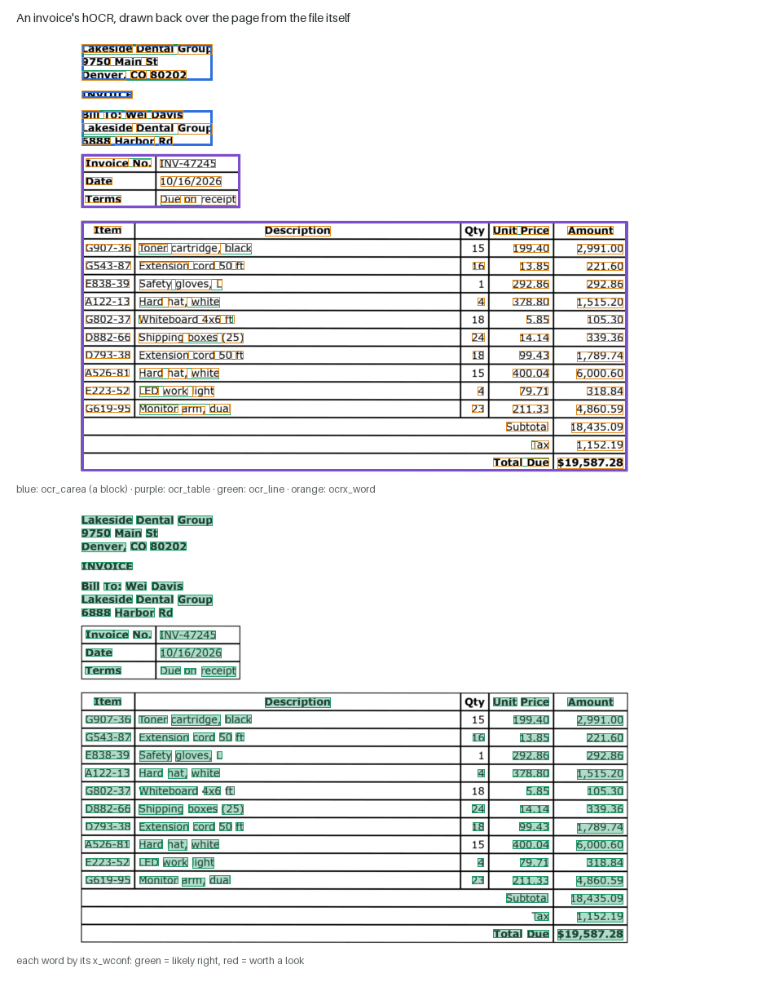

# hOCR: the page's text with its geometry

Plain text says *what* the page says. **hOCR** says what it says **and where**:
every block, line and word with its box on the page, each word with a
confidence, tables with their cells, pictures and rules with their places.
It is what a program needs to build a searchable PDF, highlight a word on
the scan, send doubtful words to a person, or pull a field out of a form by
position.

This page explains the format, exactly what this engine writes into it, how
to read it, and what to watch for.

- Code: `decode/output.py` (`hocr_document`), written by the `output` stage.
- A complete example, one generated invoice:
  [img/hocr/sample.hocr](img/hocr/sample.hocr) (drawn below).
- Related: [TABLES.md](TABLES.md) (the table records hOCR's tables come
  from), [DECODING.md](DECODING.md) (where the words and their confidences
  come from), [ARCHITECTURE.md](ARCHITECTURE.md).

---

## 1. What hOCR is

hOCR (Breuel, 2007) is not a new file format but a **convention inside
HTML**: an ordinary XHTML page whose elements carry OCR meaning in their
`class` and geometry in their `title`. Because it is HTML, a browser opens
it, any HTML or XML parser reads it, and it can carry anything HTML can.

```html
<span class="ocr_line" id="line_1_1" title="bbox 229 233 682 269; baseline 0 -9; x_xheight 19.8">
  <span class="ocrx_word" id="word_1_1_1" title="bbox 229 233 403 261; x_wconf 100; x_conf 100.0">Lakeside</span>
  <span class="ocrx_word" id="word_1_1_2" title="bbox 419 233 546 262; x_wconf 98; x_conf 54.7">Dental</span>
</span>
```

- **`class`** names what the element is: `ocr_page`, `ocr_carea` (a content
  area — a block), `ocr_par`, `ocr_line`, `ocrx_word`, `ocr_table`,
  `ocr_photo`, `ocr_separator`, and others the specification defines.
- **`title`** holds **properties**, separated by semicolons. The one every
  element has is **`bbox x0 y0 x1 y1`**: the element's box in pixels,
  from the top-left corner of the page image (x to the right, y down).
- The page's `<head>` says which classes the file uses
  (`ocr-capabilities`) and what made it (`ocr-system`).

## 2. What this engine writes



The structure follows what the layout stages found:

```
ocr_page            the whole page:  bbox 0 0 W H; ppageno 0
├── ocr_carea       one per block, in reading order
│   └── ocr_par     the block's text (paragraphs are not split: one per block)
│       └── ocr_line        bbox, baseline, x_xheight
│           └── ocrx_word   bbox, x_wconf, x_conf, and the word's text
├── ocr_table       a table, where it falls in reading order
│   └── <tr> / <td rowspan colspan title="bbox …">   the cells
│       └── ocr_line → ocrx_word                     the words in each cell
├── ocr_photo       a picture zone (no text inside)
└── ocr_separator   a rule found on the page
```

The properties:

| property | on | meaning |
|---|---|---|
| `bbox x0 y0 x1 y1` | every element | the box, in pixels of the processed page (see §4) |
| `baseline 0 d` | `ocr_line` | the baseline's slope (always 0: lines are level after deskew) and its offset `d` from the line box's bottom, in pixels — negative means above it |
| `x_xheight` | `ocr_line` | the line's x-height in pixels: the size of its type |
| `x_wconf` | `ocrx_word` | the word's **confidence, 0–100**: the calibrated probability that it is right, as a percentage (the neural profile), or the decoder's margin (the classic one) |
| `x_conf` | `ocrx_word` | the decoder's own raw confidence, kept beside the calibrated one |
| `ppageno` | `ocr_page` | the page number, from 0 |

**Confidence you can act on.** In the neural profile `x_wconf` is a
*calibrated* probability ([DECODING.md §4](DECODING.md)): of the words
marked 90 or more, about 98% are right, and keeping only those keeps about
nine words in ten. So a threshold on `x_wconf` is a review queue: send the
words below it to a person, trust the rest. The lower panel above colours
each word by it.

**Tables.** A table becomes an `ocr_table` element holding ordinary HTML
rows and cells, `rowspan` and `colspan` included, each cell with its own
`bbox` and the lines and words inside it. A line that runs across several
cells (a row of an unruled table read as one line) is split between the
cells by where its words fall. The full table records — headers, header
paths, nesting, arithmetic checks — are richer than hOCR can say; they are
written beside it as `tables.json`, `tables.html` and `tables.csv`
([TABLES.md §2](TABLES.md)).

**What is left out, on purpose:**

- lines the decoder judged to be graphics (a logo's strokes read as
  letters), exactly as they are left out of the plain text;
- paragraphs inside a block: each block is one `ocr_par`;
- characters: there is no `ocrx_cinfo` per character.

Nothing read is dropped silently: a line that belongs to no block is still
written, in a final content area.

## 3. Getting it

Every way of running the engine produces it:

```sh
.venv/bin/mlws-ocr run configs/neural.toml page.png        # runs/<id>/…/page.hocr
.venv/bin/mlws-ocr batch configs/neural.toml pages/ --out out/   # out/<name>.hocr, one per page
curl --data-binary @page.png http://127.0.0.1:8340/ocr     # the service: "hocr" in the JSON
```

and the workbench exports it (`/api/export/hocr`).

## 4. The coordinates are the processed page's

The boxes are measured on the page **as the engine saw it after cleanup**:
after `magnify` (a page below 200 dpi is resampled to 300, and the table
profile enlarges small table crops) and after `deskew` (the page rotated
level). On a straight 300-dpi scan that is the original image's frame. On
a low-resolution or skewed scan it is not: to draw a box on the original
image, scale by the magnify factor and rotate back by the deskew angle —
both recorded in a run's `page.json` (`meta.magnify_scale` and
`meta.corrections.deskew_deg`). The `ocr_page` box gives the processed
page's size.

## 5. Reading it

With nothing but the Python standard library:

```python
import re
from html.parser import HTMLParser

class Words(HTMLParser):
    """Every ocrx_word: its text, box and confidence."""
    def __init__(self):
        super().__init__(); self.words, self._cur = [], None
    def handle_starttag(self, tag, attrs):
        a = dict(attrs)
        if a.get("class") == "ocrx_word":
            box = [int(v) for v in re.search(r"bbox (\d+) (\d+) (\d+) (\d+)", a["title"]).groups()]
            conf = int(re.search(r"x_wconf (\d+)", a["title"]).group(1))
            self._cur = {"box": box, "conf": conf, "text": ""}
    def handle_data(self, data):
        if self._cur is not None:
            self._cur["text"] += data
    def handle_endtag(self, tag):
        if self._cur is not None and tag == "span":
            self.words.append(self._cur); self._cur = None

p = Words(); p.feed(open("page.hocr", encoding="utf-8").read())
review = [w for w in p.words if w["conf"] < 90]      # the words worth a second look
```

Other tools that read hOCR:

- **hocr-tools** (`pip install hocr-tools`): `hocr-check` validates a file
  against the specification — the engine's output passes it — and
  `hocr-pdf` combines the page images and their hOCR into a **searchable
  PDF**: the scan you see, with invisible text you can search and copy.
- **hocrjs** and similar viewers draw an hOCR file over its image in a
  browser.
- Any HTML or XML library (`lxml`, BeautifulSoup, a browser's DOM).

## 6. hOCR and its relatives

| format | shape | who uses it |
|---|---|---|
| **hOCR** | HTML with classes and title properties | Tesseract, OCRopus, Kraken, this engine; easy to read, view and convert |
| **ALTO** | XML (Library of Congress schema) | libraries and digitisation projects |
| **PAGE XML** | XML (PRImA) with regions, reading order and polygons | historical-document research |

Tesseract writes hOCR with the same core classes (`ocr_page`, `ocr_carea`,
`ocr_par`, `ocr_line`, `ocrx_word`) and `x_wconf`, so tools built for
Tesseract's hOCR read this engine's. The differences: this engine's
`x_wconf` is a calibrated probability, and it writes tables as
`ocr_table` with their cells, which Tesseract's hOCR does not.

## References

- T. M. Breuel, "The hOCR microformat for OCR workflow and results", ICDAR
  2007; the hOCR 1.2 specification, <https://kba.github.io/hocr-spec/1.2/>.
- hocr-tools, <https://github.com/ocropus/hocr-tools>.
- ALTO, <https://www.loc.gov/standards/alto/>; PAGE,
  <https://github.com/PRImA-Research-Lab/PAGE-XML>.
