# Neural networks, from the ground up to the ones in this engine

This page teaches enough neural-network theory to read every network in
mlws-ocr, and then walks through each one: what job it does, the exact
shape it has, why it has that shape, how it is trained, and where in the
pipeline it runs. It is meant to be read top to bottom by someone who has
never trained a network, and to stay useful as a reference for someone who
has.

- **Part I** is the general theory: neurons and layers, how a network
  learns, convolutions, recurrence, CTC, the training practices this
  project leans on, and fine-tuning and distillation.
- **Part II** is the engine's own networks, one section each, with the
  numbers.
- **Part III** is a summary table and a list of what we deliberately do not
  use, and why.

Companion documents: [NETWORKS.md](NETWORKS.md) is the operational record
(files, recipes, command lines, what each version measured);
[ARCHITECTURE.md](ARCHITECTURE.md) draws where each network sits in the
pipeline; [DATA_SOURCES.md](DATA_SOURCES.md) says where the training data
comes from. Every figure here is drawn by `scripts/make_doc_figures.py`;
the pictures of the real networks at work are the released models run on a
page from the generated table sets.

Two rules shape everything below. **Every network is trained here**, from
public data, on ordinary hardware — no pre-trained weights, no foundation
model. And **the classic engine stays**: each network joins as a measured
term beside explicit, readable algorithms, not as their replacement. So the
networks are small (the largest is under 290k parameters; a phone camera's
face detector is larger), and each one is there because it won a
measurement, recorded in [RESEARCH.md](RESEARCH.md).

---

# Part I — The theory

## 1. A neuron, a layer, a network

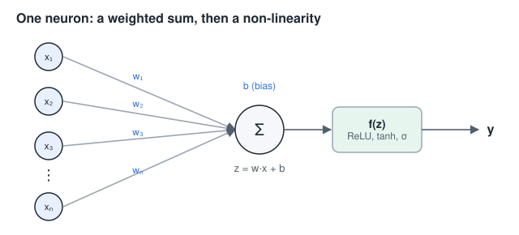

A **neuron** takes numbers in, multiplies each by a **weight**, adds them
up with a **bias**, and passes the sum through a fixed **non-linearity**:

$$y = f(w_1 x_1 + w_2 x_2 + \dots + w_n x_n + b) = f(\mathbf{w}\cdot\mathbf{x} + b)$$

The weights and bias are the neuron's **parameters**: numbers it learns.
The non-linearity `f` is chosen by the designer. Without it, a stack of
layers would collapse into a single linear map and could only draw straight
lines through data; with it, a stack can bend.

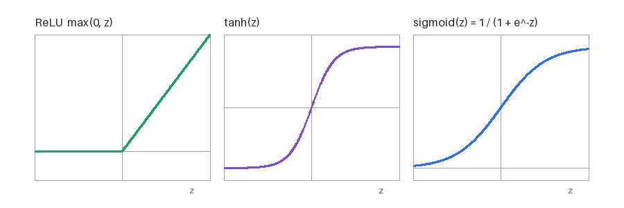

The engine uses three:

| name | formula | where, and why |
|---|---|---|
| **ReLU** | max(0, z) | every hidden layer of every image network here. Cheap, and its gradient is 1 wherever it is active, so deep stacks train without the signal fading. |
| **tanh** | (e^z − e^−z)/(e^z + e^−z) | inside the GRU, for the candidate state: a bounded value in (−1, 1) keeps a recurrent state from growing without limit. |
| **sigmoid** σ | 1/(1+e^−z) | the GRU's gates (a fraction between 0 and 1 of what to keep), and every output that is a probability of one yes/no question: "is this a column separator?", "is this pixel inside a table?", "is the reader's line better?". |

A **layer** is many neurons reading the same inputs, each with its own
weights: in matrix form `y = f(W x + b)`, where `W` has one row per neuron.
A **network** is layers in sequence, each reading the one before. The
layers between input and output are **hidden**; their outputs are
**features** the network invents for itself.

The **last layer** is shaped by the question:

- **Which one of C classes?** (Which character is this glyph?) C outputs,
  turned into probabilities that sum to one by the **softmax**,
  `p_k = e^{z_k} / Σ_j e^{z_j}`.
- **Yes or no?** One output through a sigmoid.
- **A yes/no at every position?** (A separator at every x.) One sigmoid
  per position.

## 2. How a network learns

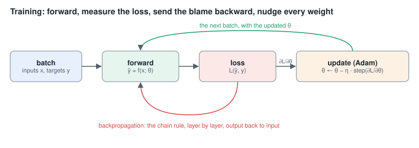

Learning is **optimisation**. Choose a **loss** `L` that is small when the
network's output agrees with the truth; then change every parameter a
little in the direction that makes `L` smaller, and repeat.

**The losses used here**

- **Cross-entropy** for "which class": `L = −log p_true`, the negative log
  of the probability the network gave the right answer. Giving the right
  class probability 0.9 costs 0.105; giving it 0.01 costs 4.6. It punishes
  confident mistakes hardest, which is what makes it a good teacher.
- **Binary cross-entropy** for "yes or no":
  `L = −[y log p + (1−y) log(1−p)]`. When the "yes" answers are rare (a
  column separator is a few pixels in hundreds), a **positive weight**
  multiplies the "yes" term so that the rare class is not simply ignored;
  the table networks use `pos_weight = 2`.
- **CTC** for reading a line of text without knowing where each letter is:
  §6.

**The gradient.** For each parameter θ, the derivative `∂L/∂θ` says how
the loss changes if θ is nudged. Collected over all parameters it is the
**gradient**, and it points uphill; **gradient descent** steps the other
way: `θ ← θ − η ∂L/∂θ`, with a small **learning rate** η.

**Backpropagation** is how the gradient is computed: the chain rule of
calculus applied layer by layer from the loss back to the input. Each
layer receives "how much does the loss change if my output changes"
from the layer above, and passes back "how much if my input changes" to
the layer below, computing its own weights' gradients on the way. This
repository writes the backward pass out by hand in numpy for every network
it can (`recognize/mlp.py`, `lang/gru.py`, `recognize/seq.py`), and the
tests check each one against finite differences — nudge a weight, watch
the loss — so the derivation on the page is known to be right.

**Mini-batches and epochs.** The gradient is estimated from a **batch** of
examples at a time (16 to 256 here), not the whole data set; one pass over
the data is an **epoch**.

**Adam.** Every trainer here uses Adam (Kingma & Ba, 2015). It keeps a
running mean of each parameter's gradient (momentum) and of its square
(scale), and steps by their ratio, so each parameter effectively gets its
own learning rate. It is forgiving of a badly scaled problem, which
matters when a 3×3 filter and a 256-wide recurrent matrix share one
optimiser. The learning rate usually follows a **schedule**: cosine decay
from its start value to near zero over the run, or a "one-cycle" warm-up
then decay for the table networks.

**Initialisation.** Weights start random but scaled to their fan-in so
that signals neither vanish nor explode through the layers: He
initialisation (`√(2/fan_in)`) before a ReLU, Glorot/Xavier
(`√(2/(fan_in+fan_out))`) elsewhere (`recognize/seq.py: SeqNet.__init__`).

**Generalisation.** A network can memorise its training set. So every
trainer holds some examples out — and holds out **whole pages**, not random
lines, so the held-out lines are not near-copies of training lines from
the same page — and keeps the epoch that scores best on them. **Weight
decay** (a small pull of every weight towards zero) discourages the
extreme weights memorisation needs. The final judgement is not the
trainer's number but the engine's own evaluation sets, which no training
ever sees (a guard in the harvest scripts refuses their pages).

## 3. Convolutions: networks for images

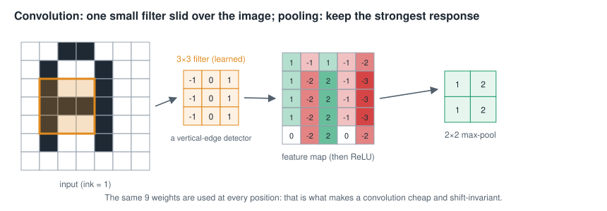

A fully connected layer over an image would give every pixel its own weight
to every neuron — millions of parameters, and a letter learned in one place
would be unknown one pixel to the right. A **convolution** instead slides
one small **filter** (here 3×3, nine weights per input channel) over the
whole image, computing the same weighted sum at every position. Its output
is a **feature map**: how strongly each place looks like what the filter
detects (a vertical edge, the end of a stroke, a bowl). A layer has many
filters, so many maps, called **channels**; the next layer's filters read
all channels at once, combining edges into strokes into letter parts.

Two properties make this right for text:

- **Weight sharing**: an 'e' is an 'e' wherever it sits on the line, so
  the same detector should apply everywhere, and the parameter count does
  not depend on the image size.
- **Locality**: ink is explained by nearby ink first.

**Pooling** shrinks a feature map by keeping the strongest response in each
small window (**max-pooling**). It buys tolerance to small shifts and
halves the work of every later layer. A **stride** of 2 on a convolution
does the same job by computing it only at every second position.

**The receptive field** of an output is the patch of input it can see. Each
3×3 layer grows it by 2 pixels; pooling doubles the growth of every layer
after it.

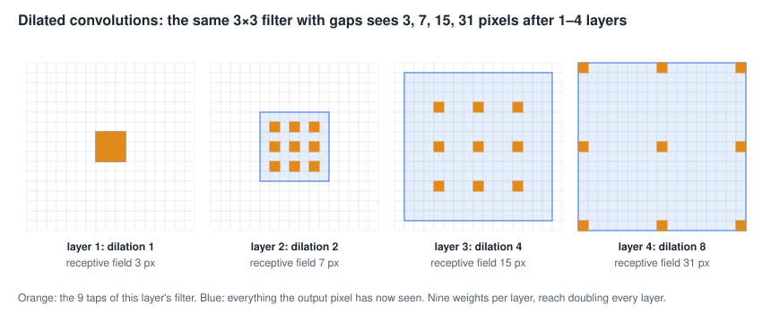

**Dilation** spaces a filter's nine taps apart — every 2nd, 4th, 8th pixel —
so the receptive field doubles with every layer at no extra cost in
weights. The table networks need that: whether a strip of whitespace is a
column gap depends on the page for a hundred pixels around, not on a 3×3
neighbourhood.

Here are the line reader's own first-layer filters, learned from data, and
what each one lights up on a real line:

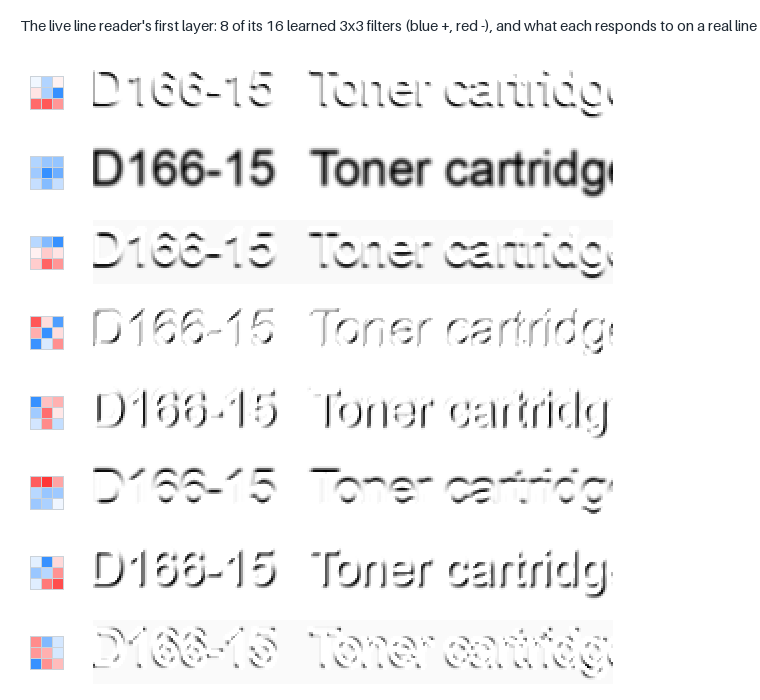

Some are edge detectors (blue on one side, red on the other), some respond
to ink mass, some to the tops or bottoms of strokes. Nobody designed them:
they are what minimising the reading loss produced.

## 4. Recurrence: networks for sequences

A line of text is a sequence, and what a column of ink means depends on its
neighbours: the right half of an 'm' is also the whole of an 'n'. A
**recurrent** network reads a sequence one step at a time and carries a
**state** vector from each step to the next, a running summary of what it
has seen.

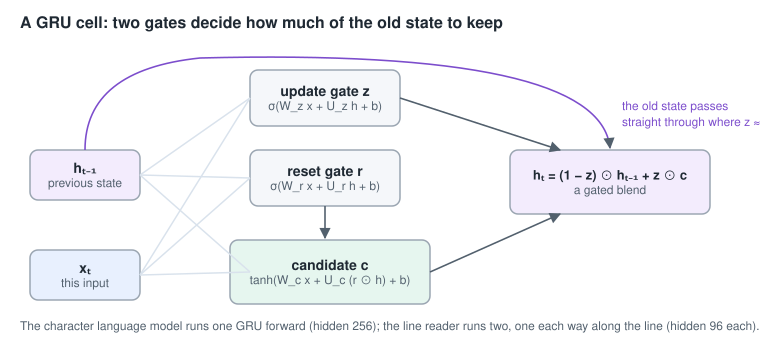

The engine's recurrent cell is the **GRU** (gated recurrent unit; Cho et
al., 2014). At each step it computes two **gates**, each a sigmoid so each
entry is a fraction between 0 and 1:

- the **update gate** `z` — how much of the state to replace,
- the **reset gate** `r` — how much of the old state to consult when
  proposing the replacement,

and a **candidate** state `c = tanh(W_c x + U_c (r ⊙ h) + b_c)`. The new
state is a blend, `h_t = (1 − z) ⊙ h_{t−1} + z ⊙ c`. Where `z` is near 0 the
old state passes through untouched, which is what lets information (and,
in training, gradient) travel across long distances without fading — the
failing of the plain recurrent networks the GRU and its elder cousin the
LSTM replaced. The GRU has two gates to the LSTM's three and no separate
memory cell: fewer parameters for the same job at this scale.

A **bidirectional** GRU runs one GRU left-to-right and another right-to-left
and puts their states side by side, so every position's summary includes
the context on both sides. The line reader uses one; the character language
model cannot (it predicts the next character, so it may only look back).

## 5. Reading with no alignment: CTC

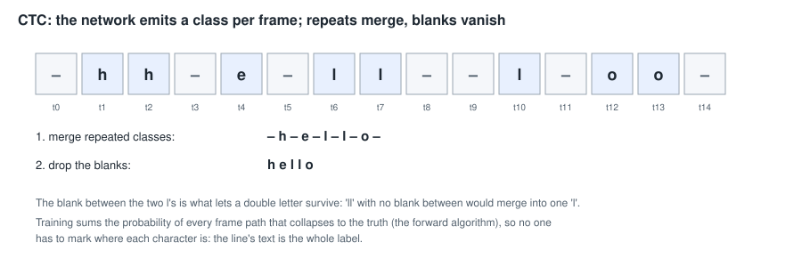

To train a reader on a line whose truth is just its text — "Toner cartridge,
black", with nobody marking where each letter starts — the reader emits a
probability distribution over characters **at every frame** (a thin column
of the line), plus one extra class, the **blank**, meaning "no new character
here". **Connectionist Temporal Classification** (Graves et al., 2006)
defines how a frame-by-frame path becomes text: merge consecutive repeats,
then delete the blanks. `–hh–e–ll–l–oo–` becomes "hello"; the blank between
the two l's is what keeps a double letter double.

Many paths collapse to the same text. The CTC loss is the negative log of
the **total** probability of all of them, computed efficiently by dynamic
programming (the forward algorithm), and its gradient tells each frame how
to shift probability towards the paths that spell the truth. The network
learns alignment by itself. `recognize/ctc.py` implements the loss, its
gradient, and the decoders.

**Decoding.** The quick read is **greedy**: take the most probable class at
each frame, then collapse. The engine uses a **prefix beam search**: it
keeps the eight best partial readings as it walks the frames, merging paths
that spell the same prefix, and adds a bonus (+1.5 nats) whenever a word it
closes is endorsed by the lexicon, a numeric format or the page's own word
list, and a small penalty (−0.5) when it is not. That is how a language
prior enters a reader that was trained on pixels alone.

Here is the live reader on a real line — the strip, the most probable class
at each 2-pixel frame (blue, darker for more confident), the probability of
the blank at each frame, and the collapsed reading:

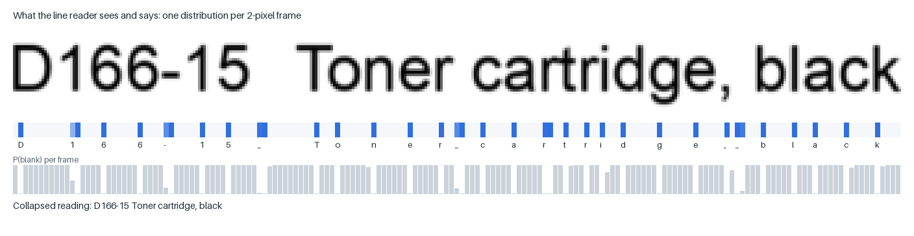

Most frames are confidently blank; each character fires in one or two
frames, roughly at its centre. The spaces between words are classes too.

## 6. Small linear models

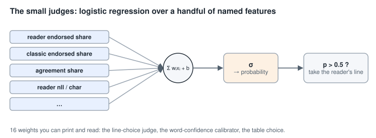

Not every decision needs a deep network. Where the question is "which of
two readings is better?" and good evidence can be named — the share of
each reading's words the lexicon knows, how much they agree, how likely the
reader finds each — the engine uses **logistic regression**: one neuron
with a sigmoid, `p = σ(w·x + b)`, over a dozen named features. It is fitted
by Newton's method (or plain gradient descent) with a little L2
regularisation, in a fraction of a second, and its sixteen or so weights can
be printed and read: a positive weight on "reader endorsed share" means
exactly what it says. **Ridge regression** (linear regression with an L2
penalty, solved in closed form) plays the same role where the target is a
number rather than a yes/no.

## 7. Practices this project leans on

**Normalise the input, not the layers.** Deep networks elsewhere often use
batch normalisation or layer normalisation inside the network, and dropout
to regularise. None of the networks here has either. The inputs are
normalised before they enter instead — a line strip is always 32 rows with
the x-height at 13 pixels and the baseline on row 22, its contrast
stretched paper-to-ink; glyph features are z-scored; a table crop is always
resampled to 75 dpi — and the networks are small enough that weight decay
and held-out selection suffice. Fewer moving parts, and a numpy forward
pass that is a few dozen readable lines.

**One reference, one fast twin.** Every network's forward pass is written
in numpy, and that is what the engine runs (`src/mlws_ocr`). The larger
networks also have a PyTorch **mirror** (`recognize/seq_torch.py`,
`layout/sepnet_torch.py`, `splitnet_torch.py`, `tabledet_torch.py`) used
only for training on a GPU; weights are exported back to `.npz`, and the
tests hold the two to the same outputs (the CRNN to 1e-4). torch is an
optional extra; the pipeline never imports it unless asked.

**Ensembles.**

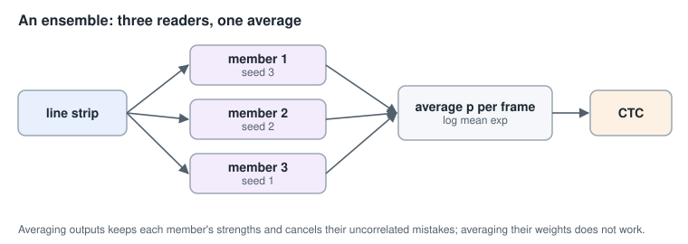

The line reader is three copies of one network trained from different
random starts (**seeds**). At read time their per-frame probabilities are
averaged. Different seeds make different mistakes; averaging keeps what
they agree on and cancels much of what they do not. Averaging their
*weights* instead (a "model soup") was measured and was worse than any one
member: the three live in different basins of the loss, and the average of
three good points is not a good point. The output average costs three
forward passes; `recognize/seq.py: SeqEnsemble` runs the three GRUs in one
stacked loop to keep that cheap.

**Teaching something new without forgetting the old** — fine-tuning,
distillation and the rest — has a section of its own, §8.

**Adopt only what measures better.** A trained network is a candidate. It
is run through the whole engine on every evaluation set, and it is named in
a profile only if it wins, or if the owner accepts a stated trade-off. The
losing attempts stay in [RESEARCH.md](RESEARCH.md) with their numbers.

## 8. Fine-tuning, forgetting, and distillation

The line reader was not trained once. It was trained, and then taught
again four times — grey strips instead of binary ones, then receipts and
forms, then eight new symbols, then the text of tables — each time starting
from the reader before. This section explains how that is done, what goes
wrong when it is done naively, and the four remedies the project uses.

### 8.1 Fine-tuning

**Fine-tuning** means training a network that has already been trained:
instead of starting from random weights, start from the weights of a
network that already does a related job (`train_seq.py --init
data/seq_line_gray9_en.npz`), and train on for a few epochs with data that
includes the new job.

It works because most of what a trained reader knows is not specific to
the text it was trained on. Its first layers detect edges, stroke ends and
bowls (§3); its middle layers, letter parts; its recurrent layer, how
letters follow one another. A receipt's thermal print uses the same
letters. Fine-tuning keeps all of that and adjusts it, so it needs far less
data and time than training from scratch: each of the reader's fine-tunes
ran for 3 to 8 epochs, half an hour to an hour and a half for the three
ensemble members together on one GPU.

It is also the only way to keep what cannot be re-created cheaply. A
from-scratch retrain to add one new character moved the typewriter set by
more than the character was worth (RESEARCH, 2026-09-16); fine-tuning
leaves everything else where it was.

### 8.2 Catastrophic forgetting

The danger has a name: **catastrophic forgetting**. The gradient only says
how to do better on the batch in front of it. If every batch is receipts,
every step pulls the shared weights towards receipts, and nothing pulls
them back towards what they did for letters and legal pages. The network
does not "remember" the old data; it only has the weights, and the weights
are moving.

This project measured it. The first attempt to teach the reader SROIE
receipts was a plain fine-tune on the receipt lines (RESEARCH, 2026-09-26,
"v4"): **SROIE +12.7 points, and up to −1.7 on every other set**. The
receipts were learned; something else was paid for them.

The four remedies below were added one at a time, each measured, until the
receipts' gain came at no more than 0.4 of a point anywhere else (v0.14.0).

### 8.3 Remedy one: rehearsal — keep the old data in the mix

The simplest remedy is to keep training on the old data alongside the new,
so every batch pulls both ways. Each fine-tune here trains on the reader's
whole previous training set plus the new lines, and **controls the shares**:
`--weight FILE=W` sets how often each file's lines are drawn per epoch
(CORD's receipt photos at ×20, the table lines at ×0.5), and
`--lines-once` takes a very large new file once an epoch instead of
repeating it. Getting the shares right (v6) closed most of the forgetting
by itself — and getting them wrong is how the v0.17 table reader was nearly
lost: with the table lines at ×1.0 instead of ×0.5, tables improved and
receipts fell (RESEARCH, `seq_line_gray13`).

### 8.4 Remedy two: L2-SP — a spring back to the start

Ordinary **weight decay** adds `λ‖θ‖²` to the loss: a pull of every weight
towards zero, to keep weights small. **L2-SP** ("starting point"; Li,
Grandvalet & Davoine, 2018) pulls towards the **starting** weights
instead:

$$L_{\text{L2-SP}} = \lambda \,\lVert \theta - \theta_0 \rVert^2 \qquad (\lambda = 10^{-4},\ \texttt{--l2sp})$$

Think of every weight tied to where it started by a weak spring. A weight
the new data really needs to move, moves — the pull of the new loss is
stronger than the spring. A weight the new data only nudges by accident
stays put. On its own (v5) it kept business letters and the modern set, but
not CORD or the Legal Reports: a spring cannot tell which accidental nudges
matter.

### 8.5 Remedy three: distillation — learn from the old network's opinions

**Knowledge distillation** (Hinton, Vinyals & Dean, 2015) trains a
**student** network to match the outputs of a **teacher** network, not just
the truth. Hinton's use was compression — a large teacher, a small student.
Here the teacher and student are the same size: the teacher is the reader
*before* the fine-tune, frozen, and the student is the reader being
fine-tuned. Used this way to prevent forgetting it is called **Learning
without Forgetting** (Li & Hoiem, 2016).

**Why the teacher's outputs, and not just the truth?** The truth for a
frame is one-hot: "this is an 'l'". The teacher says more. Its distribution
over the 120 classes also says what the 'l' *resembles*: some '1', a little
'I', a trace of '|'. That ranking of second choices — sometimes called the
network's *dark knowledge* — is exactly the behaviour the fine-tune must
not lose, and a one-hot label cannot carry it.

**Temperature.** A trained network is confident, so its second choices are
tiny numbers (the 'l' frame below: 0.77, then 0.13, then 0.07, then almost
nothing). To make the student attend to them, both networks' outputs are
**softened** by a temperature `T` before they are compared:

$$p_i^{(T)} = \frac{\exp(z_i / T)}{\sum_j \exp(z_j / T)}$$

At `T = 1` this is the ordinary softmax; larger `T` flattens it towards
uniform while keeping the order. The project uses `T = 2`
(`--distill-temp`):

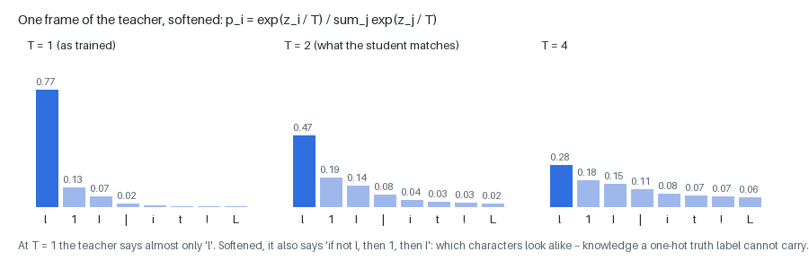

**The distillation loss** is the **Kullback–Leibler divergence** from the
teacher's softened distribution to the student's — how many extra nats it
costs to describe the teacher's opinion using the student's — at every
frame of the line:

$$L_{\text{distill}} = T^2 \cdot \frac{1}{F}\sum_{\text{frames } f} \sum_i p_i^{\text{teacher},(T)}(f)\,\log\frac{p_i^{\text{teacher},(T)}(f)}{p_i^{\text{student},(T)}(f)}$$

Three details matter:

- **The `T²` factor.** Softening by `T` shrinks the gradients of the
  divergence by about `1/T²`; multiplying back keeps the distillation term
  on the same scale as the CTC loss whatever `T` is chosen (Hinton et
  al.'s recipe).
- **Per frame, over real frames only.** A CRNN's output is a distribution
  per 2-pixel frame (§5), so distillation compares frame by frame; the
  padding frames beyond each strip's width are masked out
  (`scripts/train_seq.py`).
- **Not on the new domain.** On the lines being taught — the receipts, the
  table cells — the teacher is exactly what is being improved on, and
  matching it would hold the student back. Those files are named in
  `--distill-skip` (`sroie_box`, `funsd_box`, `tab_`) and get the CTC loss
  only. So are lines whose text needs a character the teacher has no class
  for (the teacher can only say '?' there).

Distillation with the fuller typescript data (v7) closed the last of the
forgetting: the receipts' gain kept, at most 0.4 of a word point lost
anywhere else.

### 8.6 Remedy four: EMA — ship the average, not the last step

Training ends with the weights still jittering from batch to batch. An
**exponential moving average** of the weights,

$$\bar\theta \leftarrow 0.999\,\bar\theta + 0.001\,\theta \qquad \text{(after every step; \texttt{--ema 0.999})}$$

averages over the last few thousand steps (Polyak averaging). The average
lies nearer the middle of the valley the weights have been bouncing around
in, which generalises better than any one point on its walls. Measured on
v0.14.0: the best single epoch read SROIE 1.9 points better than the EMA
weights, and held-out business letters 0.6 worse. The EMA weights ship: a
reader for every kind of page, not the best reader for the newest kind.

### 8.7 Growing the output layer

Teaching the reader eight new symbols (`* = + @ [ ] _ `` `, v0.15.0) meant
eight new output classes. `SeqNet.with_classes` (`recognize/seq.py`) builds
the wider network by **copying** every weight, moving each output row to
its class's new position **by name**, and giving each new class a fresh
random column with a bias two below the mean of the others — so the new
classes start rare and the CTC does not "spray" them across frames before
they have been learned. The frozen teacher is widened the same way, so
distillation can compare the two distributions class for class.

### 8.8 All together

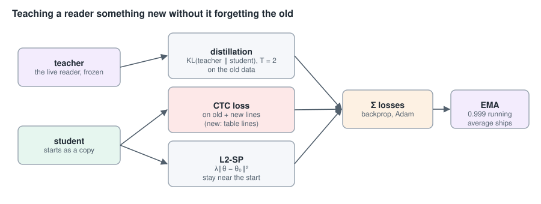

One fine-tuning step of the line reader minimises

$$L = \underbrace{L_{\text{CTC}}(\text{student}, \text{truth})}_{\text{old and new lines, weighted}} \;+\; \underbrace{1.0 \cdot T^2\, \overline{\mathrm{KL}}\big(p^{\text{teacher},(T)} \,\Vert\, p^{\text{student},(T)}\big)}_{\text{old lines only},\ T = 2} \;+\; \underbrace{10^{-4}\,\lVert\theta - \theta_0\rVert^2}_{\text{L2-SP}}$$

and ships the EMA of its weights. The recipe as one command
([NETWORKS.md](NETWORKS.md) has each version's exact files and weights):

```sh
.venv/bin/python scripts/train_seq.py --backend torch --device cuda \
    --init data/seq_line_gray9_en.npz \
    --lines <the old line files> <the new line files> --weight <per-file shares> \
    --l2sp 1e-4 --distill 1.0 --distill-skip <the new files> --ema 0.999 \
    --epochs 3 --out data/seq_line_gray12_1.npz
```

- `--init`: fine-tune — start from the live reader, which is also the
  frozen teacher;
- `--lines`, `--weight`: rehearsal, old and new lines in chosen shares;
- `--l2sp`: the spring back to the start;
- `--distill`, `--distill-skip`: learning without forgetting at `T = 2`,
  not on the new files;
- `--ema`: ship the average of the weights.

### 8.9 The reader's family tree

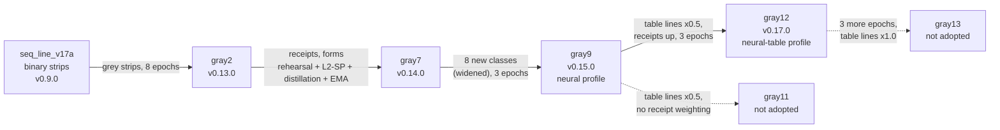

Every arrow is a fine-tune with the remedies above; every box was measured
on every evaluation set before it was adopted, and the dashed ones lost
somewhere and were not (RESEARCH.md has each one's numbers). That is the
final safeguard against forgetting: not a technique, a measurement.

---

# Part II — The networks in this engine

Each section: **the job**, **the shape** (with a figure), **why this
shape**, **training**, **where it runs**, and **what it measured**.

## A. The MLP second opinion — `recognize/mlp.py`, `mlp.npz`

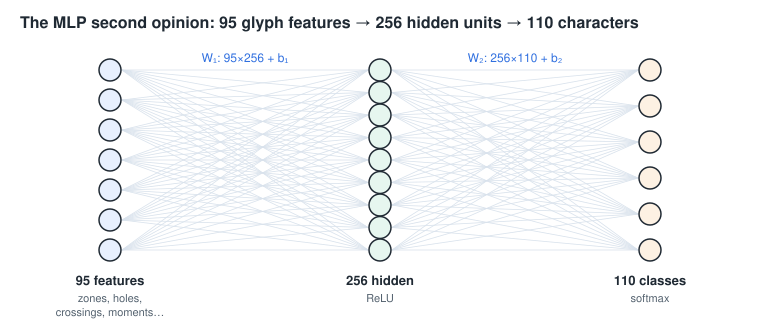

**The job.** The classic recognizer describes each glyph by 95 explicit
features — an 8×8 grid of ink densities, aspect ratio, stroke width, holes,
crossing counts, Hu moments, skeleton endpoints and junctions, side
profiles (`glyph/features.py`) — and finds the nearest stored example of
each character. The MLP reads the same 95 numbers and gives a second
opinion.

**The shape.** 95 z-scored features → 256 hidden units (ReLU) → 110
characters (softmax). 95·256 + 256 + 256·110 + 110 = **52,846** parameters.

**Why this shape.** One hidden layer is enough because the features are
already good: they were engineered to separate characters. What the MLP
adds is a learned, non-linear boundary where the nearest-neighbour rule
uses plain distance. It is a **second opinion, not a replacement**: the
prototype distances carry a physical scale that other stages depend on
(graphic detection, per-document adaptation), so the MLP only re-costs the
prototype's candidate list — each candidate's distance gains
`2.0 × (its MLP negative log-probability − the best one's)` — and injects
its own top three when the list missed them.

**Training.** `scripts/train_mlp.py`: cross-entropy with class weights
(inverse square root of each class's frequency, so rare characters are not
drowned out), Adam at 2·10⁻³ with cosine decay, weight decay 10⁻⁴, batch
256, 30 epochs, on the exemplar pool (synthetic renders in many faces and
degradations plus glyphs harvested from real scans).

**Where it runs.** `recognize.mlp_path` in the classic, neural and
neural-table profiles.

**Measured.** 99.0% top-1 on held-out real glyphs, against 97.5% for the
condensed nearest-prototype pool alone.

## B. The character language model — `lang/gru.py`, `gru_en.npz`

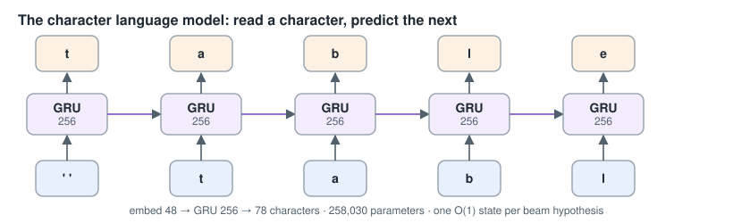

**The job.** While the beam decoder spells out a word one character at a
time, it asks: how likely is this next character, after these? The
language model answers.

**The shape.** Characters are looked up in an **embedding** (78 characters
→ 48 numbers each), read by one GRU with a 256-wide state, and the state is
mapped to a log-probability for each of the 78 possible next characters.
**258,030** parameters. Lower case only; the decoder lower-cases before
asking.

**Why this shape.** A recurrent model carries one fixed-size state per
beam hypothesis: extending a hypothesis by one character is one GRU step,
and the step for every hypothesis in the beam is one batched matrix
product. A transformer would need a growing key-value cache per hypothesis
to do the same, for no gain in quality at this size. A character model,
rather than a word model, scores misspellings, names and numbers
gracefully instead of calling them unknown.

**Training.** `scripts/train_charlm.py`: next-character cross-entropy over
random 160-character windows of the public-domain corpus
(`data/corpus_en_plus`, about 2.4 million words), full backpropagation
through time, Adam at 2·10⁻³, gradients clipped to norm 1, 24 epochs with
the rate halved over the last six; the epoch with the best held-out
perplexity is kept.

**Where it runs.** `decode.char_lm` in classic, neural and neural-table,
at weight 0.5 in the beam.

**Measured.** Held-out perplexity 3.27 against the character trigram's
10.03 (2.59 after retraining on the enlarged corpus) — on average it is as
uncertain about the next character as a fair choice among about three.

## C. The CRNN readers — `recognize/seq.py`: the word scorer and the line reader

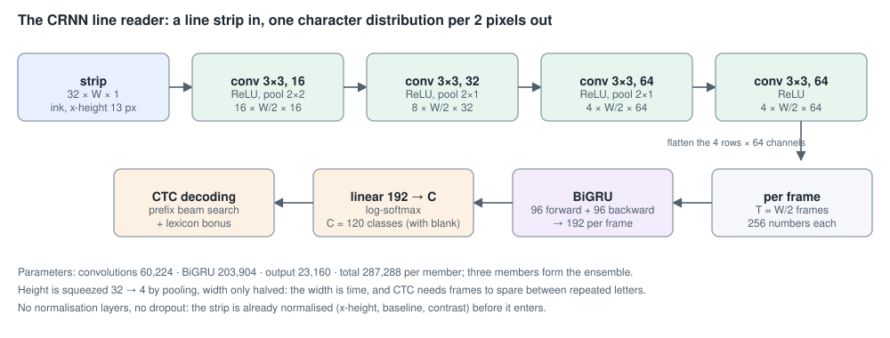

One architecture, trained twice for two jobs:

- the **word-strip scorer** (`seq_en.npz`) reads a word's window and says
  how likely each of the decoder's candidate spellings is;
- the **line reader** (`seq_line_gray9_en*.npz` in the neural profile,
  `seq_line_gray12_en*.npz` in neural-table; three members each) reads a
  whole line end to end, as a second reading beside the classic decoder's.

**The shape.** A **CRNN** (convolutional recurrent network; Shi, Bai & Yao,
2015): convolutions to see, a recurrent layer to read along, CTC to spell.

| layer | output (rows × columns × channels) |
|---|---|
| input strip, ink = 1 | 32 × W × 1 |
| conv 3×3 → 16, ReLU, max-pool 2×2 | 16 × W/2 × 16 |
| conv 3×3 → 32, ReLU, max-pool 2×1 | 8 × W/2 × 32 |
| conv 3×3 → 64, ReLU, max-pool 2×1 | 4 × W/2 × 64 |
| conv 3×3 → 64, ReLU | 4 × W/2 × 64 |
| each column flattened: 4 rows × 64 channels | T = W/2 frames × 256 |
| bidirectional GRU, 96 each way | T × 192 |
| linear → C classes, log-softmax | T × C |

Parameters: convolutions 60,224, BiGRU 203,904, output 23,160 (C = 120 for
the line readers: blank, a–z, A–Z, 0–9, punctuation, 33 accented letters,
`* = + @ [ ] _ `` ` and space) — **287,288** per member. The word scorer
has the 112 classes without the eight symbols: 285,744.

**Why this shape.**

- **The input frame is fixed** — 32 rows, x-height 13 pixels, baseline on
  row 22 (`glyph/strip.py`). Scaling by the *line's* x-height, not each
  word's height, keeps 'x' and 'X', 'o' and 'O', 'a' and 'd' apart by their
  size and position against the baseline, just as a reader sees them. The
  grey readers see the page's grey levels, contrast-stretched from paper to
  ink, rather than the binarised page: binarisation throws away exactly the
  faint and broken strokes a reader most needs.
- **Pooling squeezes height, not width.** Height goes 32 → 4 (the shape of a
  letter is summarised), width only halves. The width is **time**: each
  output frame is 2 pixels of strip. At a 13-pixel x-height an 'l' is two or
  three columns wide, and CTC needs a blank frame between repeated letters;
  a coarser stride runs out of frames on real words.
- **A bidirectional GRU** because the meaning of a column depends on both
  sides of it (the right half of an 'm'), and 96 units each way is enough
  for a 13-pixel x-height's worth of context.
- **CTC** because the truth is a line of text, not letter positions.
- **Masking**: in a batch, strips are padded to the longest; activations
  beyond each strip's own width are zeroed after every layer, so a strip's
  reading never depends on what it was batched with (measured: a 0.1-nat
  drift on the last frames before this was added).

**Training.** `scripts/train_seq.py` (numpy or torch). Synthetic windows
rendered from the font stock and 3,179 open fonts with measured
degradations (blur, threshold, speckle flips, low-resolution resampling,
tight tracking that makes letters touch), plus real lines harvested from
scans with their truth: UNLV pages, SROIE receipts, CORD receipt photos,
FUNSD forms, Library of Congress legal reports, and — for the table reader —
table cell lines from PubTables-1M and FinTabNet.c training crops. Adam
with cosine decay, CTC loss, width-bucketed batches, page-disjoint held-out
lines; the epoch with the best held-out word accuracy ships. The live
readers were **fine-tuned** in steps, each from the one before, with L2-SP,
self-distillation and EMA (§8), so each gained a new kind of text without
losing the old: grey strips (v0.13), receipts and forms (v0.14), eight new
symbols (v0.15), table lines (v0.17, table profile).

**Where it runs.** The word scorer in `decode.seq_path` (neural,
neural-table; classic uses it only to veto a correction the pixels
contradict). The line reader in `decode.line_model_path`, with the
line-choice judge (§H) deciding per line between its reading and the
classic decoder's.

**Measured.** The line reader was the engine's largest single gain:
dev-8 91.9 → 93.2 words, broad-30 87.5 → 89.8, legal-8 84.4 → 88.5 (its
first adoption). The table reader, on the table profile: PubTables-1M
structure TEDS 0.692 → 0.733, receipts 0.929 → 0.940.

## D. The glyph CNN (kept off) — `recognize/cnn.py`, `cnn.npz`

**The job it was meant to do.** A convolutional third opinion on single
glyphs, reading the glyph's pixels instead of its features: a broken stroke
or an eroded bowl costs a few filter responses, where it can change a
hand-made feature (a hole count) outright.

**The shape.** A 32×32 glyph (ink cropped, scaled to fit 28 pixels,
centred) → conv 3×3 16, ReLU, pool → conv 3×3 32, ReLU, pool → conv 3×3 64,
ReLU → global mean → linear 64 → 110 classes. **30,446** parameters. The
global mean (rather than a flattened map) makes it tolerant of where in
the box the glyph sits.

**Why it is off.** On its own it was good: 95.4% top-1 on a page-disjoint
held-out set. In the pipeline it measured negative. Allowed to add its
own top three candidates (as the MLP does), it was catastrophic — dev-8
92.9 → 86.7 characters — because a network reading raw pixels proposes
classes the prototype channel had rejected for good reasons (junk crops,
split pieces), where the MLP, reading the same 95 features, proposes the
same neighbourhood. As a pure re-coster it was flat to slightly negative
(broad-30 87.7 → 87.6, legal-8 86.5 → 86.3). The lesson was about the
ensemble, not the model: the remaining errors were decided before any
classifier saw the glyph (41% had the truth outside the candidate list —
a segmentation error), which is the problem the line reader (§C) solved by
never segmenting at all. It is shipped for the record and stays one switch
away (`recognize.cnn_path`).

## E. The table separator network — `layout/sepnet.py`, `sepnet_v2.npz`

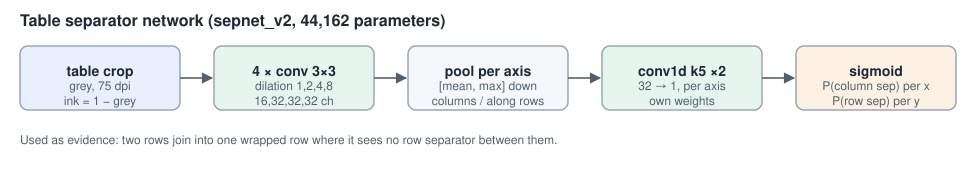

**The job.** Given a table's crop, say where the column separators are
(for every x) and where the row separators are (for every y).

**The shape.** The crop is resampled to 75 dpi (a quarter of 300), ink = 1 −
grey. Four 3×3 convolutions with dilations 1, 2, 4, 8 (16, 32, 32, 32
channels, ReLU): a receptive field of 31 pixels, 124 pixels at 300 dpi.
Then, for columns, each column of the feature map is pooled to its mean and
its maximum (64 numbers per x), and two 1-D convolutions (kernel 5, to 32
then to 1) and a sigmoid give P(column separator) at each x. Rows get their
own head the same way. **44,162** parameters.

**Why this shape.** Whether whitespace is a column gap depends on whether
it runs the table's height. No local filter sees that; **pooling a whole
column** does, in one step, and the 1-D head then looks along the table for
the pattern of gaps.

**Training.** `scripts/train_sepnet.py`: 6,000 tables drawn by
`factory/tablegen.py` with pixel-exact separators, 6,492 FinTabNet.c
training tables, and (v2) CORD receipt line items; masked binary
cross-entropy with positive weight 2; Adam with cosine decay.

**Where it runs.** `output.table_net_path` in neural-table, as **evidence**
rather than as the structure: two rows the word-alignment rules made are
joined into one wrapped row when the network sees no row separator between
them (P < 0.2), unless each holds a figure of its own in the same column.
As the structure itself it lost to the rules; as evidence it won.

## F. The table structure network — `layout/splitnet.py`, `splitnet_v2.npz`

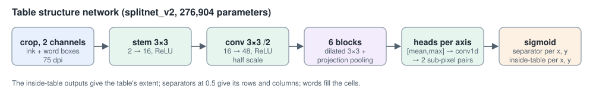

**The job.** From a table's crop and its words, give the table's rows and
columns *and* its extent — where the table starts and ends inside the crop.

**The shape.** Two input channels at 75 dpi: the ink, and a **word mask**
(each word's box filled in). A 3×3 stem (2 → 16), a 3×3 convolution with
stride 2 (16 → 48, half scale), then six **blocks**, dilations 1, 2, 4, 8,
1, 2. Each block is a dilated 3×3 convolution followed by **projection
pooling**:

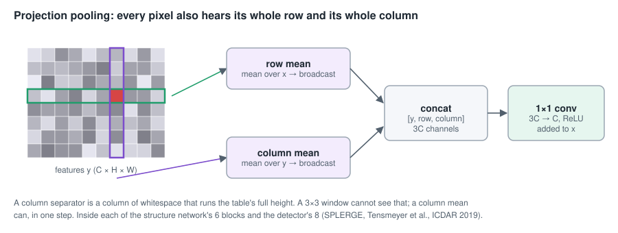

the block's features `y`, the mean of `y` along each row broadcast back
across it, and the mean down each column broadcast back down it, are
concatenated (3 × 48 channels) and mixed by a 1×1 convolution back to 48,
which is **added** to the block's input (a residual connection: the block
learns a correction, and starts near the identity). Two heads, one per
axis, pool mean and max across the other axis and run three 1-D
convolutions; each outputs four channels at half scale that interleave back
to full scale as two outputs per position: **P(separator)** and
**P(inside the table)**. **276,904** parameters.

**Why this shape.**

- **Projection pooling inside every block**, not only at the end, after
  SPLERGE (Tensmeyer et al., ICDAR 2019): every pixel hears its whole row
  and whole column at every depth, so evidence that a gap runs the table's
  height (or a rule runs its width) builds up layer by layer.
- **The word mask** as input because the words are already known by the
  time tables are built, and "a gap between words that lines up for twenty
  rows" is exactly the evidence a column is made of; the network does not
  have to re-discover words from ink.
- **The inside-the-table outputs** let the same network trim a crop that
  took in a caption or a neighbouring paragraph.
- **Half-scale body, full-scale output** (the interleaved sub-pixel pairs):
  the body is four times cheaper, and the separators are still placed to a
  quarter-of-300-dpi pixel.

Here it is on a table set by whitespace alone — no rules at all. Red: the
probability of a column separator at each x; blue, of a row separator at
each y; green, of being inside the table:

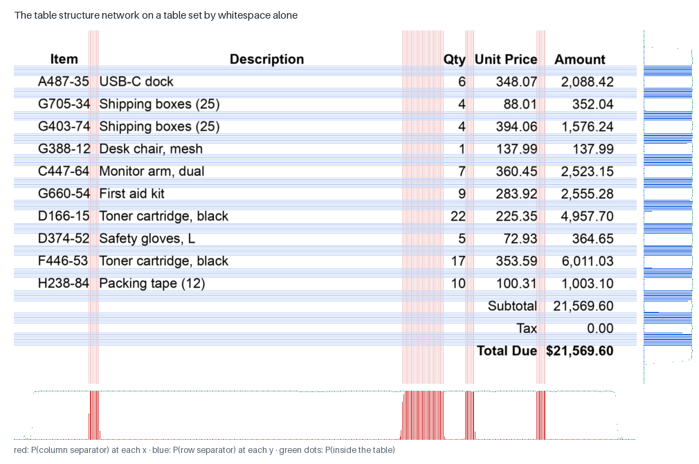

**Training.** `scripts/train_splitnet.py` on a GPU: 100,000 PubTables-1M
structure training tables, 78,537 FinTabNet.c training tables, 12,000 drawn
tables, 2,550 tables of drawn business pages and 308 CORD receipts; 512-pixel
crops, the word mask with 10% of words dropped and ±1.5 pixels of jitter (so
it tolerates a missed or misplaced word); binary cross-entropy on the four
outputs (separators with positive weight 2, inside at half weight), AdamW
with a one-cycle schedule. Held-out separator F1 0.922 after two rounds.

**Where it runs.** `output.table_split_path` in neural-table. Its table is
one of two candidates; the rules' table is the other. On a table's crop,
the rules' table stands if the network's leaves out a whole row of figures
(a header of years, a totals row); otherwise the fitted table choice (§H)
decides. On a table found on a page, the network's table is used only if
it leaves no more cells empty than the rules' and merges no figures the
rules kept apart.

## G. The table detector — `layout/tabledet.py`, `tabledet_v1.npz`

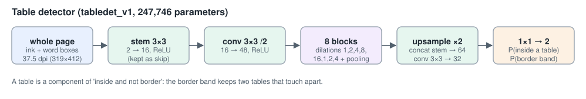

**The job.** Given a whole page, say where its tables are.

**The shape.** The page at 37.5 dpi (an eighth of 300; a letter page is
319 × 412), two channels: ink and the word mask. A 3×3 stem (2 → 16, kept
for later), a stride-2 convolution (16 → 48), then **eight** projection-
pooling blocks with dilations 1, 2, 4, 8, 16, 1, 2, 4. Then back up: a ×2
nearest-neighbour upsample, concatenated with the stem's full-resolution
features (a skip connection, as in U-Net, so fine position survives the
downsampling), a 3×3 convolution to 32, and a 1×1 convolution to **two
maps**: P(inside a table) and P(on a table's border band). **247,746**
parameters.

**Why this shape.** A detector for a document page does not need the
machinery of a photograph detector (anchor boxes, region proposals):
tables are axis-aligned rectangles, so **segmentation** — classify every
pixel — then take connected components is enough. Two tables set close
together would merge into one component, so the network also learns the
**border band**, a thin ring along each table's edge; a table is "inside
and not border", and the ring is added back afterwards. The larger dilation
(16) and the extra blocks give it a whole-page view: at 37.5 dpi, eight
dilated blocks see the full width of a letter page.

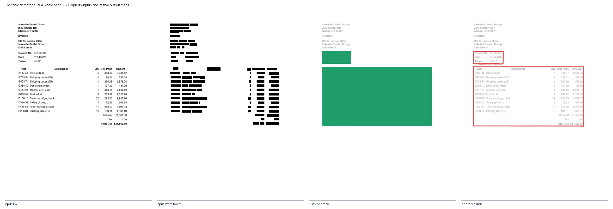

**Training.** `scripts/train_tabledet.py` on a GPU: 60,000 PubTables-1M
detection training pages, drawn business pages and CORD training receipts;
masked binary cross-entropy with the border channel weighted 3; AdamW,
one-cycle; the epoch with the best detection F1 at IoU ≥ 0.5 on held-out
pages is kept (batch 8: 16 did not fit in a 12 GB GPU).

**Where it runs.** `output.table_det_path` in neural-table, in
**complement** mode: its detections replace the rule-based finders'
fragments where they overlap, a detection nothing else found becomes a
table of the words inside it, and a ruled grid is kept as it is.

**Measured.** On 40 PubTables-1M test pages, detection F1 at IoU ≥ 0.5:
the word-alignment finder alone 0.772, the detector alone 0.989; in
complement mode, with the business sets' ruled grids and side-by-side
tables kept, the released table profile scores 0.967 (v0.17.0).

## H. The judges — small fitted models over named evidence

| judge | file | model | inputs | decides |
|---|---|---|---|---|
| **line choice** (`decode/linechoice.py`) | `linechoice.npz` | logistic, 16 weights | each reading's endorsed and unendorsed words, mean confidences, length ratio, agreement, figures share, the reader's likelihood of each reading, page quality | per line: the classic decoder's reading or the line reader's |
| **word confidence** (`decode/wordconf.py`) | `wordconf.npz` | logistic, 17 weights | the decoder's confidence, lexicon / numeric / page endorsement, the scorer's agreement, likelihood and margin, word length and make-up | `p_correct` per word in the hOCR (text unchanged) |
| **table choice** (`train_table_select.py`) | `table_select.npz` | logistic, 19 weights | both tables' empty-cell share, multi-figure cells, rows, columns, spans, words per cell, and their differences | on a table's crop: the rules' table or the structure network's |
| **segmenter judge** (`layout/segjudge.py`) | `segjudge.npz` | ridge, 32 weights | block count, gutter-spanning ink, wide-block ink, tiny blocks, page context | per newspaper or magazine page: which of four segmenters |
| **link rule** (experimental; `layout/knn_scc.py`) | `linkkeep_v1.npz` | logistic, 15 weights | a neighbour link's length, direction, size ratio, baseline difference, gutter crossing… | keep or cut a link in the knn_scc segmenter |

**Why so small.** Each is a decision between two or four known
alternatives, and the evidence that decides it can be named. A dozen
features and a logistic regression fit in under a second, cannot overfit a
few thousand examples, and can be read: the line-choice judge exists
because the reader's own likelihood *prefers its own reading by
construction*, so a judge had to weigh the reader's confidence against
independent evidence (the lexicon, agreement, the classic reading's
confidence).

**Training.** Each from a harvest of real pages (never evaluation pages)
labelled by the truth: `harvest_line_choice.py` → `train_line_choice.py`,
`harvest_word_conf.py` → `train_wordconf.py`, the table crops the structure
network never saw → `train_table_select.py` (each table weighted by how much
the choice mattered), UNLV training-pool pages → `segmenter_judge.py`.

## I. Learned, but not networks

- **Glyph prototypes** (`recognize/nearest.py`, `prototypes.npz`): 90
  stored examples of each of 110 characters, chosen by k-means per class
  (after Hart's condensed nearest neighbour, as in Tesseract's legacy
  classifier), matched by distance over the 95 features.
- **Outline prototypes** (`recognize/outline.py`, `outline_protos.npz`):
  53,087 outline segments over 110 characters, a re-derivation of
  Tesseract's legacy outline matcher; the recognizer's third opinion.
- **The lexicon and trigrams** (`lang/model.py`, `lang_en.npz`) and the
  **learned confusions** for the word corrector (`confusions_*.json`):
  counts, not weights.

---

# Part III — Summary

| model | kind | input | output | parameters | profiles |
|---|---|---|---|---|---|
| MLP second opinion | fully connected, 1 hidden layer | 95 glyph features | 110 characters | 52,846 | classic, neural, neural-table |
| character language model | embedding + GRU | previous characters | next character (78) | 258,030 | classic, neural, neural-table |
| word-strip scorer | CRNN + CTC | 32-row word strip | per-frame 112 classes | 285,744 | neural, neural-table |
| line reader (×3) | CRNN + CTC | 32-row grey line strip | per-frame 120 classes | 287,288 each | neural (gray9), neural-table (gray12) |
| glyph CNN | CNN | 32×32 glyph | 110 characters | 30,446 | off |
| table separator network | dilated CNN + axis heads | table crop, 75 dpi | P(separator) per x, per y | 44,162 | neural-table |
| table structure network | dilated CNN + projection pooling | crop + word mask, 75 dpi | separator and inside per x, per y | 276,904 | neural-table |
| table detector | dilated CNN + projection pooling + skip | page + word mask, 37.5 dpi | inside / border per pixel | 247,746 | neural-table |
| line choice, word confidence, table choice, segmenter judge, link rule | logistic / ridge | named features | a probability or a score | 15–32 | as in §H |

**What we deliberately do not use, and why**

- **Pre-trained weights or foundation models.** The point of the project is
  an engine whose every learned number was learned here, from data anyone
  can obtain ([DATA_SOURCES.md](DATA_SOURCES.md)), and can be relearned.
- **Transformers.** At this scale a GRU does the recurrent jobs with a
  constant-size state per beam hypothesis; the image jobs are local or
  axis-aligned, which convolutions and projection pooling handle directly.
- **Batch or layer normalisation, dropout.** The inputs are normalised
  before they enter, the networks are small, and held-out selection plus
  weight decay (or L2-SP) regularise enough; each layer stays a few lines
  of numpy.
- **Anchor-box object detectors** for tables. Tables are axis-aligned
  rectangles on a page: per-pixel segmentation with a border band is
  simpler and measured well.
- **Replacing the rules.** Each network joins beside an explicit
  algorithm — the MLP re-costs the prototypes, the line reader is judged
  against the classic decoder, the structure network competes with the
  rules' table — so the engine can always say *why* it read what it read.

**References**

- A. Graves, S. Fernández, F. Gomez & J. Schmidhuber, "Connectionist
  temporal classification", ICML 2006.
- B. Shi, X. Bai & C. Yao, "An end-to-end trainable neural network for
  image-based sequence recognition" (CRNN), TPAMI 2017 (arXiv 2015).
- K. Cho et al., "Learning phrase representations using RNN
  encoder-decoder for statistical machine translation" (the GRU), EMNLP
  2014.
- D. Kingma & J. Ba, "Adam: a method for stochastic optimization", ICLR 2015.
- K. He, X. Zhang, S. Ren & J. Sun, "Delving deep into rectifiers" (He
  initialisation), ICCV 2015; X. Glorot & Y. Bengio, "Understanding the
  difficulty of training deep feedforward neural networks", AISTATS 2010.
- F. Yu & V. Koltun, "Multi-scale context aggregation by dilated
  convolutions", ICLR 2016.
- C. Tensmeyer, V. Morariu, B. Price, S. Cohen & T. Martinez, "Deep
  splitting and merging for table structure decomposition" (SPLERGE,
  projection pooling), ICDAR 2019.
- O. Ronneberger, P. Fischer & T. Brox, "U-Net", MICCAI 2015 (the skip
  connection in the detector).
- X. Li, Y. Grandvalet & F. Davoine, "Explicit inductive bias for transfer
  learning with convolutional networks" (L2-SP), ICML 2018.
- Z. Li & D. Hoiem, "Learning without forgetting", ECCV 2016; G. Hinton,
  O. Vinyals & J. Dean, "Distilling the knowledge in a neural network",
  2015.
- B. Polyak & A. Juditsky, "Acceleration of stochastic approximation by
  averaging", SIAM J. Control Optim. 1992 (weight averaging).
- P. Hart, "The condensed nearest neighbor rule", IEEE Trans. Inf. Theory
  1968.
