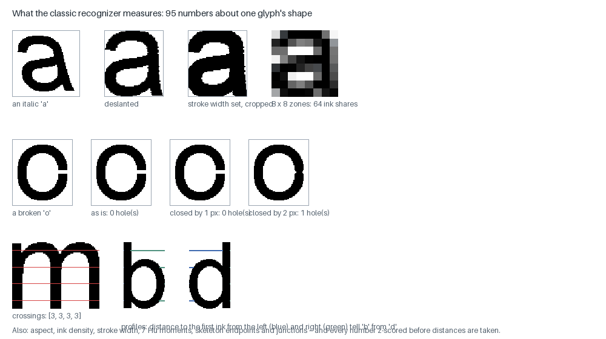
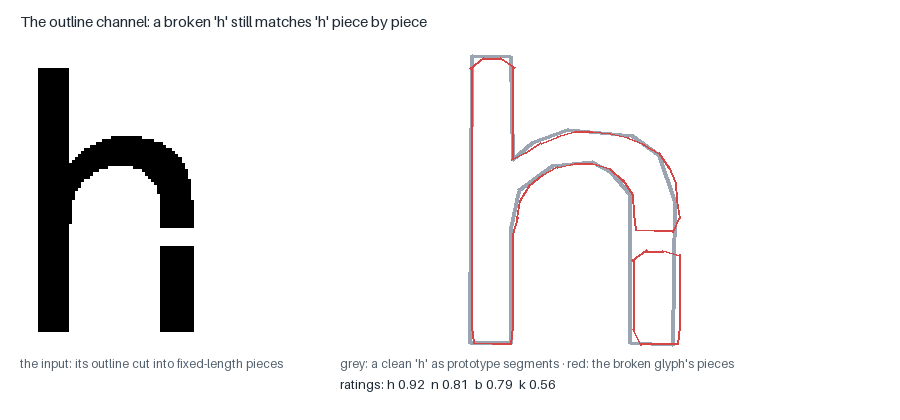
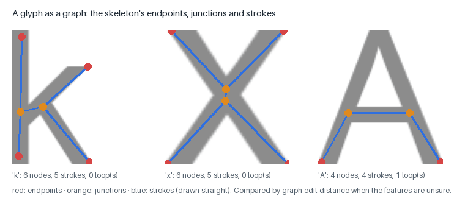
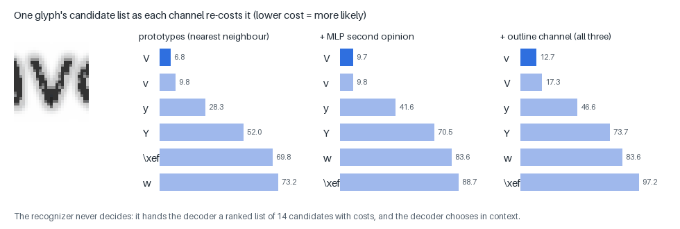

# Glyph recognition: from a blob of ink to a ranked list of characters

Once the page is cleaned and cut into lines, the classic engine looks at
each **glyph** — each connected piece of ink, or group of pieces, that is
probably one character — and asks: *which characters could this be, and how
likely is each?* This page explains how it answers: what it receives from
segmentation, the 95 numbers it measures about each glyph's shape, the
three ways it compares those numbers (and the outline) against what it has
seen before, how the three opinions are combined, and where it goes wrong.

The recognizer **never decides**. It hands the decoder a ranked list of
fourteen candidates with costs; the decoder chooses in context
([DECODING.md](DECODING.md)). The neural line reader, which reads whole lines
without segmenting glyphs at all, is on
[NEURAL_NETWORK_THEORY.md](NEURAL_NETWORK_THEORY.md); this page is the
classic engine, the reference implementation that every profile keeps.

- Code: `glyph/components.py` (glyph groups), `glyph/features.py` (the
  95 features), `recognize/nearest.py` (prototypes), `recognize/condense.py`,
  `recognize/outline.py` (the outline channel), `recognize/mlp.py`,
  `glyph/skeleton.py` and `recognize/ged.py` (skeleton graphs),
  `recognize/stage.py` (the stage that combines them).
- Models: `prototypes.npz`, `outline_protos.npz`, `mlp.npz`,
  `skeletons.json`, built by `scripts/build_prototypes.py`,
  `build_outline_protos.py`, `train_mlp.py`, `build_skeletons.py`.
- Figures: `scripts/make_page_figures.py --only recognize`, on characters
  rendered here.

---

## 1. What recognition receives

The `components` stage turns each line into **glyph groups**: its connected
components, left to right, with pieces joined when they overlap horizontally
by at least half the narrower one's width — so an 'i' and its dot, an 'é' and
its accent, and the three parts of a '%' are each one group. Two kinds of
alternative are attached, because segmentation cannot be sure:

- **Cuts** — a group much wider than the line's typical glyph (1.3×) is
  probably two letters touching ('rn', 'ti'); up to two ranked cut
  positions are proposed at the columns of least ink.
- **Merges** — two or three narrow pieces that together are about one
  character wide are probably one letter broken apart ("company" read as
  "c(21III)any" on a faint page).

The recognizer scores the whole group, every piece of every cut, and every
merge. Choosing between them is the decoder's job.

## 2. The 95 features



Every glyph crop is first **normalised**, so that the numbers describe the
shape and not the typeface's size, weight or slant:

1. **Deslant** — measure the ink's lean from its second-order moments
   (`μ₁₁/μ₀₂`), shear it upright (up to ±0.6). One prototype then covers roman
   and italic (+3 points top-1). The lean is kept, because after deslanting a
   sans 'l' and a '/' are the same shape: the slant *is* the difference.
2. **Stroke width** — erode or dilate until the stroke is about 16% of the
   glyph's size, so bold and light faces compare.
3. **Crop** to the ink.

Then 95 numbers (`glyph/features.py`):

| family | count | what it measures | why |
|---|---|---|---|
| zones | 64 | the ink share of each cell of an 8 × 8 grid over the glyph | the strongest single family (+4–5 points over 4 × 4) |
| aspect, ink density, stroke width | 3 | height / width, ink share of the box, relative stroke | separates 'l' from 'o' before any detail |
| holes | 3 | enclosed background regions, after closing gaps of 0, 1 and 2 pixels | a hairline break in an 'o' erases its hole at 0 but not at 2 — "poor man's persistence" |
| crossings | 8 | ink runs crossed by 4 horizontal and 4 vertical scan lines | 'm' crosses three strokes, 'n' two |
| Hu moments | 7 | seven moment invariants (log-compressed) | a global shape summary unchanged by position, size and rotation |
| skeleton | 2 | endpoints and junctions of the thinned glyph | 'x' has four ends, 'o' none |
| profiles | 8 | at four heights, the distance from each side to the first ink | 'b' and 'd', 'p' and 'q' are mirror images the zones can blur |

Before any distance is taken the 95 numbers are **z-scored** (each minus its
mean over the training glyphs, divided by its spread), so that a count of
holes and a zone's ink share weigh alike. A tiny spread is floored: dividing
by one amplified near-constant features into the dominant term, which was
measured to be catastrophic.

## 3. Channel one: the nearest prototype

The first opinion is the simplest learned classifier there is:
**nearest neighbour**. Keep examples of every character; a new glyph is most
likely whichever character has the example nearest to it, measured as
squared distance in the 95-dimensional z-scored space
(`recognize/nearest.py`). A character's cost is its nearest example's
distance; the fourteen best characters make the candidate list (depth 14:
10 was not enough once accented letters crowded their base letters'
neighbourhoods).

**Which examples?** The prototypes are built (`scripts/build_prototypes.py`)
from:

- **renders** of every character in 29 pinned body typefaces at two sizes,
  each passed through four degradations (clean; blurred with speckle;
  blurred and thresholded as a bitonal scanner does, at two thresholds);
- **harvests** — glyphs cut from real scanned pages whose text is known and
  which no evaluation uses.

Keeping every example (120,000 or more) scored best offline and worst in the
pipeline: common, well-covered characters crowded out rare ones ('1' read
as 'l' 17 times where it had been 3). So each class is **condensed** to
**90 prototypes** by k-means (Hart's condensed nearest neighbour, done with
k-means as Tesseract's legacy classifier does): the centres of 90 clusters
of that character's examples. The live set is 90 × 110 characters = 9,900
prototypes.

**Font families.** Each prototype carries a family tag (serif, sans, mono,
display). The recognizer samples the page's glyphs, votes on which family
the confident ones match, and — if one family clearly dominates — compares
the page against that family's prototypes only.

## 4. Channel two: the MLP second opinion

A small neural network (95 → 256 → 110) reads the same 95 numbers and says
how likely each character is; it re-costs the prototype list and may add its
own top three. It is a second opinion, not a replacement, because the
prototype distances carry a physical scale other stages rely on. Offline it
is the more accurate classifier (99.0% top-1 against 97.5%). Its full
description is in [NEURAL_NETWORK_THEORY.md §A](NEURAL_NETWORK_THEORY.md).

## 5. Channel three: the outline



The zones describe the glyph as a whole, so damage anywhere changes them. The
**outline channel** (`recognize/outline.py`) is local: a re-derivation, in
readable code, of Tesseract's legacy outline matcher (Smith, 2007):

1. **Normalise** the glyph by its moments: centre at the origin, each axis
   scaled so its spread is the same (51.2 units, as in Tesseract).
2. **Features**: walk the glyph's outlines (outer edge and holes) and cut
   them into pieces of fixed length (12.8 units); each piece is a point with
   a direction — the red ticks above.
3. **Prototypes**: each training render's outline, approximated by a
   polygon; its straight segments are the prototype — the grey lines.
   Each render is one **configuration**; configurations are condensed to about
   eleven per character (1,225 in all) by greedy coverage.
4. **Evidence**: every feature looks for the prototype segment it best fits
   (near it and parallel to it: `exp(−(d/35)² − (Δθ/0.7)²)`), and every segment
   for the features that best fit it. The rating averages both directions
   (Tesseract's *NormalizeSums*), so a glyph is penalised both for pieces the
   prototype lacks and for prototype segments nothing matched.

A break in a stroke costs one unmatched segment and a few unmatched
features; everything else still matches. The broken 'h' above rates 0.92 as
'h' against 0.81 as 'n' and 0.79 as 'b'. On the glyphs the pipeline reads
**wrongly**, the outline channel is the best of the three (right 41% of the
time against 34% and 36%). It is the slowest (about 30 ms a glyph), so it only
re-rates the top six candidates, and only when the first two are close.

## 6. A fourth opinion, when unsure: skeleton graphs



When the top two candidates are within 25% of each other and the glyph's
edges are smooth enough to trust, its **skeleton** — the ink thinned to
one-pixel strokes — is turned into a graph (endpoints, junctions, strokes
with length, angle and straightness, loops) and compared with stored graphs
of each candidate by **graph edit distance** (Riesen & Bunke, 2009): the
cheapest set of node and edge changes that turns one into the other. On
rough, degraded glyphs skeletons are noise, so the gate matters (ungated, the
heavy-degradation set lost 5 points).

## 7. Combining the opinions



The channels combine **additively**, each re-costing the prototype list:

```
cost(c) = prototype distance(c)
        + 10 × skeleton edit distance(c)        (only when unsure; top 6)
        + 2.0 × (MLP −log p(c) − best MLP −log p)  (MLP's top 3 may join)
        + 50 × (outline cost(c) − best outline cost) (only when unsure; top 6)
```

The glyph above, a degraded lowercase 'v' from "services", is closest to a
capital 'V' prototype and the MLP agrees; the outline channel, which cares
about exact position and shape of the strokes, puts 'v' first. Case twins
like v/V also get help later from the decoder's height priors.

The three channels are one model: the renders, harvests and fonts behind
them must be rebuilt together. "Rebuild them together or measure a
chimera" (widening the font stock with all three rebuilt: broad-30
87.7 / 70.4 → 88.2 / 71.0).

## 8. Where recognition goes wrong

A study of 134,838 glyphs cut from 120 real letters with known text
(`scripts/classifier_truth_eval.py`) shows where the errors come from:

- the pipeline reads **96.8%** of glyphs right;
- whole glyphs err **2.7%** of the time, pieces of a cut **13.9%**, merges
  **42.7%** — segmentation's guesses are where recognition fails;
- for **two errors in five**, the true character was not in the fourteen
  candidates at all: the glyph was mis-segmented before any classifier saw
  it — narrow letters ('i', 't', 'l', 'r', 'f') touching a neighbour and
  read whole as one wider letter ('d', 'a', 'n', 'h', 'u', 'm').

That last finding is why no fourth classifier helped (a glyph CNN, 95%
accurate on its own, measured negative in the pipeline) and why the neural
**line reader** — which never segments glyphs — was the engine's biggest
single gain.

## 9. Compared with Tesseract's legacy engine

| | Tesseract legacy | this engine |
|---|---|---|
| main classifier | outline features against clustered prototypes (with a class pruner) | 95 explicit features, nearest of 90 condensed prototypes per class, plus an MLP |
| outline matching | the main channel, integer tables | the same idea re-derived with floating-point evidence to the segment; re-rates the top six |
| prototypes | k-means clusters of training samples | the same, per class, from renders and real harvests |
| adaptation | a second classifier trained on the document | the document's glyphs clustered and pinned ([DECODING.md](DECODING.md)) |
| broken and touching glyphs | chop at concave vertices, associate by search | cut at ink minima (concave cuts measured worse here), merge hypotheses, the decoder chooses |

## 10. Parameters

| parameter (`recognize.prototypes`) | default | meaning |
|---|---|---|
| `top_k` | 14 | candidates passed to the decoder |
| `route_family`, `route_dominance` | on, 1.4 | compare against one font family when the page clearly is one |
| `mlp_path`, `mlp_weight`, `mlp_inject` | `data/mlp.npz`, 2.0, 3 | the MLP second opinion (off in the pure profile) |
| `outline_path`, `outline_weight`, `outline_margin` | `data/outline_protos.npz`, 50, 0.3 | the outline channel, when the top two are within 30% |
| `ged_rerank`, `ged_gate`, `ged_margin` | on, 0.72, 0.25 | skeleton graphs, when unsure and smooth |
| `chop_on_confidence` | on | a poorly matched wide glyph is cut and kept cut only if both pieces match better |
| `cnn_path` | off | the glyph CNN (measured negative) |

## References

- P. E. Hart, "The condensed nearest neighbor rule", IEEE Trans. Information
  Theory 14(3), 1968.
- R. Smith, "An overview of the Tesseract OCR engine", ICDAR 2007.
- M.-K. Hu, "Visual pattern recognition by moment invariants", IRE Trans.
  Information Theory 8(2), 1962.
- K. Riesen & H. Bunke, "Approximate graph edit distance computation by means
  of bipartite graph matching", Image and Vision Computing 27(7), 2009.
- D. Arthur & S. Vassilvitskii, "k-means++: the advantages of careful
  seeding", SODA 2007.
- Ø. D. Trier, A. K. Jain & T. Taxt, "Feature extraction methods for
  character recognition — a survey", Pattern Recognition 29(4), 1996.
