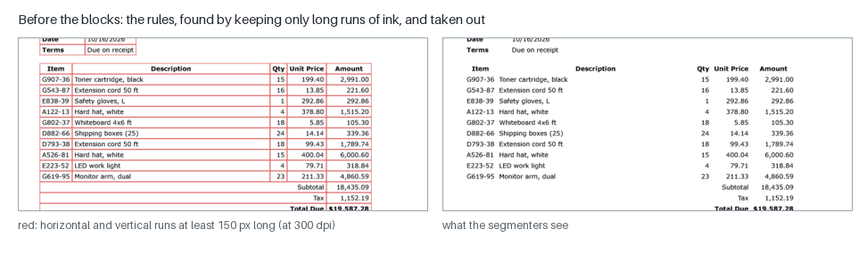
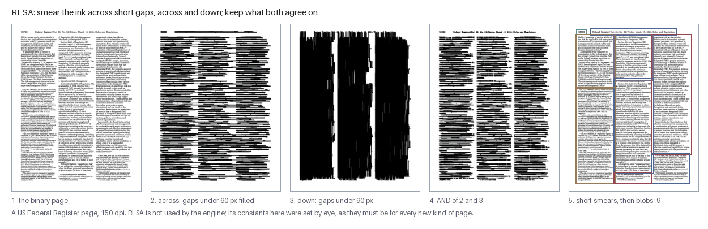
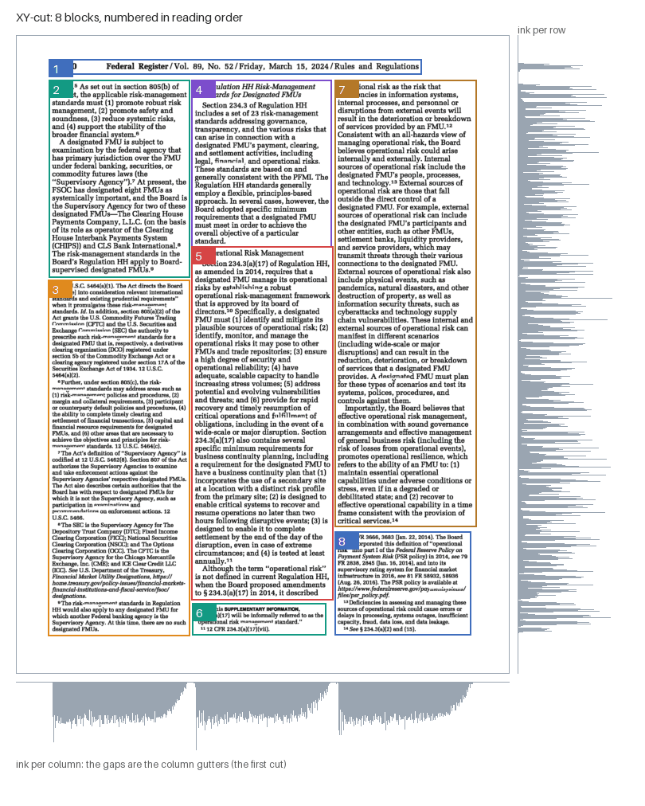
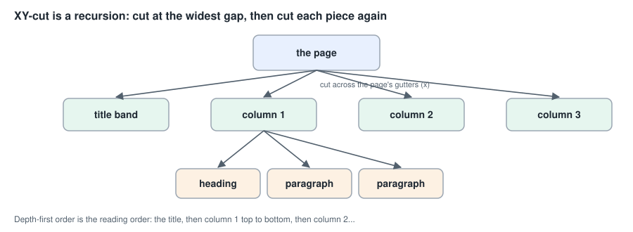
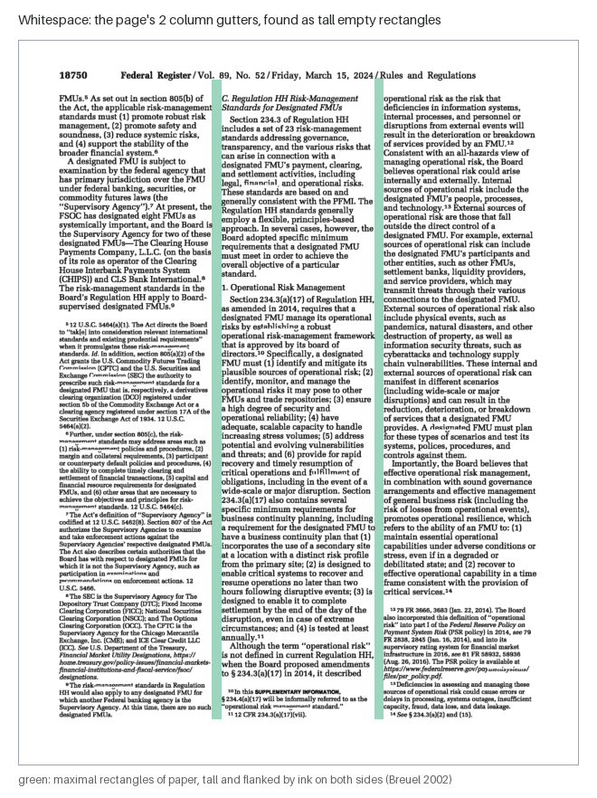
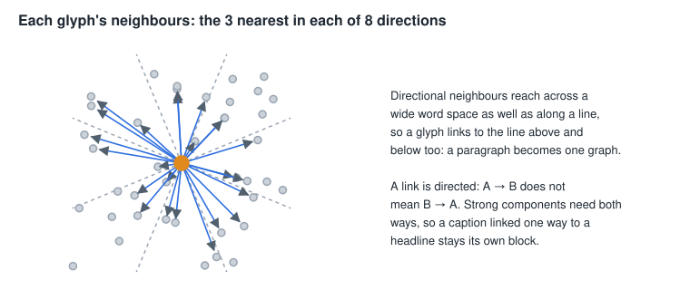
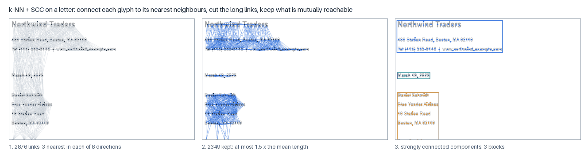

# Page segmentation: finding the blocks, their order, and the lines

A page is not one long line of text. It is a heading, two or three columns,
a caption under a photograph, a footnote, a table. Before anything can be
read, the engine has to find those regions (**blocks**), decide the order a
person would read them in (**reading order**), and cut each block into
**lines**. This is **page segmentation**, or layout analysis — the problem
this project's author worked on in the 1990s, and the part of the engine
with the longest history.

This page explains the stages before the blocks (taking out pictures and
rules), four block segmenters — **RLSA** (the classic, not used here, but
the easiest to understand), **XY-cut** (the default), **whitespace
rectangles**, and the **k-NN + strongly connected components** method —
the judge that chooses between them per page, how lines are found inside a
block, and how segmentation is measured. Figures are drawn by
`scripts/make_page_figures.py --only segment` on a page of the US Federal
Register (public domain), a letter and an invoice the project renders.

- Code: `src/mlws_ocr/layout/` — `imagezones.py`, `rulings.py`,
  `blocks.py` (XY-cut), `whitespace.py`, `knn_scc.py`, `segjudge.py`,
  `lines.py`; `glyph/components.py`.
- Where they run: `… despeckle → imagezones → rulings → blocks → tables →
  lines → components → recognize …`, all on the **binary** page
  ([BINARIZATION.md](BINARIZATION.md)), all assuming level lines
  ([SKEW_CORRECTION.md](SKEW_CORRECTION.md)).
- Results go in `page.meta["layout"]`: `image_zones`, `rules_h`, `rules_v`,
  `blocks` (in reading order), `lines`.
- Papers: [knn-scc-block-segmentation](papers/knn-scc-block-segmentation.md)
  and its follow-on [knn-scc-beyond-1995](papers/knn-scc-beyond-1995.md).

---

## 1. What makes it hard

- **Whitespace means two things.** The gap between two columns and the gap
  between two words can be the same width; the space between paragraphs and
  the space between lines can be close. A segmenter must tell a gutter from
  a word space and a paragraph break from a line break — on every kind of
  page, at every resolution.
- **Non-text ink.** A photograph bridges the whitespace a segmenter relies
  on; a rule under a heading joins it to the text below; a speck in a
  gutter closes it.
- **Order is not geometry alone.** Three columns under a title read title,
  column 1, column 2, column 3 — but a sidebar or a caption can break any
  simple rule.

## 2. Before the blocks: pictures and rules come out

**Pictures** (`imagezones.density`). A photograph or halftone is found by
size and density: a component that is huge and well filled, a hollow
component (line art) bigger than about 120 pixels each way, or a region
whose local ink density (over a 120-pixel window) exceeds 45%. The zone
then absorbs the large components touching it, is grown a little, and its
ink is removed from the page the segmenters see; its box is kept
(`layout.image_zones`) so the output can mark it (Wong, Casey & Wahl, 1982;
Fletcher & Kasturi, 1988; Bloomberg, 1991). Two guards were added from
measured failures: **text rows are protected** — a chain of five or more
glyphs of similar height on one baseline is text, even inside a dark panel
(held-out magazines 68.1 → 77.2 character accuracy) — and in the table
profile **a ruled grid is not a picture** (`keep_grids`). Without this stage
a page's photo silhouettes made XY-cut "collapse to one mega-block".

**Rules** (`rulings.morphological`). A horizontal rule is a run of ink much
longer than any letter is wide. Morphologically, it survives an **opening**
with a long horizontal line: keep only ink that belongs to a run at least
150 pixels long (at 300 dpi); vertical rules the same way down the page.
The engine computes the opening as run lengths (17× faster than the
textbook morphology, identical output), tolerates a pixel of break and of
waviness, finds dashed rules by closing their gaps first, and removes the
rules with a two-pixel margin so no stub reads as an 'I' (Yu & Jain, 1996).
The rules are kept as segments (`layout.rules_h`, `rules_v`) for the table
finder.

## 3. RLSA: smear and see what joins (not used here, but the place to start)

The **Run-Length Smoothing Algorithm** (Wong, Casey & Wahl, IBM, 1982) is
the easiest segmenter to understand, and the one this project's author
used in 1994 (the IDUR system). It needs one idea: **text is ink separated
by small gaps; blocks are separated by large ones.** So fill in the small
gaps and look at what joins.

1. **Smear across.** In every row, turn any run of paper shorter than a
   constant `C_h` into ink. Letters join into words, words into lines — and
   the gutters, wider than `C_h`, stay open.
2. **Smear down.** Do the same in every column with `C_v`: lines join into
   paragraphs, columns into long bars.
3. **AND** the two. A pixel stays ink only where both smears agree. The
   across smear leaves the gutters open; the down smear leaves the gaps
   between blocks of different width open; together they leave blocks.
4. A short final smear (a few pixels) tidies the edges.
5. The **connected components** of the result are the blocks.

Its strength is that every step is a picture you can check by eye. Its
weakness is in the constants: `C_h`, `C_v` and the final smear are fixed
numbers of pixels, right for one kind of page at one resolution and wrong
for others (a newspaper's narrow gutters, a letter's wide margins, a 200-dpi
fax). IDUR already noted how sensitive it is to noise — a speck in a gutter
bridges two columns. The engine keeps only its first step, a short
horizontal smear used to find gutters (`whitespace.find_gutters`), and the
figures here run RLSA from the figure script, not from the engine. The
k-NN + SCC method (§6) was designed in 1995 as an answer to exactly this:
its threshold is computed from each page's own spacing instead of fixed.

## 4. XY-cut: split at the widest gap, recursively (the default)

**Recursive XY-cut** (Nagy & Seth, 1984) treats the page as a rectangle and
asks one question over and over: *where is the widest empty band, across or
down?*

1. Take the region's **column profile** (ink per column) and **row
   profile** (ink per row) — the grey plots around the page.
2. Find the **gaps**: runs of (near-)empty columns at least 36 pixels wide
   (0.12 inch at 300 dpi) — candidate gutters — and runs of empty rows at
   least 30 pixels tall — candidate block breaks.
3. Cut at the gaps on whichever axis has the **widest** one, and recurse
   into each piece.
4. Stop when a region has no gap left: it is a block.

**Reading order comes free**: visiting the pieces depth-first, left before
right and top before bottom, is the order a reader follows through columns
of print. On the Federal Register page it finds the running head (1), the
three columns' paragraphs top to bottom (2–8), in order.

**Tuned by document type.** The same gap sizes cannot serve every page, so
the engine's XY-cut takes the page's type as a hint:

- **newspapers and magazines** get narrower gutters (half the width) and
  may not cut a short region into columns (a headline stays one block);
  newspapers also get closer paragraph breaks — news pages 73.1 / 61.7 →
  **92.8 / 83.1** character / word;
- **letters, legal pages and books** get much wider gutters (2.5×) and cut
  full-height gutters first — a legal pleading had been split into 187
  one-line blocks; legal +6.0 characters / +9.6 words;
- a page that yields more than 80 blocks is retried with 2.5× gutters
  (rivers of word spacing were being taken for gutters).

XY-cut's limit is its geometry: it can only cut straight through the whole
current region, so an L-shaped layout — a photo with text wrapping around
it, a column that ends partway down — can only be cut in pieces. It is
nonetheless the engine's default for every kind of page (the classic
profile), and one of the judge's choices in the neural profile (§7).

## 5. Whitespace rectangles

Instead of profiles, look for the **background** directly: the largest
empty rectangles on the page (Baird, 1994; Breuel's branch-and-bound
algorithm, 2002).

`whitespace.find_gutters` smears each line a little (RLSA's first step), so
the words are solid obstacles, then searches for **maximal rectangles** that
touch no obstacle: a priority queue ordered by area, splitting each
candidate around the obstacle nearest its centre into four smaller ones.
A **gutter** is such a rectangle that is tall (at least 0.28 of the text's
height), at least 16 pixels wide, and has ink along both sides (a gap with
text on one side only is a margin). The segmenter (`blocks.whitespace`) then
cuts columns at the gutters and splits each column at its tall empty bands.

It finds gutters XY-cut misses — ones that do not run the whole page —
but alone it segmented worse than XY-cut (broad-30 92.0 vs 95.3; news-8 69.2
vs 95.8): false gutters in the rivers of justified text were the main
failure. Its gutter finder lives on as evidence inside the k-NN method and
the judge.

## 6. k-NN + strongly connected components (the author's 1995 method)

Designed by this project's author in 1995 as an answer to RLSA's fixed
constants, inspired by O'Gorman's Docstrum (1993), and implemented for the
first time here, thirty years later. The papers tell the full story; the
method is this.

1. **Nodes**: every connected component (roughly, every glyph), at the
   centre of its box.
2. **Directional neighbours**: for each node, the 3 nearest others in
   **each of 8 directions** (45° sectors) — up to 24 directed links. A
   glyph therefore links along its line *and* to the lines above and below.
3. **Prune**: cut every link longer than 1.5 × the page's mean link length.
   The threshold is measured on each page, from its own spacing — the
   difference from RLSA.
4. **Strongly connected components**: two nodes are in the same block only
   if each can reach the other along the kept, **directed** links. A
   caption's link up to a headline may survive pruning, but if the headline
   does not link back down, the caption stays its own block.
5. The components' boxes, merged where they overlap, are the blocks.

**Where it shines and where it failed.** On letters and legal pages it
matches XY-cut (broad-30 95.8 / 93.3 against XY-cut's 95.8 / 93.0) with no
tuning at all. On newspapers, the 1995 settings failed badly (news-8 45.5
against 97.4): newspaper gutters are 30–50 pixels wide, the mean link is
60–70, so a cut at 1.5 × the mean is 90–100 pixels and the columns weld
together (the Federal Register page above comes out as one block). The
follow-on work kept the method and added what it lacked:

- **a tighter cut** (0.8 × the mean) with XY-cut's reading order;
- **a tree of strong components**: since removing links can only split a
  strongly connected component, the components at thresholds 1.5, 1.2, 1.0
  and 0.8 nest into a tree; each region takes the coarsest level that has
  **no gutter inside it** (gutter evidence from §5) — whole paragraphs
  where the page allows, split columns where it does not;
- a learned link rule and headline joining, as options.

With the tree, news-8 reached 96.8 / 94.1 — but on 70 newspaper pages XY-cut
still averaged higher (86.0 against 80.2), so no single segmenter wins
every page.

## 7. The judge: choose per page

If no segmenter wins every page, pick one per page. The neural profile's
blocks stage (`blocks.judged`) runs six candidates on newspaper and
magazine pages — XY-cut with and without its type hint, the tight k-NN,
the SCC tree, and those two with headline joining — describes each result
by four numbers (how many blocks, how much ink sits in blocks that span a
gutter, how much in very wide blocks, how many tiny blocks) plus the page's
gutters and type, and takes the candidate a small ridge regression
predicts will read best (`segjudge.npz`, 32 weights; trained on the UNLV
training pool). Other pages go straight to XY-cut, which cross-validation
showed the judge could not beat there.

Held-out, 30 pages of each: newspapers **86.7** against XY-cut's 83.1,
magazines **83.7** against 78.0 (character accuracy; the best possible
per-page choice would be 90.3 and 84.8).

## 8. Lines inside a block

Inside a block the lines run the full width, so the block's own **row
profile** does the job (`lines.profile`): every run of rows with ink is a
line. Each line gets a **baseline** — the lowest row, scanning up, that
holds at least a quarter of the line's peak row count — used later by the
decoder to tell 'p' from 'P' and ',' from ''' by position. Two refinements:

- a "line" more than 1.8 × the median height is two lines touching (a
  descender reaching the ascender below); it is re-profiled with smoothing
  and split (one page's deletions 193 → 0);
- in the table profile, inside a ruled grid, lines are found **cell by
  cell** (`lines.in_cells`), so a header whose cells sit at different
  heights does not merge into one unreadable strip.

The x-height is measured later, per line, by the decoder.

## 9. Glyph groups

The last layout step (`components.overlap`) splits each line into glyphs:
its connected components, with parts that overlap horizontally (the dot and
body of an 'i', the pieces of a '%') joined into one group. A group much
wider than the line's typical glyph is probably two letters touching; the
stage proposes where to cut it, from valleys in its ink profile, and leaves
the choice to the decoder. The neural line reader skips this step entirely
— it reads the whole line (see
[NEURAL_NETWORK_THEORY.md](NEURAL_NETWORK_THEORY.md)).

## 10. How segmentation is measured

A segmenter's job is to make the page readable, so the engine's main
measure is **end to end**: character and word accuracy of the whole page
read with that segmenter, on the evaluation sets (`eval_unlv.py --blocks
<impl>`). Two finer tools explain the numbers:

- **`scripts/eval_layout.py`** scores blocks against the UNLV truth zones
  directly: a zone is **fragmented** if less than 80% of its ink lands in one
  block; two zones side by side in one block are a **weld**; pairs of zones
  read in the wrong order are **inversions**.
- **`scripts/eval_blocks.py`** reads each truth text zone on its own —
  segmentation removed from the question — so the gap between it and the
  whole-page read is what segmentation costs.

## 11. Not used here

- **Docstrum** (O'Gorman, 1993) — nearest-neighbour clustering with
  distances and angles analysed per page; the ancestor of §6 and the source
  of its per-direction pruning options.
- **Voronoi-based segmentation** (Kise et al., 1998) — area Voronoi
  diagrams of the components.
- **Tesseract's tab-stop layout** (Smith, 2009) — column finding by
  aligned tab stops; better than any segmenter here on three-column
  magazines, and the reference for that open problem
  ([TESSERACT.md](TESSERACT.md)).

## 12. Parameters and profiles

| stage | impl | key parameters | profiles |
|---|---|---|---|
| imagezones | `density` | `density_thresh` 0.45, `protect_text_rows` on, `keep_grids` (neural-table) | every profile |
| rulings | `morphological` | `min_len_300dpi` 150, `tolerant` on, `dash_gap_300dpi` 12, `short_in_grid_300dpi` 40 and `edge_bars` (neural-table) | every profile |
| blocks | `xycut` | `min_gap_x_300dpi` 36, `min_gap_y_300dpi` 30, document-type priors | classic, pure |
| | `judged` | `model_path` `data/segjudge.npz`, newspapers and magazines judged | neural, neural-table |
| | `whitespace`, `knn_scc` | see the code and the papers | layout profiles for comparison |
| lines | `profile` | tall-line re-split; `in_cells` (neural-table) | every profile |
| components | `overlap` | cut candidates for wide groups | every profile |

## References

- K. Y. Wong, R. G. Casey & F. M. Wahl, "Document analysis system", IBM
  Journal of Research and Development 26(6), 1982 (RLSA).
- G. Nagy & S. Seth, "Hierarchical representation of optically scanned
  documents", ICPR 1984 (XY-cut).
- L. A. Fletcher & R. Kasturi, "A robust algorithm for text string
  separation from mixed text/graphics images", IEEE PAMI 10(6), 1988.
- D. S. Bloomberg, "Multiresolution morphological approach to document
  image analysis", ICDAR 1991.
- L. O'Gorman, "The document spectrum for page layout analysis", IEEE PAMI
  15(11), 1993 (Docstrum).
- H. S. Baird, "Background structure in document images", 1994.
- B. Yu & A. K. Jain, "A generic system for form dropout", IEEE PAMI 18(11),
  1996.
- K. Kise, A. Sato & M. Iwata, "Segmentation of page images using the area
  Voronoi diagram", CVIU 70(3), 1998.
- T. M. Breuel, "Two geometric algorithms for layout analysis", DAS 2002.
- R. Smith, "Hybrid page layout analysis via tab-stop detection", ICDAR
  2009.
- M. Sharpe, F. Ahmed & D. Sutcliffe, the IDUR document understanding
  system, IAPR Workshop on Machine Vision Applications (MVA '94), p. 267.
