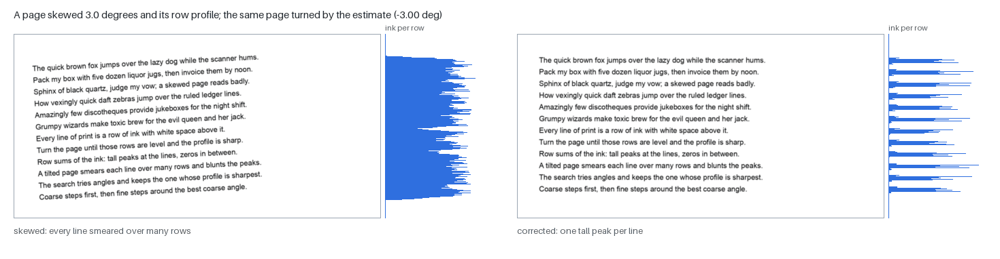
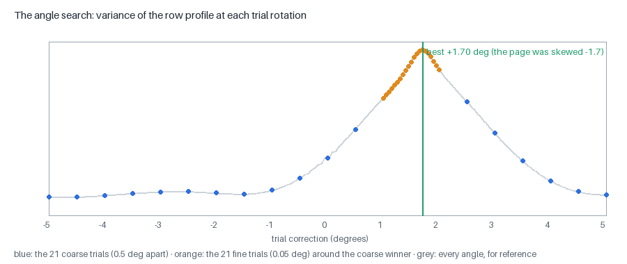
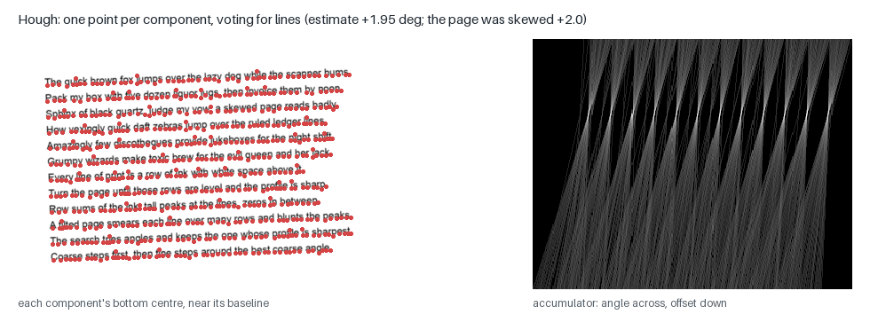
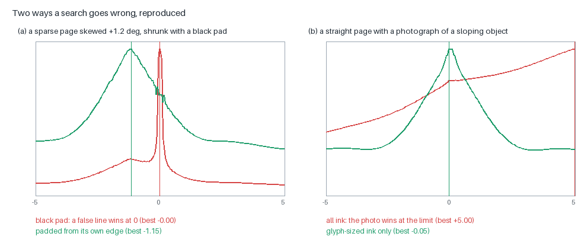

# Skew: finding how far a page is turned, and turning it back

A page fed crooked through a scanner, or photographed at a slant, arrives
**skewed**: its lines of text run uphill or downhill. Nearly everything
after the cleanup stages assumes level lines — the line finder cuts the page
into horizontal bands, the recogniser compares glyphs upright, the table
finder looks for straight columns of whitespace — so the first real job of
the engine is to measure the skew and undo it.

This page explains the idea, the two estimators in the engine, the rules
that were added when the estimator was fooled, and how the correction is
applied. Figures are drawn by `scripts/make_page_figures.py --only skew`
on pages rendered and degraded by the project's own synthetic scanner
model (`factory/synth.py`).

- Code: `src/mlws_ocr/cleanup/deskew.py` (slot `deskew`; impls
  `projection`, the default, and `hough`).
- Where it runs: second, after `magnify` and before `illumination` —
  on the raw grey page. The angle applied is recorded in
  `meta["corrections"]["deskew_deg"]`.
- Related: [BINARIZATION.md](BINARIZATION.md) (the stages after it),
  [SEGMENTATION.md](SEGMENTATION.md) (the stages that most need level lines),
  [ARCHITECTURE.md](ARCHITECTURE.md).

---

## 1. The idea: a level page has a sharp profile

Count the ink pixels in every row of the page. That list of counts is the
page's **row profile** (or horizontal **projection profile**). When the text
is level, each line of print is a band of rows full of ink, and the leading
between lines is rows with none: the profile is a comb of tall peaks and
empty valleys. When the page is turned even a degree or two, every line
spreads across many rows, the peaks flatten and the valleys fill in.

So "how level is this page?" has a number: how **spiky** the profile is.
The engine uses the profile's **variance** — the mean squared difference
between each row's count and the average. Level lines give high variance
(peaks far above the mean, valleys far below); skewed lines give low
variance (every row near the mean). The skew is the rotation that makes the
variance largest (Postl, 1986; Baird, 1987).

## 2. The projection estimator (`deskew.projection`, the default)

**Step 1 — a small ink mask.** The grey page is shrunk to 1,200 pixels
wide (bilinear) and turned into ink / not-ink with a single global Otsu
threshold. Skew is a property of the whole page, so a small copy loses
nothing that matters, and the search is fifty times cheaper.

**Step 2 — a coarse search.** Try every angle from −5° to +5° in 0.5° steps
(21 trials) and score each by the variance of the ink's row profile at that
rotation. Keep the best.

**Step 3 — a fine search.** Try every angle within half a degree of the
coarse winner in 0.05° steps (21 more trials). The best of these is the
estimate — good to about a twentieth of a degree.

**Rotating coordinates, not images.** A naive search rotates the mask 42
times. The engine instead rotates the **coordinates** of the ink pixels:
for a trial angle `a`, each ink pixel at offset `(dx, dy)` from the centre
lands on row `dy·cos a + dx·sin a`, and a histogram of those rows is the
profile (`_InkProjector`). Same answer — it agrees with full image rotation
to within one fine step on 16 of 16 test pages — about fifty times faster.

**Pixels rotated out of the frame are dropped.** Near ±5°, some ink rotates
past the top or bottom of the page. An early version clamped those pixels
onto the edge row; on pages with a large photograph reaching the page's
edge, that piled thousands of pixels into one row, a fake spike that won
the search at the full 5° and turned two straight pages into ruins
(newspaper 8227_030 read 0.7% of its characters). Dropping them, as a real
rotation would, fixed both and changed nothing on the 105 standard pages
(RESEARCH, 2026-09-12).

The search is limited to ±5° on purpose: real scans are rarely skewed more,
and a narrow search has fewer wrong answers to find.

## 3. The Hough estimator (`deskew.hough`, the alternative)

The **Hough transform** (Hough, 1962; for skew, Srihari & Govindaraju, 1989,
and Hinds, Fisher & D'Amato, 1990) finds lines by voting. Here the voters
are not pixels but **one point per connected component** — the bottom
centre of each character, which sits on its line's baseline. For every
trial angle θ, each point votes for the line at that angle passing through
it, identified by its offset `ρ = y·cos θ − x·sin θ`. At the right angle,
all the points on one baseline vote for the same `ρ`, so the votes pile up
into a few tall bins; at a wrong angle they spread out. Scoring each angle
by the sum of its squared bin counts is the same "how spiky" question as
the projection variance, asked of about a thousand points instead of a
million pixels.

The accumulator on the right shows it: angle across, offset down, bright
where many points agree — each bright knot is a text line, and the knots
line up at the page's angle.

The Hough estimator searches −5° to +5° in 0.05° steps in one pass. It is
kept as an alternative for comparison (`configs/deskew-hough.toml`, a
cleanup-only profile for the inspector's side-by-side view) and does not
carry the rules of §4.

## 4. When the estimator is fooled

A variance search finds whatever makes the profile spikiest — usually the
text, but not always. Two failures were found on real pages and fixed; both
are reproduced here on synthetic pages:

**(a) A false line at 0°.** To shrink the page, the search called
`scipy.ndimage.zoom` — which, for many shrink ratios, fills the last row and
column of the result from outside the image, with 0: **black**. So every
shrunk page had a 1,200-pixel straight "line" along its bottom edge. On an
ordinary page the text outweighs it. On a sparse page — a form with a few
short lines — that one line owned the variance, and the search returned
exactly 0° on 34 of 220 business table pages that were in fact turned by
about a degree, splitting every table row in two. Padding the shrunk page
from its own edge (`deskew.edge_nearest`, in the table profile) found the
right angle on 218 of the 220 (timesheets TEDS 0.707 → 0.801;
RESEARCH, 2026-09-29).

**(b) A photograph at the limit.** A large photograph can dominate the ink,
and whatever slopes in it — a horizon, a pole, a shadow — can out-vote the
text. The estimate then runs to the edge of the search, ±5°, and the page is
turned five degrees the wrong way: six of 200 magazine pages did this, and
three of them lost most of their text (RESEARCH, 2026-09-27). The fix rests
on one observation: **an estimate on the search limit is the sign of no real
peak** — a genuine skew of exactly 5° is far rarer than a fooled estimate.
So in the default `text_ink = "limit"` mode, an estimate at the limit is
re-made from **glyph-sized ink only** (connected components no taller than
2.5% of the page and no wider than ten times their height — the objects
Baird's estimator votes with; `text_sized`), which leaves the photograph
out. If even that lands on the limit, the page is left unrotated.
Held-out magazines: 77.1 / 65.3 → **82.1 / 73.4** character / word accuracy
(word recall 84% → 92%).

Two broader fixes were measured and **not** adopted — the record is part of
the lesson:

- Always estimating from glyph-sized ink (`text_ink = true`) moved 29 other
  pages by 0.3–0.8° with no way to tell which estimate was better.
- Masking out every picture zone before estimating (`zone_mask`) rescued
  three of the six limit pages but cost SROIE, FUNSD and CORD: on pages
  without photographs, the "zones" it removed were structure the estimate
  needed.

The rule that acts **only when the estimate shows no peak** kept the
benefit and none of the cost.

**(c) Uneven light** (the table profile's `deskew.ink_fallback`): under a
photograph's shading, a global Otsu threshold can mark half the page as
"ink", and the profile of a half-black page has no useful peaks. When more
than a quarter of the shrunk page comes out as ink, the mask is re-made
against the page's own blurred background instead (a pixel is ink when it is
0.12 darker than its neighbourhood).

## 5. Applying the correction

The estimate is applied to the **full-resolution grey page**, not the
mask: a bilinear rotation about the centre, keeping the page's size, with
the corners that rotate in filled with paper white (1.0). Rotating before
binarising matters — rotating a black-and-white image jags every stroke,
while the grey page rotates smoothly and is binarised afterwards.

The stage reports both the estimate and what it applied, and draws the
score-against-angle curve as a debug image. In the workbench the angle can
be overridden by typing it or by clicking two points along a line of text
(`deskew.angle_deg`); the estimate is still computed and shown beside it.

## 6. What skew correction does not do

- **Per-line slope.** The engine corrects the page as a whole and then
  assumes each line is level; the line finder gives each line one baseline
  row. Pages whose lines curve (a book's spine, a crumpled receipt) are not
  flattened.
- **Italic slant** is a different thing — the letters lean, the lines do
  not — and is handled per glyph: each glyph is sheared upright before its
  features are measured (`glyph/features.py`), and its lean is kept so the
  decoder can tell '/' from 'l'.
- **Quarter turns.** A page scanned sideways is not searched for (±5° only);
  quarter-turned text inside a table cell is handled by the table profile's
  `decode.rotated_cells`.

## 7. Parameters and profiles

| parameter (`deskew.projection`) | default | meaning |
|---|---|---|
| `max_angle` | 5.0 | degrees searched either side of zero |
| `coarse_step`, `fine_step` | 0.5, 0.05 | the two search passes |
| `working_width` | 1200 | width of the shrunk page the search runs on |
| `text_ink` | False | `"limit"` in every profile: re-estimate from glyph-sized ink when the estimate hits the limit, else leave the page unrotated |
| `text_max_frac` | 0.025 | glyph-sized: no taller than this share of the page |
| `edge_nearest` | False | on in neural-table: pad the shrunk page from its own edge, not black |
| `ink_fallback` | False | on in neural-table: re-threshold against the local background when over a quarter of the page is "ink" |
| `zone_mask` | False | picture zones left out of the estimate (measured, not adopted) |
| `angle_deg` | None | a manual correction (the workbench) |

Tests: `tests/test_cleanup_stages.py` (both estimators within 0.2° of a
2.3° synthetic skew; the coordinate projector agrees with image rotation;
a photograph at the frame edge does not win), `tests/test_deskew_manual.py`
(manual angles, the glyph-size filter, the limit rule).

## References

- W. Postl, "Detection of linear oblique structures and skew scan in
  digitized documents", ICPR 1986.
- H. S. Baird, "The skew angle of printed documents", Proc. SPSE 40th
  Conference, 1987.
- P. V. C. Hough, "Method and means for recognizing complex patterns", US
  Patent 3,069,654, 1962.
- S. N. Srihari & V. Govindaraju, "Analysis of textual images using the
  Hough transform", Machine Vision and Applications 2, 1989.
- S. C. Hinds, J. L. Fisher & D. P. D'Amato, "A document skew detection
  method using run-length encoding and the Hough transform", ICPR 1990.
- N. Otsu, "A threshold selection method from gray-level histograms", IEEE
  Trans. SMC 9, 1979.
