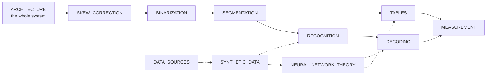

# Start here: a path through the engine

mlws-ocr is meant to be read. Every stage is small and explicit, every
learned model is trained here from public data, and every decision is
recorded with the measurement behind it. These pages teach how it works —
the ideas first, then exactly what this engine does, with pictures of it
doing it, and what was tried and did not work.

This page is the map. Follow the pipeline from pixels to text, or jump to
the track that matches what you came for.



## The path, in pipeline order

| # | page | what you learn | read it for |
|---|---|---|---|
| 1 | [ARCHITECTURE.md](ARCHITECTURE.md) | the system in 13 diagrams: packages, the stage contract, the pipeline, profiles, where each model plugs in, runs on disk | the big picture before any detail |
| 2 | [SKEW_CORRECTION.md](SKEW_CORRECTION.md) | how far is the page turned? Projection profiles, Hough, and the two ways the search was fooled | a first algorithm, and a first lesson in guarding one |
| 3 | [BINARIZATION.md](BINARIZATION.md) | grey to ink: Otsu and Sauvola, flattening the light, scanner frames, why the reader reads grey | where information is lost, and how not to lose it |
| 4 | [SEGMENTATION.md](SEGMENTATION.md) | pictures and rules out, then blocks: RLSA, XY-cut, whitespace, k-NN + strongly connected components, the per-page judge; reading order; lines | the oldest problem in document analysis |
| 5 | [TABLES.md](TABLES.md) | rows, columns and cells: ruled grids from rules, unruled tables from words, the junction mesh, checks, TEDS | the current frontier |
| 6 | [RECOGNITION.md](RECOGNITION.md) | a glyph to candidate characters: 95 features, prototypes, the outline channel, skeleton graphs | the classic recognizer, the reference implementation |
| 7 | [DECODING.md](DECODING.md) | candidates to words: beam search, language models, priors, the neural readers and the judge, adaptation, the noisy-channel corrector | where context turns shapes into text |
| 8 | [MEASUREMENT.md](MEASUREMENT.md) | how every number is computed, and the lessons from the numbers that were wrong | how to know whether anything worked |

Alongside, at any point:

| page | what you learn |
|---|---|
| [NEURAL_NETWORK_THEORY.md](NEURAL_NETWORK_THEORY.md) | neural networks from one neuron up — learning, convolutions, recurrence, CTC, fine-tuning and distillation, ensembles and soups — then every network in the engine, its exact shape and why |
| [SYNTHETIC_DATA.md](SYNTHETIC_DATA.md) | drawing our own pages with the answers known: the degradation model, fonts, training windows, test sets — and what synthetic data could not do |
| [DATA_SOURCES.md](DATA_SOURCES.md) | every real dataset: licence, download, where it goes, what it trains or measures |

## Tracks

**"How does OCR work?"** — ARCHITECTURE §1–4, then SKEW_CORRECTION,
BINARIZATION, SEGMENTATION §1–4, RECOGNITION §1–3, DECODING §1–2. About two
hours; no machine learning needed.

**"I want to understand neural networks."** — NEURAL_NETWORK_THEORY Part I
(§1–7), then Part II §C (the line reader, with its real per-frame output),
then §8–9 (fine-tuning, distillation, averaging) with this project's own
history as the worked example. SYNTHETIC_DATA §3 shows what the readers
train on.

**"I want to extract tables."** — SEGMENTATION §2 (rules), TABLES, then
NEURAL_NETWORK_THEORY §E–G (the three table networks) and MEASUREMENT §1
and TABLES §8 (TEDS).

**"I want to change something and know whether it helped."** — MEASUREMENT
in full, DATA_SOURCES §9–11, then the rows of [RESEARCH.md](RESEARCH.md)
nearest your change — including the ones marked as not adopted.

**"How does this compare with Tesseract?"** — [TESSERACT.md](TESSERACT.md),
then RECOGNITION §9 and DECODING §8.

## Going deeper

Once the teaching pages make sense, the working documents are the record:

- [DESIGN.md](DESIGN.md) — what each part is and why it is shaped the way it
  is; the scoreboard and its history.
- [NETWORKS.md](NETWORKS.md) — every model's files, recipe and command lines;
  the release history.
- [RESEARCH.md](RESEARCH.md) — every algorithm's source and every
  measurement behind every decision, negative results included. Nothing
  lands without a row.
- [ROADMAP.md](ROADMAP.md) — where the work stands and what comes next.
- The papers in [papers/](papers/README.md): the k-NN + SCC segmentation
  method and its follow-on, *Diagnose, don't tune*, and *Tables from Rules
  and One Small Network*.

## Running it while you read

```sh
.venv/bin/python scripts/fetch_models.py                 # the released models
.venv/bin/mlws-ocr run configs/neural.toml page.png      # every stage written to runs/<id>/
.venv/bin/mlws-ocr-ui page.png                           # the workbench: see, change and correct every stage
```

The workbench is the best companion to these pages: open a page, click a
stage, and see the same pictures the pages describe — the deskew angle, the
binary page, the blocks and their order, the lines, the words, the
tables — then change an algorithm or a parameter and watch what follows
change with it. Every figure in these pages can be regenerated with
`scripts/make_doc_figures.py` and `scripts/make_page_figures.py`.
