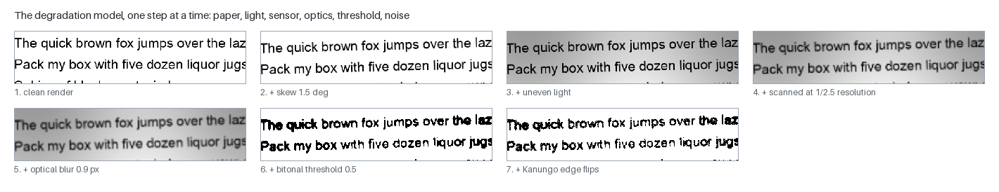
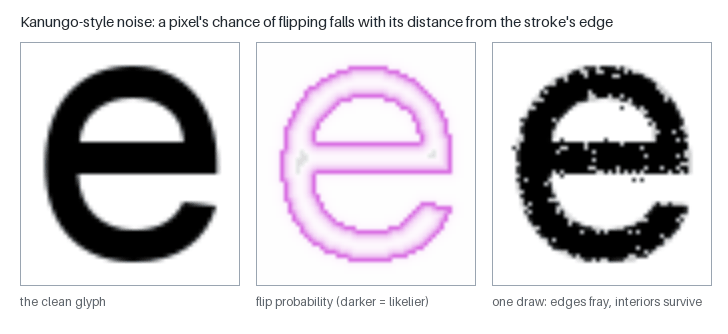
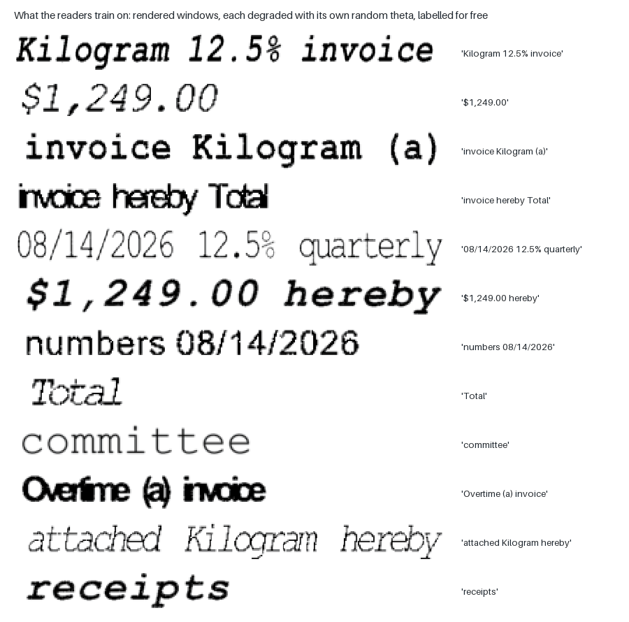
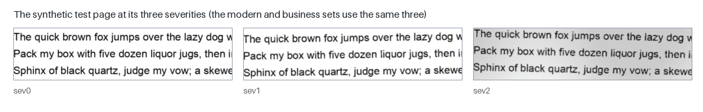
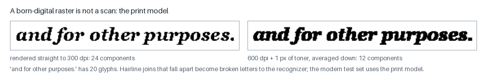
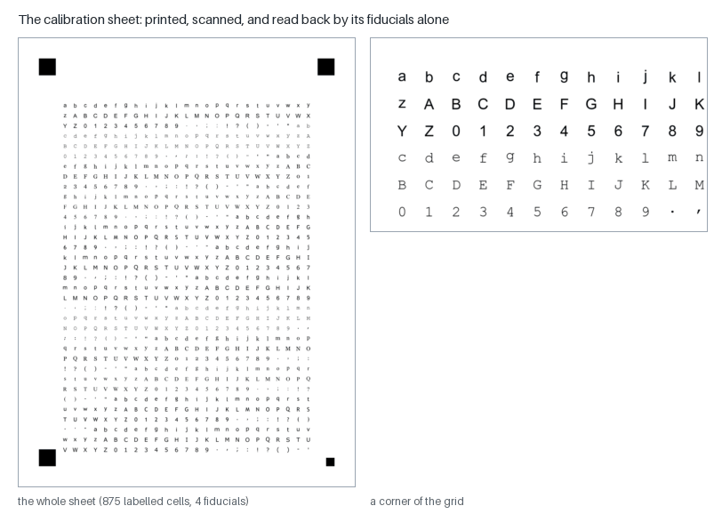

# Synthetic data: drawing our own pages, with the answers already known

Training a recogniser needs examples with their answers; testing one needs
pages whose text is known exactly. Real scans with truth are scarce and
each has its own licence. So the project **draws its own**: it renders text
from fonts, runs it through a model of what a printer, a scanner and a
camera do to a page, and keeps the text it drew as the label. "Labels are
free because we drew the ink ourselves" (`factory/synth.py`).

This page explains the degradation model, the fonts, the training windows
the neural readers learn from, the generated test pages and tables, the
attempt to fit the model to real scanners, and — as important — what
synthetic data could not do, and where real scans had to take over.

- Code: `src/mlws_ocr/factory/` — `synth.py` (degradation, pages),
  `fonts.py` and `stock.py` (the fonts and the character set), `words.py`
  (training windows), `tablegen.py` (tables), `sheet.py`, `decode_sheet.py`,
  `fit_theta.py` (calibration).
- Scripts: `make_seq_data.py`, `make_table_set.py`, `make_business_set.py`,
  `make_modern_set.py`, `make_calibration_sheet.py`, `fit_theta_unlv.py`.
- Figures: `scripts/make_page_figures.py --only synth`.
- Related: [DATA_SOURCES.md](DATA_SOURCES.md) (the real data),
  [NEURAL_NETWORK_THEORY.md](NEURAL_NETWORK_THEORY.md) (what trains on it).

---

## 1. The degradation model

A clean rendering is too easy: real pages are skewed, unevenly lit, scanned
at low resolution, blurred and speckled. `degrade(image, theta)` applies
each of those in the order it happens physically — "geometry (skew) happens
to the paper, lighting happens at scan time, optics blur the result, and
sensor/threshold noise comes last":

| step | parameter | what it models |
|---|---|---|
| skew | `skew_deg` | the page fed crooked |
| uneven light | `illum_amplitude`, `illum_period` | a smooth field of darkening, a sum of two sine waves |
| low resolution | `downsample` | a page scanned at a fraction of the resolution and enlarged back (a 72-dpi fax read at 2×) |
| optical blur | `blur_sigma` | the lens: a Gaussian blur |
| bitonal threshold | `threshold` | a black-and-white scanner or fax thresholding the blurred grey — "the dominant degradation in the UNLV sets" |
| edge noise | `flip_fg`, `flip_bg`, `flip_decay` | pixels flipping ink ↔ paper, mostly at the edges of strokes |

The whole setting is one vector, **theta**, and every sample keeps the theta
that made it. A theta of zeros is the identity (a test checks it), and a seed
makes every draw repeatable.

**Edge noise** follows Kanungo et al. (2000): a pixel's chance of flipping
falls off exponentially with its distance from the nearest ink/paper
boundary, so strokes fray at their edges while their interiors survive:

(The engine's version is a simplification of the published model: one decay
rate for ink and paper, linear rather than squared distance, and no
morphological closing afterwards.)

## 2. Fonts

Rendering needs typefaces, and the choice of faces decides what the models
learn:

- **The pinned stock** (`factory/stock.py`): 29 body faces named one by one —
  Arial in seven styles, Courier New, Georgia, Times New Roman Italic,
  Trebuchet, Avenir Next and others. Pinned, because letting the stock grow
  by itself was measured to hurt: an extra thirty faces crashed the
  synthetic test from 92.7 to 75.4, and even six sensible additions cost real
  letters until all three recognition channels were rebuilt together.
- **Held out**: Verdana and Tahoma are never trained on, so the synthetic
  test page, rendered in Verdana, measures a face the recognizer has not
  seen.
- **Open fonts** (Google Fonts): 3,179 faces pass a **shape gate** — an 'o'
  must render with a hole, an 'l' without one and taller than wide —
  and a name filter that keeps out ornament, script and symbol faces. They
  feed the neural readers, which have no prototype budget to dilute; 615
  faces helped the word scorer, all 3,179 did not.
- **The character set**: 110 classes — letters, digits, punctuation, `& $ % /
  #` and 32 accented letters. More can be added for an experiment with
  `MLWS_EXTRA_CLASSES` (how the reader learned `* = + @ [ ] _ `` `), which
  always needs a control build beside it.

## 3. Training windows for the readers

The neural readers learn from **windows**: a few words rendered as a line in
a random face at a random size, degraded with a random theta, and normalised
to a 32-row strip (`factory/words.py`, `scripts/make_seq_data.py`). The
randomness is the point — each draw is a different face, size, spacing and
damage:

- **size**: x-heights from 10 to 32 pixels, weighted towards 14–26;
- **damage**: 16% of windows clean; otherwise blur of 0.25 to 0.06 × the
  x-height (a blur that softens 26-pixel type erases 12-pixel type),
  a threshold between 0.40 and 0.60, and edge flips of 0–10%;
- **touching letters**: 45% of lines are set with tight tracking, so that
  letters touch — the case the classic recognizer finds hardest;
- **words**: drawn from the text corpus with frequency tempering, plus 12%
  numbers (amounts, dates, phone numbers, percentages, citations) and some
  capitals;
- **never the evaluation pages' text**.

The first set was 250,000 windows (43% with a touching pair) in 8 minutes.

## 4. Generated test pages

**The synthetic test page** (`scripts/eval_pages.py`): 24 lines rendered in
the held-out Verdana at three **severities**, used by the regression test
of every profile:

**The modern set** renders real US government PDFs (bills and a Federal
Register issue) and templated invoices, payslips and letters in faces kept
out of the stock. It needed a **print model**: a PDF rasterised straight to
300 dpi is not what a scanner sees. Thin serifs and joins fall below any
threshold, and a phrase of 20 glyphs came apart into 78 pieces. Rendering at
600 dpi, spreading each dark pixel by one (a toner model) and averaging down
to 300 gave 19 pieces, and the bill page rose from 18.2% to 68.4%
characters read. "A born-digital raster is not a scan — a test set needs a
printer model as much as a scanner model."

**The business set** (`make_business_set.py`): invoices, payslips,
statements, purchase orders and receipts in modern faces, 60 pages, at the
three severities.

**The table sets** (`factory/tablegen.py`, `make_table_set.py`): tables
built from one model that draws both the picture and its HTML truth, "so
the picture and its truth cannot disagree" — in five rule styles, with
spans and nested tables; paystubs, invoices, timesheets, receipts, and the
US Department of Labor certified payroll form filled in software,
typewriter and hand-lettered faces with arithmetic that adds up. See
[TABLES.md](TABLES.md).

**Seeds separate testing from training**: the evaluation sets are drawn with
one seed, and training pages with another (tables: seed 1 for evaluation,
101 for training).

## 5. Fitting the model to a real scanner

If the degradation model is right, its theta should be fittable to a real
scanner. The project built the machinery:

- a **calibration sheet** of 875 labelled cells with four fiducial marks
  (`make_calibration_sheet.py`): print it, scan it, and
  `decode_calibration_scan.py` finds the marks, fits the page's geometry and
  crops every cell with its known label — no recognition involved;
- **label-free fitting** (`fit_theta.py`): compare the distributions of
  simple glyph statistics (stroke width, ink share, edge roughness, holes)
  between real and synthetic glyphs, and search theta (blur and the two flip
  rates) to make them match.

It did not pay off, and the reason was instructive: on the UNLV scans the
fit moved the distance by 3% and gained nothing, because "those TIFFs are
already bitonal, so the dominant degradation is the scanner's own
thresholding of low-resolution glyphs, which a grey-blur-and-flip model
cannot mimic". Real, truth-labelled strips cut from the scans themselves
proved the better source, and the physical sheet was dropped.

## 6. What synthetic data could not do

The project's record is clear that synthetic data is where training
**starts**, not where it ends:

- **Real glyphs generalise better.** Adding 52,571 glyphs cut from real
  scans was "the largest word-accuracy leg of the project" for the classic
  recognizer.
- **The first reader trained on synthetic windows alone** did not beat the
  classic decoder on typewriter pages ("the synthetic stock is thin on
  typewriter faces"); with real strips added it became "the largest
  word-accuracy gain in the project's record" (letters 91.7 / 81.4 → 92.8 /
  85.0). Real strips are weighted up in every recipe since.
- **Imitating a real degradation rarely transfers.** Synthetic low
  resolution did nothing for fax-resolution forms; synthetic tight word
  gaps hurt receipts ("real touching words are kerning pairs and ink bleed,
  not a uniform narrow gap"); synthetic display faces hurt business pages.
  "A synthetic imitation of a real degradation transfers only when it *is*
  the degradation."
- **The synthetic test saturates.** The neural profile reads the synthetic
  page at 100% while real letters sit near 94–96; it is a regression guard,
  not a target, and changes that help it can hurt real pages.

What synthetic data does uniquely well is **exact truth at scale**: millions
of labelled windows, tables whose every span is known, and test pages that
can be regenerated from a seed.

## References

- H. S. Baird, "Document image defect models", in *Structured Document
  Image Analysis*, Springer, 1992.
- T. Kanungo, R. M. Haralick, H. S. Baird, W. Stuetzle & D. Madigan, "A
  statistical, nonparametric methodology for document degradation model
  validation", IEEE PAMI 22(11), 2000.
- M. Jaderberg, K. Simonyan, A. Vedaldi & A. Zisserman, "Synthetic data and
  artificial neural networks for natural scene text recognition", 2014.
- T. M. Breuel, A. Ul-Hasan, M. Al-Azawi & F. Shafait, "High-performance OCR
  for printed English and Fraktur using LSTM networks", ICDAR 2013.
- W3C, *HTML* (table model) and CSS 2.1 §17.5.2.2 (automatic table layout).
