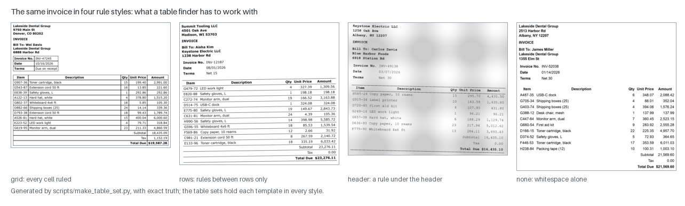
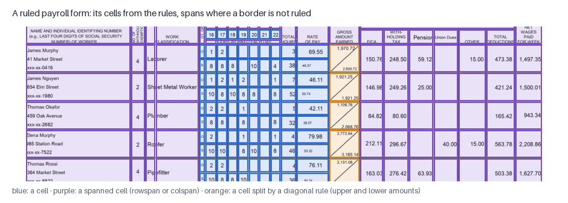
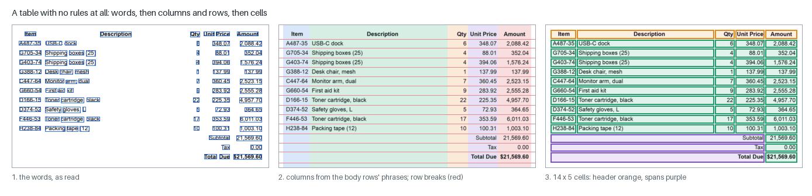
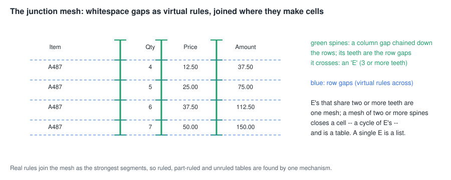
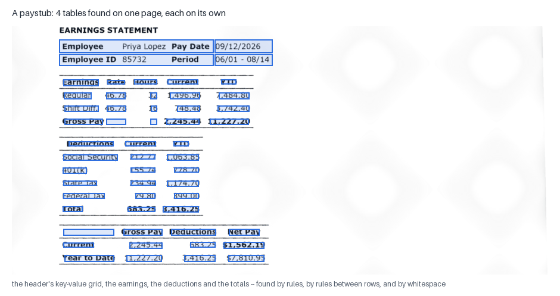
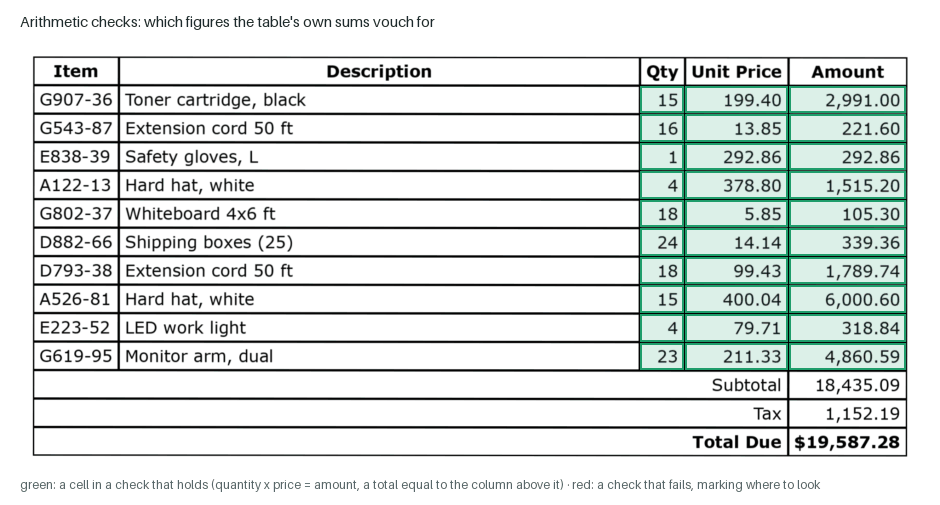
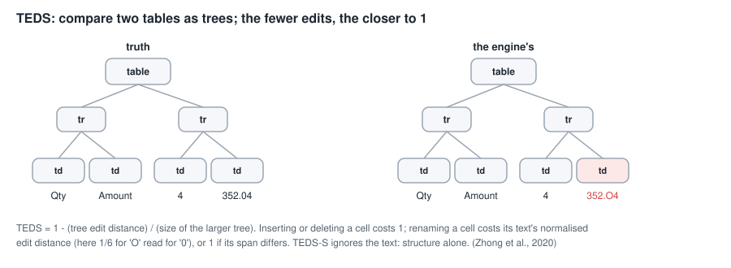

# Table extraction: from ink to rows, columns and cells

Most business documents are tables — invoices, payslips, timesheets,
statements, receipts, the certified payroll form. Reading a table as lines of
text loses what makes it a table: which number is the quantity and which the
price, which header a figure sits under, which cells span two rows. Table
extraction recovers the **structure** — rows, columns, cells, spans, headers,
tables inside tables — and puts the text into it.

This page explains how the engine does that: ruled tables from their rules,
unruled tables from the alignment of their words, the self-trained networks
that join the rules in the table profile, how cells are read and checked,
what comes out, and how it is measured. Figures are drawn by
`scripts/make_page_figures.py --only tables` on the project's own generated
table pages (exact truth, ours to publish). The method is written up as a
paper, [Tables from Rules and One Small Network](papers/tables-from-rules.md).

- Code: `layout/tables.py` (ruled grids), `layout/wstables.py` (tables
  without rules), `layout/junctions.py` (the junction mesh), the table
  networks (`layout/tabledet.py`, `splitnet.py`, `sepnet.py`), `decode/output.py`
  (finding tables on the page, words into cells), `decode/tableio.py`
  (records, nesting, HTML, CSV), `decode/arith.py` (checks), `decode/cellfix.py`
  (figure columns).
- Profiles: **neural** reports tables without changing a word of the page's
  text; **neural-table** (`configs/neural-table.toml`) adds the options that
  also change what the reader sees, and the networks.
- Related: [SEGMENTATION.md](SEGMENTATION.md) (rules and blocks come first),
  [NEURAL_NETWORK_THEORY.md](NEURAL_NETWORK_THEORY.md) (the three table
  networks), [ARCHITECTURE.md §9](ARCHITECTURE.md#9-the-tables-subsystem).

---

## 1. What a finder has to work with



The same table can be drawn fully ruled, with rules only between its rows,
with one rule under the header, or with no rules at all — whitespace alone.
A table finder must handle all of them, and must also refuse what is not a
table: two columns of newspaper prose, a letterhead, a chart's gridlines.
The engine's generated table sets draw every template in every style so
each case is measured.

## 2. What comes out

A table is a **record** (`decode/tableio.py: table_records`):

```json
{"box": [x0, y0, x1, y1], "n_rows": 14, "n_cols": 5, "source": "whitespace",
 "header_rows": 1,
 "cells": [{"row": 0, "col": 0, "rowspan": 1, "colspan": 1, "box": [...], "text": "Item", "header": true},
           {"row": 11, "col": 0, "colspan": 4, "text": "Subtotal", "...": "..."},
           {"row": 3, "col": 4, "text": "292.86", "check": "ok",
            "col_header": ["Amount"], "row_header": ["E838-39"]}]}
```

- **Spans**: a cell covering several rows or columns carries `rowspan` /
  `colspan`.
- **Headers**: the rows above the first row holding a figure (at most three)
  are marked `header`; the leading columns that are mostly labels are the
  **stub**. Every body cell gets its **header path** — the header cells above
  it and the stub cells beside it — so a figure knows it is the
  `Amount` of `E838-39` (`header_paths`).
- **Nesting**: a table lying inside a cell of a larger one is stored in that
  cell's `tables`; tables set side by side are made the cells of a one-row
  outer table (`nest_side_by_side`).
- **Checks**: cells the table's own arithmetic vouches for, or contradicts
  (§7).

Every page's tables are written as `tables.json`, `tables.html` (with
`<th scope="col">` and `<th scope="row">` for headers and stubs, and nested
tables inside their cells), `tables.csv` (a spanned cell's text in its
top-left slot), and `ocr_table` elements in the hOCR.

## 3. Ruled tables: from rules to cells

The rulings stage has already found every rule and taken it out of the page
([SEGMENTATION.md §2](SEGMENTATION.md)). In the table profile that includes
rules too faint for the binarizer: a light-grey hairline enlarged from a
72-dpi figure is about 0.84 grey, Sauvola keeps 3% of it as ink, and the
grid loses a row or column rule. They are found in the grey page as thin
ridges with paper on both sides (`rulings.faint_depth`; PubTables-1M
0.732 → 0.755, one table 0.161 → 0.703). The tables stage (`tables.grid`)
builds grids from them:

1. **Frames.** Rules that touch (within 8 pixels at 300 dpi) belong to one
   frame — a union-find over every pair of rules.
2. **Levels.** The frame's horizontal rules, sorted by height and grouped
   where they lie within 12 pixels, are its row boundaries; the vertical
   rules its column boundaries. A frame with fewer than two of either is a
   lone separator, not a table.
3. **Spans.** Two neighbouring cells merge when the border between them is
   less than 60% covered by rules: a header drawn across three columns is
   one cell (payroll forms 0.305 → 0.668 TEDS).
4. **Broken rules.** A border that is unruled for a stretch is not always a
   span: when some row has text on both sides of it, far apart, the break
   is a gap in the rule, not a merge (`broken_rules`).
5. **Open sides.** A table drawn without its outer left or right rule is
   closed by the ends of its row rules, where two or more of them run past
   the last column rule (`open_sides`; payroll forms 0.668 → 0.713).
6. **Nested frames.** Rules that sit inside one cell of a frame, inset from
   its borders, are a table of their own inside that cell (`nested`;
   paystubs 0.752 → 0.793).
7. **Diagonals.** A cell with ink along its diagonal (the payroll form's
   gross-amount cell holds two amounts, one each side of a slash) is found,
   the diagonal erased before reading, and the cell's words split into upper
   and lower (`diagonals`).
8. **A frame is not a table.** On a table's crop, a "grid" of one column or one row is the box drawn round the table; the crop's words are read as the table instead (`ws_table_thin_grids`; PubTables-1M 0.723 → 0.732).
9. **Charts are not tables.** A chart's axes and gridlines make perfect
   grids of empty cells. A grid is kept only if some row's cells hold ink
   (`min_row_ink`; charts measured 0.00–0.04 cell ink, real tables
   0.06–0.10; PubTables detection F1 0.736 → 0.772).



Two earlier stages protect the grid: the picture stage leaves a large ruled
grid to the rulings stage instead of taking it for a picture (`keep_grids`:
payroll forms 0.003 → 0.305 — the whole form had been deleted as "art"), and
the rulings stage keeps short dividers whose both ends meet a rule
(`short_in_grid_300dpi`: the 136-pixel line under "Morning" in a timesheet
header).

**Words into cells.** Each word goes to the cell holding its centre. A word
lying across cell borders — "fMTWThFSaSu", a row of day letters read as one
word — is split at the borders by its characters' own positions
(`split_words_at_cells`); in the table profile, lines are found cell by cell
inside a ruled grid in the first place (`lines.in_cells`; payroll forms 0.738
→ 0.786), and a cell's words are ordered by their line, not by each word's
own height (`cell_order_by_line`: "Date Pay" → "Pay Date").

## 4. Tables without rules

Most tables are not fully ruled, and many have no rules at all. For those
the evidence is the **words**: a table is words that line up in columns
across several rows, with a column of figures.



**From words to a grid** (`wstables.whitespace_table`):

1. **Rows** — words whose centres lie within half a line height of each
   other.
2. **Phrases** — words closer together than 0.8 of the typical word height
   join into one phrase ("Toner cartridge, black"); a lone currency sign
   joins the amount beside it.
3. **Columns** — from the **body** rows only, which begin at the first row
   holding a figure after its first phrase (a two-level header must not
   decide the columns). Phrases whose extents overlap by more than 15% share
   a column (the threshold swept 0 to 0.25 on held-out tables; 0.15 was
   best).
4. **Headers** — each header phrase spans the columns it stands over; a
   header cell spans down where the header rows below it are empty.
5. **Wrapped rows** — a body row with an empty first column and no figures,
   closely under another, is its second line and joins it.

**Finding them on the page** (`wstables.page_tables`, in the output stage,
where every word is known):

- **Rule regions**: a stack of three or more horizontal rules with ends
  aligned — a table ruled only between rows, or a scientific table's
  booktabs rules — is a table region.
- **The junction mesh** (`junctions.py`; neural-table), described below.
- **The word finder**: runs of rows with two or more phrases agreeing on two
  or more columns.
- **A table needs a column of figures.** Without that test the engine found
  "tables" in newspaper columns and letterheads (17 on 12 news and magazine
  pages → 1): a table's defining trait is a column that is mostly numbers.

**The junction mesh** — the owner's idea for finding tables with one
mechanism whatever their rules:



Treat every gap as a **virtual rule**. A column gap between words, chained
down the rows it crosses, is a **spine**; the row gaps it crosses are its
**teeth**. A spine with three or more teeth is an **E**. E's that share two
or more teeth are one **mesh**, and a mesh of two or more spines closes a
cell — a cycle of connected E's — and is a table; a single E is a list. Real
rules join the mesh as its strongest segments, so ruled, part-ruled and
unruled tables are found by the same test (paystubs 0.804 → 0.849, receipts
0.836 → 0.898).

**Tidying.** A caption row ("Table 3. …") at the top and a paragraph of
notes at the bottom are trimmed — tested on the whole row, so a caption
the columns cut into pieces, or one whose "Table" was misread ("laule z"),
goes too (`trim_notes_rows`); a wrapped cell's words are taken line by
line, not left to right across its lines ("We product, investigations …"
was "We are subject to lawsuits, investigations …"; `table_cell_lines`);
on a table's crop a first-column label spans the rows of sub-labels beneath
it ("Sex, n (%)" over Men and Women; `table_label_rowspans`), the
PubTables-1M convention, though not a total row or a wrapped line beneath
it. The three: PubTables-1M 0.755 → 0.779, FinTabNet 0.807 → 0.810. A total whose label is set to the right
("Subtotal", "Total Due") becomes one cell spanning to its figures (invoices
0.847 → 0.958); tables side by side (a paystub's earnings beside its
deductions) are nested into one layout.



## 5. The networks, in the table profile

Three self-trained networks join the rules (their shapes and training:
[NEURAL_NETWORK_THEORY.md §E–G](NEURAL_NETWORK_THEORY.md)):

- **The detector** looks at the whole page and says where tables are. In
  **complement** mode its detections replace the finders' fragments inside
  them, a detection nothing else found becomes a table of its words, and
  ruled grids and side-by-side tables stay as the rules found them
  (PubTables-1M detection F1 0.685 → 0.957).
- **The structure network** proposes each table's rows, columns and extent.
  Its table competes with the rules' table: on a table's crop a small fitted
  choice decides — unless the network's table leaves out a whole row of
  figures, in which case the rules' table stands; on a page, the network's
  table is used only if it leaves no more cells empty and merges no figures.
- **The separator network** is evidence for joining a wrapped row: two rows
  join where it sees no row separator between them — unless each holds a
  cell of figures of its own in the same column (a receipt's item lines).

The pattern is the engine's usual one: the network is a candidate or a
witness beside an explicit rule, never an unexamined replacement.

## 6. Reading the cells

Cells are harder to read than running text: short, often numbers, crowded
by rules. The table profile adds:

- **A reader for tables.** The table profile's line reader was trained
  on top of the neural one with lines cut from real tables (PubTables-1M and
  FinTabNet.c training crops, at their PDF text), and it can write the
  tables' own symbols — ± − – — × ° μ < > ≤ ≥ ’ “ ” † ‡ · •, nineteen classes
  the neural reader lacks (before them, every '±' in its training trained as
  '?'). On the PubTables-1M test crops it writes 85 of the 97 '±'; the minus
  sign and the en dash it still reads as hyphens, near-identical at 72 dpi
  (`seq_line_gray15`; PubTables-1M 0.787 → 0.797, CORD 0.476 → 0.493). A
  reading run across an empty stretch wider than a word space by far — two
  columns' words joined — is split there (`line_gap_split`).
- **Rules out of the grey.** The line reader reads the grey page, where the
  rules removed from the binary are still drawn; they are painted out of the
  grey too, or a border reads as '1' or 'l' (`line_gray_rules_out`; payroll
  forms 0.609 → 0.738).
- **Figure columns read as figures.** In a ruled table's column that is
  mostly figures, a word that is neither a figure nor a known word is read
  again with the reader's alphabet cut to digits and figure punctuation
  (`figure_cells`: a handwriting face's '8' read as 'a' mended).
- **Turned text.** A tall, narrow cell whose words make no sense is read a
  quarter turn round (`rotated_cells`: "OT. OR ST.").
- **Repairs** in figure cells: "S 25" → "$ 25", "1, 428.80" → "1,428.80", a
  lone 'o' in a marks column → 'O', a flat bar alone in a cell → "—"
  (`dollar_s`, `join_digit_groups`, `cell_marks`, `table_dashes`); and in a
  column of figures, a non-figure cell is re-mapped by look-alike shapes when
  that makes it a figure (`fix_figure_columns`; 62 repairs on FinTabNet, all
  correct).

## 7. The table checks its own arithmetic

A table often contains its own proof. `decode/arith.py` finds and tests:

- **Products** — a column equal to the product of two others in at least
  three rows and three quarters of the rows it could apply to (quantity ×
  price = amount);
- **Cross-foot sums** — a column equal to the sum of a run of neighbouring
  columns (a payroll record's days against its total hours);
- **Totals** — a row labelled as a total equal to the column above it.



A check that holds marks its cells `ok`; one that fails marks them `fail` —
a pointer to where a misreading is. Measured on 96 generated pages: of 13
failed checks, **12 held a real misreading** ("71 × 116.21 = 813.47"); none of
167 kept product checks did. The checks never change the text — they tell a
reviewer where to look.

## 8. Measuring tables



**TEDS** (tree-edit-distance similarity; Zhong, ShafieiBavani & Jimeno
Yepes, 2020) compares the predicted table with the truth as HTML **trees**:
table → rows → cells. The distance is the cheapest set of edits turning one
tree into the other (Zhang–Shasha): inserting or deleting a cell costs 1;
renaming a cell costs the normalised edit distance between the two texts (or
1 if its span differs). `TEDS = 1 − distance / size of the larger tree`: 1.0 is
perfect. **TEDS-S** ignores the text — structure alone — so the gap between
TEDS and TEDS-S is what reading costs. On whole pages (`--whole-page`) every
table on the page is scored under one root, so a missed or invented table
costs its whole tree. Detection is scored separately as **F1** of the table
boxes matched at intersection-over-union ≥ 0.5.

The evaluation sets, and where they stand (neural-table, TEDS / TEDS-S):

| set | pages | v0.16.0 | now |
|---|---|---|---|
| invoices (generated) | 20 | 0.764 | **0.967 / 0.981** |
| timesheets (generated) † | 20 | 0.612 | **0.942 / 0.964** |
| receipts (generated) | 20 | 0.625 | **0.929 / 0.953** |
| paystubs (generated) | 20 | 0.791 | **0.940 / 0.952** |
| payroll forms (generated) † | 20 | 0.717 | **0.913 / 0.939** |
| annual-report tables (FinTabNet.c) | 60 | 0.763 | 0.815 / 0.876 |
| scientific tables (PubTables-1M) | 60 | – | 0.797 / 0.876 |
| scientific pages, detection F1 | 40 | – | 0.967 |
| real receipts (CORD) | 30 | 0.327 | 0.493 / 0.575 |

The two real crop sets were also read on the 240 held-out tables of the same draws, none of which any decision looked at: PubTables-1M 0.759 / 0.847, FinTabNet.c 0.810 / 0.873 — the 60 flatter PubTables-1M by about 0.04 ([MEASUREMENT.md §4](MEASUREMENT.md)).

† Part of these two sets' gain came from correcting the generated truth
where it disagreed with its own images (the images are byte-identical);
RESEARCH.md records each correction. Every row above is re-measured with
`scripts/eval_tables.py` ([DATA_SOURCES.md §10](DATA_SOURCES.md) has the
command lines).

**Where the rest is lost.** FinTabNet's and PubTables' structure scores are
well above their full scores — reading, not structure, is most of the gap.
CORD's photographed receipts fail first at the image (dark, tiny, curved
photos), and its truth builds each menu item from separate printed lines,
which no layout rule sees.

## 9. What was tried and not kept

The record matters as much as the result ([RESEARCH.md](RESEARCH.md)):

| tried | result |
|---|---|
| the separator network as the structure itself | 0.508 against the rules' 0.700 (kept as evidence instead) |
| a column veto from the separator network | lost at every threshold |
| paragraph rows (a table of paragraphs) | one table 0.266 → 0.615, but PubTables-1M 0.664 → 0.607 |
| merging stacked groups | fused paystubs (0.777 → 0.667) |
| cleaning the network's separators | PubTables-1M 0.686 → 0.610 |
| magnifying small type for CORD | CORD +0.04, payroll forms 0.907 → 0.441 |
| a reader trained further on table lines (gray13, gray14) | report tables up, receipts down; not adopted |

## 10. Correcting tables by hand

The workbench's Tables view shows each table beside its scan and lets you
add or remove a column or row line, merge cells, set a cell's text, and draw
or delete a table (`workbench/edits.py`). The corrections are applied after
the output stage, so they survive re-running the stages above; the tables'
JSON, HTML and CSV are rebuilt, and the page text is left as read.

## References

- Y. Zhong, E. ShafieiBavani & A. Jimeno Yepes, "Image-based table
  recognition: data, model, and evaluation" (PubTabNet, TEDS), ECCV 2020.
- K. Zhang & D. Shasha, "Simple fast algorithms for the editing distance
  between trees and related problems", SIAM J. Computing 18(6), 1989.
- T. Kieninger & A. Dengel, "The T-Recs table recognition and analysis
  system", DAS 1998.
- C. Tensmeyer, V. Morariu, B. Price, S. Cohen & T. Martinez, "Deep
  splitting and merging for table structure decomposition", ICDAR 2019.
- B. Smock, R. Pesala & R. Abraham, "PubTables-1M: towards comprehensive
  table extraction from unstructured documents", CVPR 2022; "Aligning
  benchmark datasets for table structure recognition" (FinTabNet.c), ICDAR
  2023.
- X. Zheng, D. Burdick, L. Popa, X. Zhong & N. X. R. Wang, "Global table
  extractor (GTE)" (FinTabNet), WACV 2021.
- B. Yu & A. K. Jain, "A generic system for form dropout", IEEE PAMI 18(11),
  1996.
